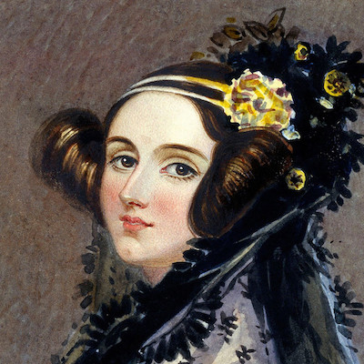
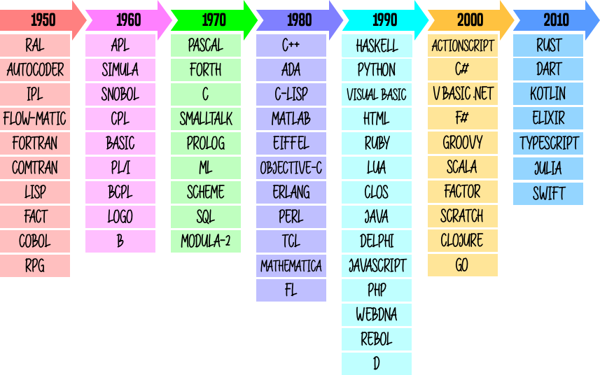

################
Algo de historia
################

.. image:: img/dario-veronesi-lUO-BjCiZEA-unsplash.jpg

La historia de la programación está relacionada directamente con la aparición de los computadores, que ya desde el siglo XV tuvo sus inicios con la construcción de una máquina que realizaba operaciones básicas y raíces cuadradas (`Gottfried Wilheml von Leibniz`_); aunque en realidad la primera gran influencia hacia la creación de los computadores fue la  máquina diferencial para el cálculo de polinomios, proyecto no concluido de `Charles Babbage`_ (1793-1871)  con el apoyo de `Lady Ada Countess of Lovelace`_ (1815-1852), primera persona que incursionó en la programación y de quien proviene el nombre del lenguaje de programación `ADA`_ creado por el DoD (Departamento de defensa de Estados Unidos) en la década de 1970. [#circo-unsplash]_

***********************
Hitos de la computación
***********************

La siguiente tabla es un resumen de los principales hitos en la historia de la computación:

.. csv-table:: Hitos en la computación
    :file: tables/prog_milestones.csv
    :widths: 30, 60, 10
    :header-rows: 1
    :class: longtable

Luego los avances en las ciencias informáticas han sido muy acelerados, se reemplazaron los `tubos de vacío`_ por `transistores`_ en 1958 y en el mismo año, se sustituyeron por `circuitos integrados`_, y en 1961 se miniaturizaron en **chips de silicio**. En 1971 apareció el primer microprocesador de Intel; y en 1973 el primer sistema operativo CP/M.  El primer computador personal es comercializado por IBM en el año 1980.

    Ada Lovelace: primera programadora de la historia [#adalovelace]_

*************************************
De los computadores a la programación
*************************************

De acuerdo a este breve viaje por la historia, la programación está vinculada a la aparición de los computadores, y los lenguajes tuvieron también su evolución. Inicialmente, como ya hemos visto, se programaba en **código binario**, es decir en cadenas de 0s y 1s, que es el lenguaje que entiende directamente el computador, tarea extremadamente difícil; luego se creó el **lenguaje ensamblador**, que aunque era lo mismo que programar en binario, al estar en letras era más fácil de recordar.  Posteriormente aparecieron **lenguajes de alto nivel**, que en general, utilizan palabras en inglés, para dar las órdenes a seguir, para lo cual utilizan un proceso intermedio entre el lenguaje máquina y el nuevo código llamado código fuente, este proceso puede ser un compilador o un intérprete.

Un **compilador** lee todas las instrucciones y genera un resultado; un **intérprete** ejecuta y genera resultados línea a línea. En cualquier caso han aparecido nuevos lenguajes de programación, unos denominados estructurados y en la actualidad en cambio los lenguajes orientados a objetos y los lenguajes orientados a eventos. [#prog-history]_

***************************************
Cronología de lenguajes de programación
***************************************

Desde la década de 1950 se han sucedido multitud de lenguajes de programación que cada vez incorporan más funcionalidades destinadas a cubrir las necesidades del desarrollo de aplicaciones. A continuación se muestra una tabla con la historia de los lenguajes de programación más destacados:

    Cronología de los lenguajes de programación más destacados

El **número** actual de lenguajes de programación depende de lo que se considere un *lenguaje de programación* y a *quién se pregunte*. Según `TIOBE <https://www.tiobe.com/tiobe-index/programming-languages-definition/#instances>`_ más de 250; según `Wikipedia <https://en.wikipedia.org/wiki/List_of_programming_languages>`__ más de 700, según `Language List <http://www.info.univ-angers.fr/~gh/hilapr/langlist/langlist.htm>`_ más de 2500; y para una cifra muy alta podemos considerar a `Online Historical Encyclopaedia of Programming Languages`_ que se acerca a los **9000**.

**************************************
Creadores de lenguajes de programación
**************************************

El avance de la computación está íntimamente relacionado con el desarrollo de los lenguajes de programación. Sus creadores y creadoras juegan un *rol fundamental* en la historia tecnológica. Veamos algunas de estas personas: [#proglangs-creators]_

.. csv-table:: Creadores de lenguajes de programación
    :file: tables/proglangs_creators.csv
    :widths: 30, 70
    :header-rows: 1
    :class: longtable

.. --------------- Footnotes ---------------

.. [#circo-unsplash] Foto original por `Dario Veronesi`_ en Unsplash.
.. [#adalovelace] Fuente: `Meatze`_.
.. [#prog-history] Fuente: `Universidad Técnica del Norte`_.
.. [#proglangs-creators] Fuente: `Wikipedia <https://es.wikipedia.org/wiki/Historia_de_los_lenguajes_de_programaci%C3%B3n>`_.

.. --------------- Hyperlinks ---------------

.. _ADA: https://es.wikipedia.org/wiki/Ada_(lenguaje_de_programaci%C3%B3n)
.. _Charles Babbage: https://es.wikipedia.org/wiki/Charles_Babbage
.. _Dario Veronesi: https://unsplash.com/@dariovero_?utm_source=unsplash&utm_medium=referral&utm_content=creditCopyText
.. _Gottfried Wilheml von Leibniz: https://es.wikipedia.org/wiki/Gottfried_Leibniz
.. _Lady Ada Countess of Lovelace: https://es.wikipedia.org/wiki/Ada_Lovelace
.. _Meatze: https://www.meatze.eus/blog-igualdad/la-primera-programadora-pertenece-al-siglo-xix-ada-lovelace/
.. _Universidad Técnica del Norte: http://www.utn.edu.ec/reduca/programacion/fundamentos/un_poco_de_historia.html
.. _circuitos integrados: https://es.wikipedia.org/wiki/Circuito_integrado
.. _transistores: https://es.wikipedia.org/wiki/Transistor
.. _tubos de vacío: https://es.wikipedia.org/wiki/Computadora_de_tubos_de_vac%C3%ADo
.. _Online Historical Encyclopaedia of Programming Languages: http://hopl.info/
