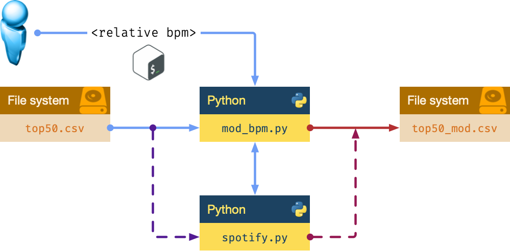

:orphan:

####################
Miniproyecto Spotify
####################

El objetivo de este miniproyecto es integrar la mayoría de elementos del lenguaje de programación Python vistos hasta ahora e implementar un **Speed Changer** para canciones de **Spotify** utilizando el paradigma de orientación a objetos.

*****************
Ficheros de datos
*****************

Vamos a partir de un fichero de datos extraído de `Kaggle <https://www.kaggle.com/>`_ que contiene las **50 canciones más escuchadas en el mundo en Spotify durante el año 2019**.

He limpiado este fichero para quedarnos únicamente con los datos que nos interesan. Las columnas con las que vamos a trabajar son las siguientes:

- **Col. 0** ·️ Track Name: nombre de la canción (cadena de texto).
- **Col. 1** ·️ Artist Name: nombre del artista (cadena de texto).
- **Col. 2** ·️ Genre: género de la canción (cadena de texto).
- **Col. 3** ·️ Beats Per Minute: tempo de la canción (valor entero).
- **Col. 4** ·️ Energy: indica lo "energética" que es la canción (valor entero).
- **Col. 5** ·️ Danceability: indica lo "bailable" que es la canción (valor entero).
- **Col. 6** ·️ Length: duración de la canción (valor entero).

Puede descargar el fichero limpio desde este enlace :download:`top50.csv <files/top50.csv>`.

***********************
Requisitos del programa
***********************

Nuestro programa permitirá modificar la velocidad de las canciones variando sus bpm (beats per minute) o `pulsaciones por minuto`_.

Ejemplos de ejecución
=====================

.. code-block:: console

    $ python mod_bpm.py 10   # increase songs in 10bpm
    $ python mod_bpm.py -25  # decrease songs in 25bpm

********************
Código a implementar
********************

``spotify.py``

.. code-block:: python

    class Song:
        def __init__(self, track: str, artist: str, genre: str, bpm: int,
                     energy: int, danceability: int, length: int):
            # your code here

        def __str__(self):
            # your code here

        def change_speed(self, relative_bpm: int) -> None:
            # your code here

        @staticmethod
        def load_songs(path: str) -> list['Song']:
            # your code here
            return songs

        @staticmethod
        def save_songs(songs: list['Song'], path: str) -> None:
            # your code here

``mod_bpm.py``

.. code-block:: python

    import sys

    from spotify import Song

    """Information about headers in datafile
    0: track name
    1: artist name
    2: genre
    3: beats per minute
    4: energy
    5: danceability
    6: length"""

    if __name__ == '__main__':
        input_file = 'top50.csv'
        output_file = 'top50_mod.csv'
        relative_bpm = int(sys.argv[1])  # read keyboard input

        # load songs (from input_file)

        # change speed of all songs

        # save songs (to output_file)

**************************
Detalles de implementación
**************************

Métodos
=======

``__init__``
    Constructor de la clase para almacenar parámetros.

``__str__``
    El formato de salida debe ser una línea con los campos separados por comas, tal y como está definido en el fichero de entrada.

``load_songs``
    Leer el fichero de datos, crear un objeto de tipo Song por cada línea del fichero y devolver una lista con todas las canciones (objetos).

``save_songs``
    El parámetro songs será una lista de canciones. Almacenar todas las canciones en el fichero de salida con el mismo formato que el fichero de entrada. Utilizar de forma implícita la llamada al método __str__ de cada objeto.

``change_speed``
    Actualizar parámetros:
        1. Si aumentamos en :math:`x` bpms una determinada canción, el resto de parámetros se actualiza así:

            - La energía aumenta en :math:`2x`
            - La bailabilidad aumenta en :math:`3x`
            - La longitud disminuye en :math:`x`

        2. Si disminuimos en :math:`y` bpms una determinada canción, el resto de parámetros se actualiza así:

            - La energía disminuye en :math:`2y`
            - La bailabilidad disminuye en :math:`3y`
            - La longitud aumenta en :math:`y`

Apertura de ficheros
====================

El fichero de entrada que se aporta :download:`top50.csv <files/top50.csv>` está codificado con *utf8*. Si tuviera problemas para abrirlo en su plataforma  puede que tenga que ver con la **codificación**. En ese caso puede probar a añadir el parámetro ``encoding``:

.. code-block::

    >>> open('top50.csv', encoding='utf8')           # lectura
    >>> open('top50_mod.csv', 'w', encoding='utf8')  # escritura

**************************
Comprobación de resultados
**************************

Para comprobar si su programa está funcionando bien, aquí se aporta la salida de dos ejecuciones:
    ``$ python mod_bpm.py 10``
        Salida esperada → :download:`top50_mod_plus10.csv <files/top50_mod_plus10.csv>` 

    ``$ python mod_bpm.py -5``
        Salida esperada → :download:`top50_mod_minus10.csv <files/top50_mod_minus5.csv>` 

La forma más sencilla es comparar el fichero de salida de tu programa ``top50_mod.csv`` con el correspondiente de los anteriores. La herramienta ``diff`` compara dos ficheros y nos dice si son exactamente iguales:

.. code-block:: console

    $ diff -s top50_mod.csv top50_mod_plus10.csv
    Files top50_mod.csv and top50_mod_plus10.csv are identical

    $ diff -s top50_mod.csv top50_mod_minus5.csv
    Files top50_mod.csv and top50_mod_minus5.csv are identical

.. hint:: En Windows puede utilizar el comando ``fc``.

*********************
Rúbrica de evaluación
*********************

+----------------+---------------------------+------------+
|    Fichero     |           Item            | Valoración |
+================+===========================+============+
| ·              | Salida correcta           | 30%        |
+----------------+---------------------------+------------+
| ``mod_bpm.py`` | Carga de canciones        | 5%         |
+----------------+---------------------------+------------+
| ``mod_bpm.py`` | Modificación de velocidad | 5%         |
+----------------+---------------------------+------------+
| ``mod_bpm.py`` | Escritura de canciones    | 5%         |
+----------------+---------------------------+------------+
| ``spotify.py`` | ``__init__``              | 5%         |
+----------------+---------------------------+------------+
| ``spotify.py`` | ``__str__``               | 5%         |
+----------------+---------------------------+------------+
| ``spotify.py`` | ``change_speed``          | 10%        |
+----------------+---------------------------+------------+
| ``spotify.py`` | ``load_songs``            | 20%        |
+----------------+---------------------------+------------+
| ``spotify.py`` | ``save_songs``            | 15%        |
+----------------+---------------------------+------------+

.. _pulsaciones por minuto: https://es.wikipedia.org/wiki/Pulsaciones_por_minuto
