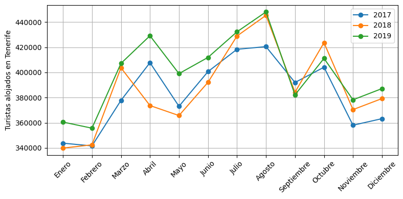
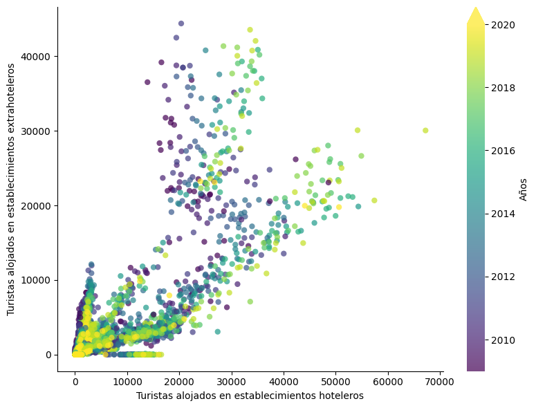
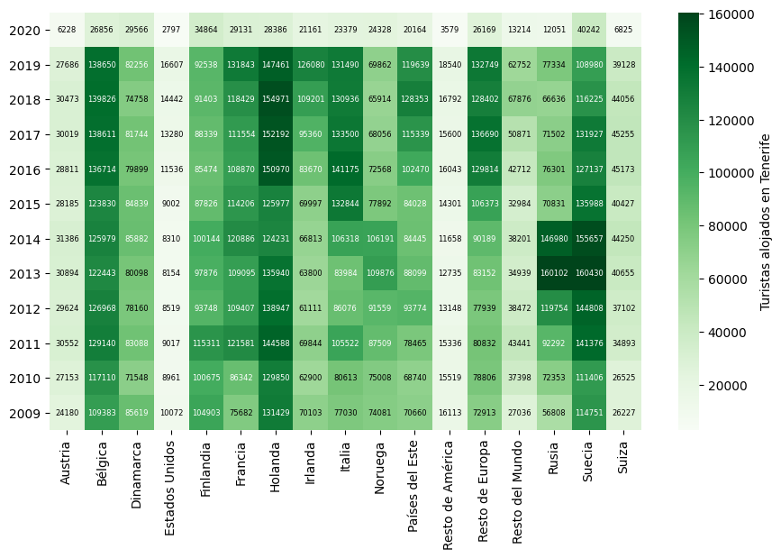
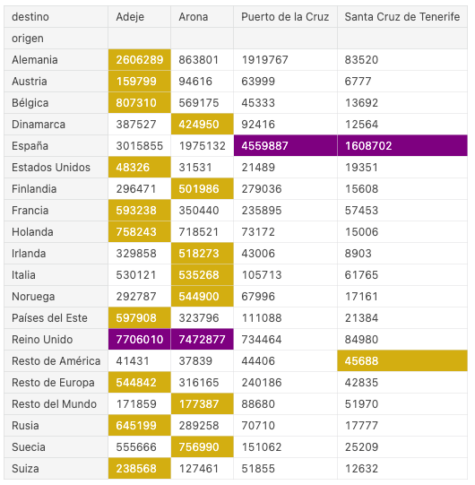

:orphan:

####################
Miniproyecto Turismo
####################

.. image:: img/turismo-tenerife.jpg

El objetivo de este miniproyecto es hacer uso de distintas herramientas de ciencia de datos en Python para **analizar las cifras de turistas alojados en 4 municipios de Tenerife**: Adeje, Arona, Puerto de la Cruz y Santa Cruz de Tenerife.

Vamos a utilizar los siguientes "datasets" de `TenerifeData`_:

- :download:`Turistas alojados en Adeje (2006 - 2020) <files/turistasalojadosadeje.csv>`
- :download:`Turistas alojados en Arona (2006 - 2020) <files/turistasalojadosarona.csv>` 
- :download:`Turistas alojados en Puerto de la Cruz (2009 - 2020) <files/turistasalojadospuertodelacruz.csv>` 
- :download:`Turistas alojados en Santa Cruz de Tenerife (2009 - 2020) <files/turistasalojadossantacruz.csv>` 

*****************
Limpieza de datos
*****************

En primer lugar se pide realizar una serie de actuaciones sobre los "datasets" de cada municipio.

Adeje
=====

- Cargar el "dataset" en formato csv especificando que el delimitador de miles es el punto.
- Añadir una columna "destino" con el valor "Adeje".
- Quedarse sólo con las observaciones con años mayores o iguales que 2009.
- Crear una nueva columna "4 y 5 estrellas" con la suma de las columnas "4 estrellas" y "5 estrellas".
- Eliminar las columnas "4 estrellas" y "5 estrellas".
- Renombrar la columna "hoteles" a "hoteleros" y la columna "nación" a "origen".

Arona
=====

- Cargar el "dataset" en formato csv especificando que el delimitador de miles es el punto.
- Añadir una columna "destino" con el valor "Arona".
- Quedarse sólo con las observaciones con años mayores o iguales que 2009.
- Crear una nueva columna "4 y 5 estrellas" con la suma de las columnas "4 estrellas" y "5 estrellas".
- Eliminar las columnas "4 estrellas" y "5 estrellas".
- Renombrar la columna "nacion" a "origen".
  
Puerto de la Cruz
=================

- Cargar el "dataset" en formato csv especificando que el delimitador de miles es el punto.
- Añadir una columna "destino" con el valor "Puerto de la Cruz".
- Renombrar la columna "nacion" a "origen".

Santa Cruz de Tenerife
======================

- Cargar el "dataset" en formato csv especificando que el delimitador de miles es el punto.
- Añadir una columna "destino" con el valor "Santa Cruz de Tenerife".
- Crear una nueva columna "1 y 2 estrellas" con la suma de las columnas "1 estrella" y "2 estrellas".
- Eliminar las columnas "1 estrella" y "2 estrellas".
- Renombrar la columna "nacion" a "origen".

DataFrame conjunto
==================

Una vez se tengan los 4 DataFrames, se pide concatenarlos todos en uno único y realizar las siguientes actuaciones:

- Eliminar las filas que tengan como "origen" la palabra "TOTAL".
- Eliminar las filas que tengan un mes no comprendido entre 1 y 12.
- Eliminar la columna "total".
- Reordenar las columnas y dejarlas como sigue: *año, mes, origen, destino, 4 y 5 estrellas, 3 estrellas, 1 y 2 estrellas, hoteleros, extrahoteleros*.
- Reemplazar valores en la columna "origen" con estas sustituciones: "Gran Bretaña" por "Reino Unido" y "USA" por "Estados Unidos".
- Recalcular la columna "hoteleros" como la suma de las columnas "4 y 5 estrellas" + "3 estrellas" + "1 y 2 estrellas".
- Crear una nueva columna "total" con la suma de las columnas "hoteleros" y "extrahoteleros".
- Reemplazar los números del 1 al 12 en la columna "mes" por los nombres de los meses "Enero", "Febrero", ..., "Diciembre".
- Convertir la columna "mes" en tipo categórico ordenado.

*****************
Análisis de datos
*****************

Gráfico de evolución de alojamientos totales
============================================

Se pide obtener el siguiente gráfico:

.. note::
    - Tamaño de figura recomendado 800x400 píxeles.
    - Rotación de etiquetas en 45º.
    - Ojo sólo años 2017, 2018 y 2019.

Gráfico de dispersión de tipos de alojamiento
=============================================

Se pide obtener el siguiente gráfico:

.. note::
    - Tamaño de figura recomendado 800x600 píxeles.
    - Valor de transparencia de puntos en 0.7.

Mapa de calor con origen y años
===============================

Se pide obtener el siguiente gráfico:

.. note::
    - Tamaño de figura recomendado 900x600 píxeles.
    - Eliminar Alemania, España y Reino Unido de los posibles orígenes ya que desnivelan demasiado el resto de valores.
    - Mapa de colores "Greens".
    - Tamaño de fuente en valores de celda: 6.
    - Rotación de etiquetas en 90º.

Tabla de distribución de alojamientos origen-destino
====================================================

Se pide obtener la siguiente tabla:

.. note::
    - Usar los mecanismos para definir `estilos de tabla`_ en Pandas.
    - Pintar en amarillo los valores máximos por filas.
    - Pintar en púrpura los valores máximos por columnas.

.. _TenerifeData: https://www.tenerifedata.com/dataset/turistas-alojados-por-municipios
.. _estilos de tabla: https://pandas.pydata.org/pandas-docs/stable/user_guide/style.html#Acting-on-Data
