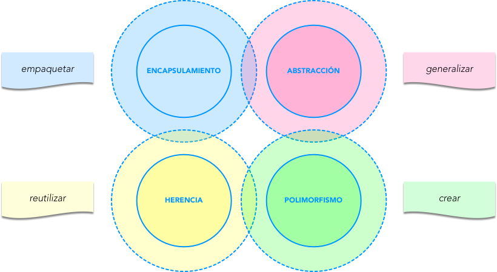
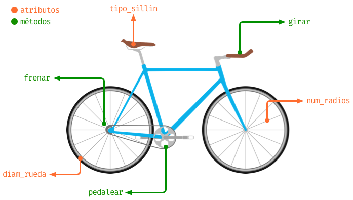
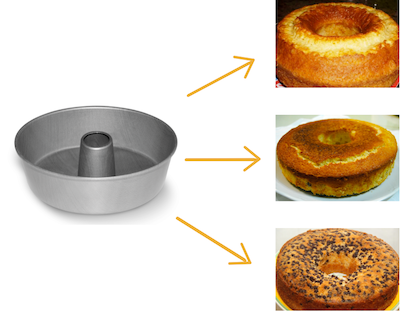
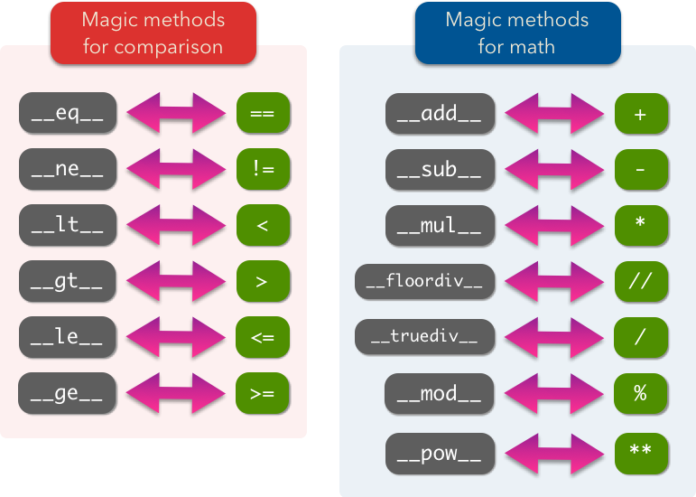
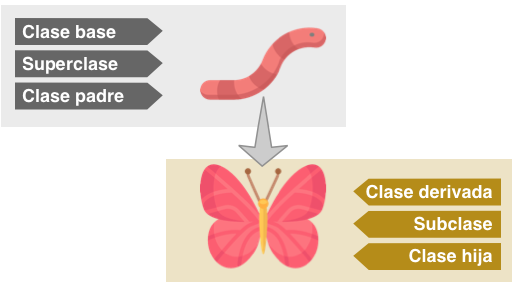
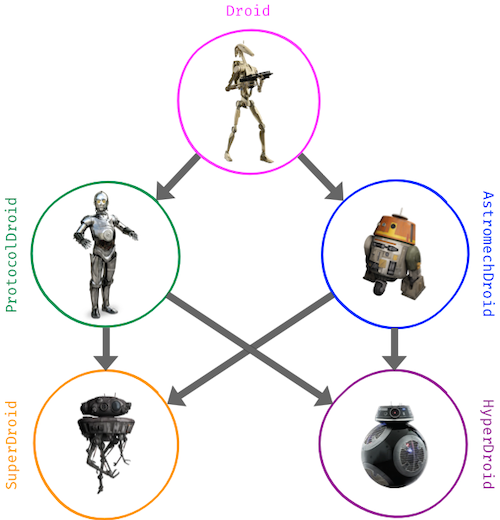
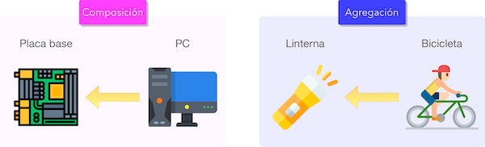

################
Objetos y Clases
################

.. image:: img/rabie-madaci-skx1Rn6LW9I-unsplash.jpg

Hasta ahora hemos estado usando objetos de forma totalmente transparente, casi sin ser conscientes de ello. Pero, en realidad, todo en Python es un objeto, desde números a funciones. El lenguaje provee ciertos mecanismos para no tener que usar explícitamente técnicas de orientación a objetos.

Llegados a este punto, investigaremos en profundidad sobre la creación y manipulación de clases y objetos, y todas las operaciones que engloban este paradigma. [#things-unsplash]_

********************************
Programación orientada a objetos
********************************

La programación orientada a objetos (`POO`_) o en sus siglas inglesas **OOP** es una manera de programar que permite a las personas que desarrollan, pensar como si trabajaran con entidades de la vida real u objetos.

Sus **beneficios** son los siguientes:

**Encapsulamiento**
    Permite **empaquetar** el código dentro de una unidad (objeto) donde se puede determinar el ámbito de actuación.
**Abstracción**
    Permite **generalizar** los tipos de objetos a través de las clases y simplificar el programa.
**Herencia**
    Permite **reutilizar** código al poder heredar atributos y comportamientos de una clase a otra.
**Polimorfismo**
    Permite **crear** múltiples objetos a partir de una misma pieza flexible de código.

   Beneficios de la Programación Orientada a Objetos

¿Qué es un objeto?
==================

Un **objeto** es una **estructura de datos personalizada** que contiene:

**Datos**
    Vienen a ser *variables* con el nombre técnico de **atributos**.
**Código**
    Vienen a ser funciones con el nombre técnico de **métodos**.

Se podría pensar en los **atributos** como **nombres** y en sus **métodos** como **verbos**. Un objeto representa una instancia única de alguna entidad y sus métodos definen cómo interactuan con otros objetos.

   Analogía de atributos y métodos en un objeto "bicicleta"

¿Qué es una clase?
==================

Para crear un objeto primero debemos definir la clase que lo contiene. Podemos pensar en la **clase** como el **molde** con el que crear nuevos objetos de ese tipo.

   Ejemplificación de creación de objetos a partir de una clase

***************
Creando objetos
***************

Empecemos por crear nuestra **primera clase**. En este caso vamos a modelar algunos de los `droides de la saga StarWars`_:

.. figure:: img/starwars-droids.jpg

   Droides de la saga StarWars [#starwars-droids]_

Para ello usaremos la palabra reservada ``class`` seguido del nombre de la clase::

    >>> class StarWarsDroid:
    ...     pass
    ...

.. hint:: Los nombres de clases se suelen escribir en formato ``CamelCase`` y en singular [#pep8]_.

Existen multitud de droides en el universo StarWars. Una vez que hemos definido la clase genérica podemos crear **instancias/objetos** (droides) concretos::

    >>> c3po = StarWarsDroid()
    >>> r2d2 = StarWarsDroid()
    >>> bb8 = StarWarsDroid()

    >>> type(c3po)
    __main__.StarWarsDroid
    >>> type(r2d2)
    __main__.StarWarsDroid
    >>> type(bb8)
    __main__.StarWarsDroid

Añadiendo atributos
===================

Un **atributo** no es más que una variable, un nombre al que asignamos un valor, con la particularidad de vivir dentro de una clase o de un objeto.

Los atributos se pueden asignar durante la creación de un objeto o incluso añadirlos a posteriori::

    >>> blue_droid = StarWarsDroid()
    >>> golden_droid = StarWarsDroid()

    >>> golden_droid.name = 'C-3PO'

    >>> blue_droid.name = 'R2-D2'
    >>> blue_droid.height = 1.09
    >>> blue_droid.num_feet = 3
    >>> blue_droid.partner_droid = golden_droid  # otro droide como atributo

Una vez creados, es muy sencillo acceder a los atributos::

    >>> golden_droid.name
    'C-3PO'

    >>> blue_droid.num_feet
    3

Hemos definido un droide "socio". Veremos a continuación que podemos trabajar con él de una manera totalmente natural::

    >>> type(blue_droid.partner_droid)
    __main__.StarWarsDroid

    >>> blue_droid.partner_droid.name  # acceso al nombre del droide socio
    'C-3PO'

    >>> blue_droid.partner_droid.num_feet  # aún sin definir!
    Traceback (most recent call last):
      File "<stdin>", line 1, in <module>
    AttributeError: 'StarWarsDroid' object has no attribute 'num_feet'

    >>> blue_droid.partner_droid.num_feet = 2

Añadiendo métodos
=================

Un **método** es una función que forma parte de una clase o de un objeto. En su ámbito tiene acceso a otros métodos y atributos de la clase o del objeto al que pertenece.

La definición de un método (de instancia) es análoga a la de una función ordinaria, pero incorporando un primer parámetro ``self`` que hace referencia a la instancia actual del objeto.

Una de las acciones más sencillas que se puede hacer sobre un droide es encenderlo o apagarlo. Vamos a implementar estos dos métodos en nuestra clase::

    >>> class Droid:
    ...     def switch_on(self):
    ...         print("Hi! I'm a droid. Can I help you?")
    ...
    ...     def switch_off(self):
    ...         print("Bye! I'm going to sleep")
    ...

    >>> k2so = Droid()

    >>> k2so.switch_on()
    Hi! I'm a droid. Can I help you?

    >>> k2so.switch_off()
    Bye! I'm going to sleep

Inicialización
==============

Existe un **método especial** que se ejecuta cuando creamos una instancia de un objeto. Este método es ``__init__`` y nos permite asignar atributos y realizar operaciones con el objeto en el momento de su creación. También es ampliamente conocido como el **constructor**. 

Veamos un ejemplo de este método con nuestros droides en el que únicamente guardaremos el nombre del droide como un atributo del objeto:

.. code-block::
    :linenos:

    >>> class Droid:
    ...     def __init__(self, name):
    ...         self.name = name
    ...

    >>> droid = Droid('BB-8')

    >>> droid.name
    'BB-8'

**Línea 2**
    Definición del constructor.
**Línea 7**
    Creación del objeto (y llamada implícita al constructor)
**Línea 9**
    Acceso al atributo ``name`` creado previamente en el constructor.

.. admonition:: Ejercicio
    :class: exercise

    Escriba una clase ``MobilePhone`` que represente un teléfono móvil.

    Atributos:

    - ``manufacturer`` (cadena de texto)
    - ``screen_size`` (flotante)
    - ``num_cores`` (entero)
    - ``apps`` (lista de cadenas de texto)
    - ``status`` (0: apagado, 1: encendido)

    Métodos:

    - ``__init__(self, manufacturer, screen_size, num_cores)``
    - ``power_on(self)``
    - ``power_off(self)``
    - ``install_app(self, app)``
    - ``uninstall_app(self, app)``

    Crear al menos una instancia (móvil) a partir de la clase creada y "jugar" con los métodos, visualizando cómo cambian sus atributos.

*********
Atributos
*********

Acceso directo
==============

En el siguiente ejemplo vemos que, aunque el atributo ``name`` se ha creado en el constructor de la clase, también podemos modificarlo desde "fuera" con un acceso directo::

    >>> class Droid:
    ...     def __init__(self, name):
    ...         self.name = name
    ...

    >>> droid = Droid('C-3PO')

    >>> droid.name
    'C-3PO'

    >>> droid.name = 'waka-waka'  # esto sería válido!

Propiedades
===========

Como hemos visto previamente, los atributos definidos en un objeto son accesibles públicamente. Esto puede parecer extraño a personas desarrolladoras de otros lenguajes. En Python existe un cierto "sentido de responsabilidad" a la hora de programar, para manejar este tipo de situaciones.

Una posible solución "pitónica" para la privacidad de los atributos es el uso de **propiedades**. La forma más común de aplicar propiedades es mediante el uso de :ref:`decoradores <modularity/functions:Decoradores>`:

- ``@property`` para leer el valor de un atributo.
- ``@name.setter`` para escribir el valor de un atributo.

Veamos un ejemplo en el que estamos ofuscando el nombre del droide a través de propiedades::

    >>> class Droid:
    ...     def __init__(self, name):
    ...         self.hidden_name = name
    ...
    ...     @property
    ...     def name(self):
    ...         print('inside the getter')
    ...         return self.hidden_name
    ...
    ...     @name.setter
    ...     def name(self, name):
    ...         print('inside the setter')
    ...         self.hidden_name = name
    ...

    >>> droid = Droid('N1-G3L')

    >>> droid.name
    inside the getter
    'N1-G3L'

    >>> droid.name = 'Nigel'
    inside the setter

    >>> droid.name
    inside the getter
    'Nigel'

En cualquier caso, seguimos pudiendo acceder directamente a ``.hidden_name``::

    >>> droid.hidden_name
    'Nigel'

Valores calculados
------------------

Una propiedad también se puede usar para devolver un **valor calculado** (o computado).

A modo de ejemplo, supongamos que la altura del periscopio de los droides astromecánicos se calcula siempre como un porcentaje de su altura. Veamos cómo implementarlo::

    >>> class AstromechDroid:
    ...     def __init__(self, name, height):
    ...         self.name = name
    ...         self.height = height
    ...
    ...     @property
    ...     def periscope_height(self):
    ...         return 0.3 * self.height
    ...

    >>> droid = AstromechDroid('R2-D2', 1.05)

    >>> droid.periscope_height  # podemos acceder como atributo
    0.315

    >>> droid.periscope_height = 10  # no podemos modificarlo
    Traceback (most recent call last):
      File "<stdin>", line 1, in <module>
    AttributeError: can't set attribute

Ocultando atributos
===================

Python tiene una convención sobre aquellos atributos que queremos hacer **"privados"** (u ocultos): comenzar el nombre con doble subguión ``__``

.. code-block::

    >>> class Droid:
    ...     def __init__(self, name):
    ...         self.__name = name
    ...

    >>> droid = Droid('BC-44')

    >>> droid.__name  # efectivamente no aparece como atributo
    Traceback (most recent call last):
      File "<stdin>", line 1, in <module>
    AttributeError: 'Droid' object has no attribute '__name'

Lo que realmente ocurre tras el telón se conoce como "*name mangling*" y consiste en modificar el nombre del atributo incorporado la clase como un prefijo. Sabiendo esto podemos acceder al valor del atributo supuestamente privado::

    >>> droid._Droid__name
    'BC-44'

Atributos de clase
==================

Podemos asignar atributos a las clases y serán heredados por todos los objetos instanciados de esa clase.

A modo de ejemplo, en un principio, todos los droides están diseñados para que obedezcan a su dueño. Esto lo conseguiremos a nivel de clase, salvo que ese comportamiento se sobreescriba::

    >>> class Droid:
    ...     obeys_owner = True  # obedece a su dueño
    ...

    >>> good_droid = Droid()
    >>> good_droid.obeys_owner
    True

    >>> t1000 = Droid()
    >>> t1000.obeys_owner = False  # T-1000 (Terminator)
    >>> t1000.obeys_owner
    False

    >>> Droid.obeys_owner  # el cambio no afecta a nivel de clase
    True

*******
Métodos
*******

Métodos de instancia
====================

Un **método de instancia** es un método que modifica el comportamiento del objeto al que hace referencia. Recibe ``self`` como primer parámetro, el cual se convierte en el propio objeto sobre el que estamos trabajando. Python envía este argumento de forma transparente.

Veamos un ejemplo en el que, además del constructor, creamos un método de instancia para desplazar un droide:

.. code-block::
    :emphasize-lines: 6

    >>> class Droid:
    ...     def __init__(self, name):  # método de instancia -> constructor
    ...         self.name = name
    ...         self.covered_distance = 0
    ...
    ...     def move_up(self, steps):  # método de instancia
    ...         self.covered_distance += steps
    ...         print(f'Moving {steps} steps')
    ...

    >>> droid = Droid('C1-10P')

    >>> droid.move_up(10)
    Moving 10 steps

Métodos de clase
================

Un **método de clase** es un método que modifica el comportamiento de la clase a la que hace referencia. Recibe ``cls`` como primer parámetro, el cual se convierte en la propia clase sobre la que estamos trabajando. Python envía este argumento de forma transparente. La identificación de estos métodos se completa aplicando el decorador ``@classmethod`` a la función.

Veamos un ejemplo en el que implementaremos un método de clase que lleva la cuenta de los droides que hemos creado:

.. code-block::
    :emphasize-lines: 7,8

    >>> class Droid:
    ...     count = 0
    ...
    ...     def __init__(self):
    ...         Droid.count += 1
    ...
    ...     @classmethod
    ...     def total_droids(cls):
    ...         print(f'{cls.count} droids built so far!')
    ...

    >>> droid1 = Droid()
    >>> droid2 = Droid()
    >>> droid3 = Droid()

    >>> Droid.total_droids()
    3 droids built so far!

Métodos estáticos
=================

Un **método estático** es un método que no modifica el comportamiento del objeto ni de la clase. No recibe ningún parámetro especial. La identificación de estos métodos se completa aplicando el decorador ``@staticmethod`` a la función.

Veamos un ejemplo en el que creamos un método estático para devolver las categorías de droides que existen en StarWars:

.. code-block::
    :emphasize-lines: 5,6

    >>> class Droid:
    ...     def __init__(self):
    ...         pass
    ...
    ...     @staticmethod
    ...     def get_droids_categories():
    ...         return ['Messeger', 'Astromech', 'Power', 'Protocol']
    ...

    >>> Droid.get_droids_categories()
    ['Messeger', 'Astromech', 'Power', 'Protocol']

Métodos mágicos
===============

|advlev|

Cuando escribimos ``'hello' + 'world'`` ¿cómo sabe el objeto ``'hello'`` qué debe hacer para sumarse con la cadena de texto ``'world'``? O dicho de otra forma, ¿cuál es la implementación del operador ``+`` para "strings"? En valores numéricos puede parecer evidente (siguiendo los operadores matemáticos), pero no es así para otros objetos.

La solución que proporciona Python para estas situaciones son los **métodos mágicos**, que permiten implementar operaciones entre objetos. Los métodos mágicos empiezan y terminan por doble subguión ``__`` (es por ello que también se les conoce como "dunder-methods"). Uno de los "dunder-methods" más famosos es el constructor de una clase: ``__init__()``.

Para cada operador, existe un método mágico asociado (que podemos personalizar). Por ejemplo la comparación de dos objetos se realiza con el método ``__eq__()``:

.. figure:: img/magic-methods.png

   Equivalencia entre operador y método mágico

Extrapolando esta idea a nuestro universo StarWars, podríamos establecer que dos droides son iguales si su nombre es igual, independientemente de que tengan distintos números de serie:

.. code-block::
    :emphasize-lines: 6,7

    >>> class Droid:
    ...     def __init__(self, name, serial_number):
    ...         self.serial_number = serial_number
    ...         self.name = name
    ...
    ...     def __eq__(self, droid):
    ...         return self.name == droid.name
    ...

    >>> droid1 = Droid('C-3PO', 43974973242)
    >>> droid2 = Droid('C-3PO', 85094905984)

    >>> droid1 == droid2  # llamada implícita a __eq__
    True

    >>> droid1.__eq__(droid2)
    True

   Métodos mágicos para comparaciones y operaciones matemáticas

.. note:: Los métodos mágicos no sólo están restringidos a operadores de comparación o matemáticos. Existen muchos otros en la documentación oficial de Python, donde son llamados `métodos especiales`_.

Veamos un ejemplo en el que "sumamos" dos droides. Esto se podría ver como una fusión. Supongamos que la suma de dos droides implica: a) que el nombre del droide resultante es la concatenación de los nombres de los droides; b) que la energía del droide resultante es la suma de la energía de los droides::

    >>> class Droid:
    ...     def __init__(self, name, power):
    ...         self.name = name
    ...         self.power = power
    ...
    ...     def __add__(self, droid):
    ...         new_name = self.name + '-' + droid.name
    ...         new_power = self.power + droid.power
    ...         new_droid = Droid(new_name, new_power)
    ...         return new_droid  # Hay que devolver un objeto de tipo Droid
    ...

    >>> droid1 = Droid('C3PO', 45)
    >>> droid2 = Droid('R2D2', 91)

    >>> droid3 = droid1 + droid2

    >>> print(f'Fusion droid:\n{droid3.name} with power {droid3.power}')
    Fusion droid:
    C3PO-R2D2 with power 136

``__str__``
-----------

Uno de los métodos mágicos más utilizados es ``__str__`` que permite establecer la forma en la que un objeto es representado como *cadena de texto*::

    >>> class Droid:
    ...     def __init__(self, name, serial_number):
    ...         self.serial_number = serial_number
    ...         self.name = name
    ...
    ...     def __str__(self):
    ...         return f'🤖 Droid "{self.name}" serial-no {self.serial_number}'
    ...

    >>> droid = Droid('K-2SO', 8403898409432)

    >>> print(droid)  # llamada a droid.__str__()
    🤖 Droid "K-2SO" serial-no 8403898409432

    >>> droid.__str__()
    '🤖 Droid "K-2SO" serial-no 8403898409432'

.. admonition:: Ejercicio
    :class: exercise

    Defina una clase ``Fraction`` que represente una fracción con numerador y denominador enteros y utilice los métodos mágicos para poder sumar, restar, multiplicar y dividir estas fracciones.

    Además de esto, necesitaremos:

    - ``gcd(a, b)`` como **método estático** siguiendo el :download:`algoritmo de Euclides ` para calcular el máximo común divisor entre ``a`` y ``b``.
    - ``__init__(self, num, den)`` para construir una fracción (incluyendo simplificación de sus términos mediante el método ``gcd()``.
    - ``__str__(self)`` para representar una fracción.

    Compruebe que se cumplen las siguientes igualdades:

    .. math::

        \bigg[ \frac{25}{30} + \frac{40}{45} = \frac{31}{18} \bigg] \hspace{5mm}
        \bigg[ \frac{25}{30} - \frac{40}{45} = \frac{-1}{18} \bigg] \hspace{5mm}
        \bigg[ \frac{25}{30} * \frac{40}{45} = \frac{20}{27} \bigg] \hspace{5mm}
        \bigg[ \frac{25}{30} / \frac{40}{45} = \frac{15}{16} \bigg]

********
Herencia
********

|intlev|

La **herencia** consiste en **crear una nueva clase partiendo de una clase existente**, pero que añade o modifica ciertos aspectos. Se considera una buena práctica tanto para *reutilizar código* como para *realizar generalizaciones*.

   Nomenclatura de clases en la herencia [#freepik-icons]_

.. note:: Cuando se utiliza herencia, la clase derivada, de forma automática, puede usar todo el código de la clase base sin necesidad de copiar nada explícitamente.

Heredar desde una clase base
============================

Para que una clase "herede" de otra, basta con indicar la clase base entre paréntesis en la definición de la clase derivada.

Sigamos con el ejemplo. Una de las grandes categorías de droides en StarWars es la de `droides de protocolo`_. Vamos a crear una herencia sobre esta idea::

    >>> # Clase base
    ...
    ... class Droid:
    ...     pass
    ...

    >>> # Clase derivada
    ...
    ... class ProtocolDroid(Droid):
    ...     pass
    ...

    >>> issubclass(ProtocolDroid, Droid)  # comprobación de herencia
    True

    >>> r2d2 = Droid()
    >>> c3po = ProtocolDroid()

Vamos a añadir un par de métodos a la clase base, y analizar su comportamiento::

    >>> class Droid:
    ...     def switch_on(self):
    ...         print("Hi! I'm a droid. Can I help you?")
    ...
    ...     def switch_off(self):
    ...         print("Bye! I'm going to sleep")
    ...

    >>> class ProtocolDroid(Droid):
    ...     pass
    ...

    >>> r2d2 = Droid()
    >>> c3po = ProtocolDroid()

    >>> r2d2.switch_on()
    Hi! I'm a droid. Can I help you?

    >>> c3po.switch_on()  # método heredado de Droid
    Hi! I'm a droid. Can I help you?

    >>> r2d2.switch_off()
    Bye! I'm going to sleep

Sobreescribir un método
=======================

Como hemos visto, una clase derivada hereda todo lo que tiene su clase base. Pero en muchas ocasiones nos interesa modificar el comportamiento de esta herencia.

En el ejemplo vamos a modificar el comportamiento del método ``switch_on()`` para la clase derivada::

    >>> class Droid:
    ...     def switch_on(self):
    ...         print("Hi! I'm a droid. Can I help you?")
    ...
    ...     def switch_off(self):
    ...         print("Bye! I'm going to sleep")
    ...

    >>> class ProtocolDroid(Droid):
    ...     def switch_on(self):
    ...         print("Hi! I'm a PROTOCOL droid. Can I help you?")
    ...

    >>> r2d2 = Droid()
    >>> c3po = ProtocolDroid()

    >>> r2d2.switch_on()
    Hi! I'm a droid. Can I help you?

    >>> c3po.switch_on()  # método heredado pero sobreescrito
    Hi! I'm a PROTOCOL droid. Can I help you?

Añadir un método
================

La clase derivada también puede añadir métodos que no estaban presentes en su clase base. En el siguiente ejemplo vamos a añadir un método ``translate()`` que permita a los *droides de protocolo* traducir cualquier mensaje:

.. code-block::
    :emphasize-lines: 13

    >>> class Droid:
    ...     def switch_on(self):
    ...         print("Hi! I'm a droid. Can I help you?")
    ...
    ...     def switch_off(self):
    ...         print("Bye! I'm going to sleep")
    ...

    >>> class ProtocolDroid(Droid):
    ...     def switch_on(self):
    ...         print("Hi! I'm a PROTOCOL droid. Can I help you?")
    ...
    ...     def translate(self, msg, from_language):
    ...         print(f'{msg} means "ZASCA" in {from_language}')

    >>> r2d2 = Droid()
    >>> c3po = ProtocolDroid()

    >>> c3po.translate('kiitos', 'Huttese')  # idioma de Watoo
    kiitos means "ZASCA" in Huttese

    >>> r2d2.translate('kiitos', 'Huttese')  # droide genérico no puede traducir
    Traceback (most recent call last):
      File "<stdin>", line 1, in <module>
    AttributeError: 'Droid' object has no attribute 'translate'

Con esto ya hemos aportado una personalidad diferente a los droides de protocolo, a pesar de que heredan de la clase genérica de droides de StarWars.

Accediendo a la clase base
==========================

Puede darse la situación en la que tengamos que acceder desde la clase derivada a métodos o atributos de la clase base. Python ofrece ``super()`` como mecanismo para ello.

Veamos un ejemplo más elaborado con nuestros droides:

.. code-block::
    :emphasize-lines: 8

    >>> class Droid:
    ...     def __init__(self, name):
    ...         self.name = name
    ...

    >>> class ProtocolDroid(Droid):
    ...     def __init__(self, name, languages):
    ...         super().__init__(name)  # llamada al constructor de la clase base
    ...         self.languages = languages
    ...

    >>> droid = ProtocolDroid('C-3PO', ['Ewokese', 'Huttese', 'Jawaese'])

    >>> droid.name  # fijado en el constructor de la clase base
    'C-3PO'

    >>> droid.languages  # fijado en el constructor de la clase derivada
    ['Ewokese', 'Huttese', 'Jawaese']    

Herencia múltiple
=================

|advlev|

Aunque no está disponible en todos los lenguajes de programación, Python sí permite que los objetos pueden heredar de **múltiples clases base**.

Si en una clase se hace referencia a un método o atributo que no existe, Python lo buscará en todas sus clases base. Es posible que exista una *colisión* en caso de que el método o el atributo buscado esté, a la vez, en varias clases base. En este caso, Python resuelve el conflicto a través del **orden de resolución de métodos** [#mro]_.

Supongamos que queremos modelar la siguiente estructura de clases con *herencia múltiple*:

    Ejemplo de herencia múltiple [#starwars-fandom]_
   
.. code-block::
    :emphasize-lines: 16,20

    >>> class Droid:
    ...     def greet(self):
    ...         return 'Here a droid'
    ...

    >>> class ProtocolDroid(Droid):
    ...     def greet(self):
    ...         return 'Here a protocol droid'
    ...

    >>> class AstromechDroid(Droid):
    ...     def greet(self):
    ...         return 'Here an astromech droid'
    ...

    >>> class SuperDroid(ProtocolDroid, AstromechDroid):
    ...     pass
    ...

    >>> class HyperDroid(AstromechDroid, ProtocolDroid):
    ...     pass
    

Todas las clases en Python disponen de un método especial llamado ``mro()`` que devuelve una lista de las clases que se visitarían en caso de acceder a un método o un atributo. También existe el atributo ``__mro__`` como una tupla de esas clases::

    >>> SuperDroid.mro()
    [__main__.SuperDroid,
     __main__.ProtocolDroid,
     __main__.AstromechDroid,
     __main__.Droid,
     object]

    >>> HyperDroid.__mro__
    (__main__.HyperDroid,
     __main__.AstromechDroid,
     __main__.ProtocolDroid,
     __main__.Droid,
     object)

Veamos el resultado de la llamada a los métodos definidos::

    >>> super_droid = SuperDroid()
    >>> hyper_droid = HyperDroid()

    >>> super_droid.greet()
    'Here a protocol droid'

    >>> hyper_droid.greet()
    'Here an astromech droid'

.. note:: Todos los objetos en Python heredan, en primera instancia, de ``object``. Esto se puede comprobar con el ``mro()`` correspondiente:

    .. code-block::

        >>> int.mro()
        [int, object]

        >>> str.mro()
        [str, object]

        >>> float.mro()
        [float, object]

        >>> tuple.mro()
        [tuple, object]

        >>> list.mro()
        [list, object]

        >>> bool.mro()
        [bool, int, object]

Mixins
======

Hay situaciones en la que nos interesa incorporar una clase base "independiente" de la jerarquía establecida, y sólo a efectos de **tareas auxiliares**. Esta aproximación podría ayudar a evitar *colisiones* en métodos o atributos reduciendo la ambigüedad que añade la herencia múltiple. Estas clases auxiliares reciben el nombre de **"mixins"**.

Veamos un ejemplo en el que usamos un "mixin" para mostrar las variables de un objeto::

    >>> class Instrospection:
    ...     def dig(self):
    ...         print(vars(self))  ## vars devuelve las variables del argumento
    ...
    ... class Droid(Instrospection):
    ...     pass
    ...

    >>> droid = Droid()

    >>> droid.code = 'DN-LD'
    >>> droid.num_feet = 2
    >>> droid.type = 'Power Droid'

    >>> droid.dig()
    {'code': 'DN-LD', 'num_feet': 2, 'type': 'Power Droid'}

.. admonition:: Ejercicio
    :class: exercise

    Dada la siguiente estructura/herencia que representa diferentes clases de ficheros:

    .. image:: img/files-inheritance.png

    Se pide lo siguiente:

    1. Cree las **3 clases** de la imagen anterior con la herencia señalada.
    2. Cree un objeto de tipo ``VideoFile`` con las siguientes características:

        - ``path``: /home/python/vanrossum.mp4
        - ``codec``: h264
        - ``geoloc``: (23.5454, 31.4343)
        - ``duration``: 487
        - ``dimensions``: (1920, 1080)
    3. Añadir el contenido hello al fichero.
    4. Añadir el contenido world al fichero.
    5. Imprimir por pantalla la ``info()`` de este objeto (el método ``info()`` debería retornar ``str`` y debería hacer uso de los métodos ``info()`` de las clases base).

Agregación y composición
========================

Aunque la herencia de clases nos permite modelar una gran cantidad de casos de uso en términos de "**is-a**" (*es un*), existen muchas otras situaciones en las que la agregación o la composición son una mejor opción. En este caso una clase se compone de otras cases: hablamos de una relación "**has-a**" (*tiene un*).

Hay una sutil diferencia entre agregación y composición:

- La **composición** implica que el objeto utilizado no puede "funcionar" sin la presencia de su propietario
- La **agregación** implica que el objeto utilizado puede funcionar por sí mismo.

   Agregación vs. Composición [#freepik-icons]_

Veamos un ejemplo de **agregación** en el que añadimos una herramienta a un droide::

    >>> class Tool:
    ...     def __init__(self, name):
    ...         self.name = name
    ...
    ...     def __str__(self):
    ...         return self.name.upper()
    ...
    ... class Droid:
    ...     def __init__(self, name, serial_number, tool):
    ...         self.name = name
    ...         self.serial_number = serial_number
    ...         self.tool = tool  # agregación
    ...
    ...     def __str__(self):
    ...         return f'Droid {self.name} armed with a {self.tool}'
    ...

    >>> lighter = Tool('lighter')
    >>> bb8 = Droid('BB-8', 48050989085439, lighter)

    >>> print(bb8)
    Droid BB-8 armed with a LIGHTER

.. rubric:: AMPLIAR CONOCIMIENTOS

- `Supercharge Your Classes With Python super() <https://realpython.com/courses/python-super/>`_
- `Inheritance and Composition: A Python OOP Guide <https://realpython.com/inheritance-composition-python/>`_
- `OOP Method Types in Python: @classmethod vs @staticmethod vs Instance Methods <https://realpython.com/courses/python-method-types/>`_
- `Intro to Object-Oriented Programming (OOP) in Python <https://realpython.com/courses/intro-object-oriented-programming-oop-python/>`_
- `Pythonic OOP String Conversion: __repr__ vs __str__ <https://realpython.com/courses/pythonic-oop-string-conversion-__repr__-vs-__str__/>`_
- `@staticmethod vs @classmethod in Python <https://realpython.com/courses/staticmethod-vs-classmethod-python/>`_
- `Modeling Polymorphism in Django With Python <https://realpython.com/modeling-polymorphism-django-python/>`_
- `Operator and Function Overloading in Custom Python Classes <https://realpython.com/operator-function-overloading/>`_
- `Object-Oriented Programming (OOP) in Python 3 <https://realpython.com/python3-object-oriented-programming/>`_

.. --------------- Footnotes ---------------

.. [#things-unsplash] Foto original por `Rabie Madaci`_ en Unsplash.
.. [#starwars-droids] Fuente de la imagen: `Astro Mech Droids`_.
.. [#pep8] Guía de estilos `PEP8 <https://www.python.org/dev/peps/pep-0008/#class-names>`__ para convenciones de nombres.
.. [#mro] Viene del inglés "method resolution order" o ``mro``.
.. [#starwars-fandom] Imágenes de los droides por `StarWars Fandom`_.
.. [#freepik-icons] Iconos por `Freepik`_.

.. --------------- Hyperlinks ---------------

.. _Rabie Madaci: https://unsplash.com/@rbmadaci?utm_source=unsplash&utm_medium=referral&utm_content=creditCopyText
.. _POO: https://es.wikipedia.org/wiki/Programaci%C3%B3n_orientada_a_objetos
.. _droides de la saga Starwars: https://en.wikipedia.org/wiki/Droid_(Star_Wars)
.. _Astro Mech Droids: https://www.facebook.com/astromechdroids/
.. _droides de protocolo: https://starwars.fandom.com/wiki/Category:Protocol_droids
.. _StarWars Fandom: https://starwars.fandom.com/
.. _métodos especiales: https://docs.python.org/3/reference/datamodel.html#special-method-names
.. _Freepik: https://www.flaticon.com/authors/freepik
