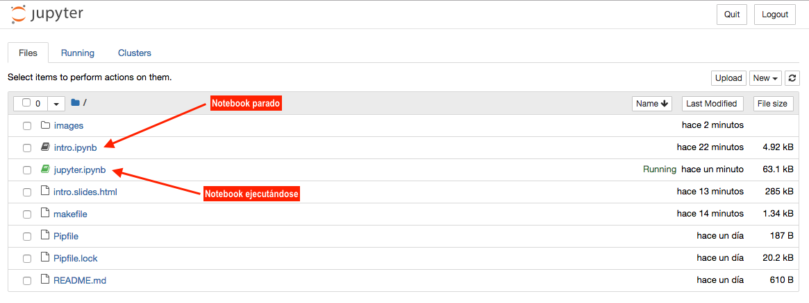
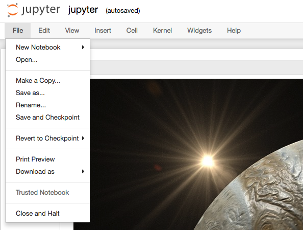
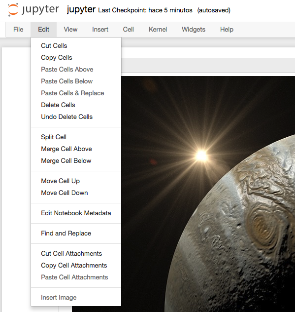
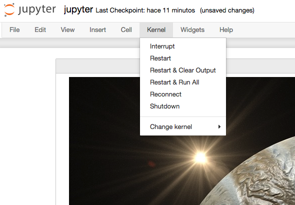
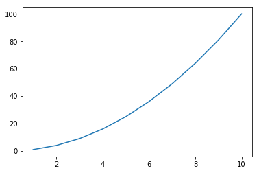

#######
jupyter
#######

El módulo `jupyter <https://jupyter.org/>`__ proporciona un entorno de desarrollo integrado para ciencia de datos, que no es exclusivo de Python, sino que además admite otros lenguajes en su "backend". [#jupiter-unsplash]_

.. code-block:: console

    $ pip install jupyter

Para lanzar el servidor de "notebooks"[#notebooks-note]_:

.. code-block:: console

    $ jupyter notebook

.. note:: Este comando nos debería abrir una ventana en el navegador web por defecto del sistema, apuntando a la dirección http://localhost:8888

*********
Notebooks
*********

Un "notebook" es un documento que está compuesto por **celdas** en las que podemos incluir:

- Texto en formato `markdown`_ (incluyendo fórmulas).
- Elementos multimedia.
- Código Python *ejecutable*.

Los "notebooks" son archivos con extensión ``.ipynb`` (proviene de "IPython Notebook").

********
Interfaz
********

Jupyter se presenta como una aplicación web en cuya interfaz podemos encontrar distintos elementos que nos permitirán desarrollar nuestras tareas de programación de una forma más cómoda.

Explorador de archivos
======================

Lo primero que veremos al arrancar el servidor de "notebooks" será el **explorador de archivos** con un diseño muy similar al de cualquier sistema operativo.

    Explorador de archivos de Jupyter Notebook

.. note:: Los "notebooks" que se están ejecutando suelen tener un color verde en el icono, mientras que los que están parados aparecen en gris.

Barra de menú
=============

Menú Fichero
------------

Del estilo de los menús tradicionales de aplicaciones, aquí podemos encontrar las principales funciones sobre ficheros.

    Menú Fichero de Jupyter Notebook

Checkpoints:
    Permiten guardar el estado del "notebook" en un momento determinado para luego poder revertirlo a ese momento del tiempo.

Exportar notebooks:
    Es posible exportar "notebooks" a una gran variedad de formatos:

    - Python (``.py``)
    - HTML (``.html``)
    - Reveal.js "slides" (``.html``)
    - Markdown (``.md``)
    - reST (``.rst``)
    - PDF vía LaTeX (``.pdf``)
    - asciidoc (``.asciidoc``)
    - custom (``.txt``)
    - LaTeX (``.tex``)

.. admonition:: Ejercicio
    :class: exercise

    Cree un "notebook" de prueba y descárgelo en formato **HTML** y **Markdown**.

Menú Edición
------------

Este menú contiene las acciones que podemos realizar sobre una o varias celdas.

    Menú Edición de Jupyter Notebook

Las funciones las podríamos agrupar en **gestión de celdas** (cortar, pegar, borrar, dividir, unir, mover, etc.) e **inserción de imágenes** seleccionando desde un cuadro de diálogo.

Menú Vista
----------

Permite modificar el aspecto visual de determinados elementos de la aplicación.

    Menú Vista de Jupyter Notebook

Números de línea:
    Puede resultar interesante mostrar los números de línea en celdas que contengan código.
    
Modo presentación (Cell Toolbar ▶️  Slideshow) :
    Jupyter Notebook ofrece la posibilidad de crear una presentación sobre el documento en el que estamos trabajando. Cada celda se puede configurar con alguno de los siguientes tipos:

    - Slide.
    - Subslide.
    - Fragment.
    - Skip.
    - Notes.

Etiquetas (Cell Toolbar ▶️  Tags):
    Es interesante -- entre otras -- el uso de la etiqueta ``raises-exception`` ya que nos permite ejecutar todas las celdas de un "notebook" sin que el sistema se detenga por errores en la celda etiquetada, ya que estamos informando que lanzará una :ref:`excepción <core/modularity/exceptions:Excepciones>`.

Menú Insertar
-------------

Insertar celda antes o después de la actual.

.. figure:: img/jupyter-insert-menu.png
    :align: center

    Menú Insertar de Jupyter Notebook

Menú Celda
----------

Principalmente enfocado a la ejecución de las celdas que componen el "notebook".

.. figure:: img/jupyter-cell-menu.png
    :align: center

    Menú Celda de Jupyter Notebook

Ejecución de celdas:
    La ejecución de celdas se puede hacer de forma individual o grupal así como indicando el punto de partida (celda actual).

Tipo de celdas:
    - **Code**: para incluir código (se podrá ejecutar el lenguaje de programación según el "kernel" instalado).
    - **Markdown**: para escribir texto utilizando sintaxis `markdown`_.
    - **Raw**: estas celdas no serán formateadas.

Salida de celdas:
    La ejecución de las celdas de código tiene (suele tener) una salida. Esta salida se puede ocultar (si interesa). Incluso tenemos control sobre activar o desactivar el "scroll" en caso de que la salida sea muy larga.

Menú Kernel
-----------

Permite gestionar el servicio que se encarga de lanzar los "notebooks".

    Menú Kernel de Jupyter Notebook

El **kernel** es la capa de software que se encarga de ejecutar las celdas de nuestro "notebook" que contienen código. Podemos tener instalados distintos "kernels" para un mismo Jupyter Notebook. El kernel se puede interrumpir o reiniciar.

Hay veces, que debido a un error de programación o a procesos muy largos, podemos encontrarnos con el "kernel" bloqueado durante un largo período de tiempo. En estas ocasiones es útil reiniciarlo para salvar esa situación.

.. figure:: img/jupyter-busy-kernel.png
    :align: center

    Kernel ocupado

Menú Ayuda
----------

Como cualquier aplicación, existe un menú de ayuda en el que se pueden encontrar enlaces a referencias y manuales.

.. figure:: img/jupyter-help-menu.png
    :align: center

    Menú Ayuda de Jupyter Notebook

Uno de los elementos más interesantes de la ayuda es el uso de los "shortcuts" [#shortcut]_. Aunque hay muchos, dejamos aquí algunos de los más útiles:

+-------------------+-----------------------------------------------------+
|     Shortcut      |                       Acción                        |
+===================+=====================================================+
| ``SHIFT + ENTER`` | Ejecutar la celda actual                            |
+-------------------+-----------------------------------------------------+
| ``ALT + ENTER``   | Ejecutar la celda actual y "abrir" una celda debajo |
+-------------------+-----------------------------------------------------+
| a                 | Abrir una celda encima de la actual ("above")       |
+-------------------+-----------------------------------------------------+
| b                 | Abrir una celda debajo de la actual ("below")       |
+-------------------+-----------------------------------------------------+
| m                 | Convertir la celda actual a Markdown                |
+-------------------+-----------------------------------------------------+
| y                 | Convertir la celda actual a código                  |
+-------------------+-----------------------------------------------------+
| dd                | Borrar la celda actual                              |
+-------------------+-----------------------------------------------------+

*******
MathJax
*******

`MathJax <https://www.mathjax.org/>`__ es una biblioteca javascript que permite visualizar fórmulas matemáticas en navegadores web, utilizando (entre otros) el lenguajes de marcado `LaTeX`_. Para escribir fórmulas matemáticas la celda debe ser de tipo Markdown y tendremos que usar delimitadores especiales.

Fórmulas "en línea":
    Se debe usar el delimitador dólar antes y después de la expresión ``$ ... $``

    Por ejemplo: ``$ \sum_{x=1}^n sin(x) + cos(x) $`` produce ::math:`\sum_{x=1}^n sin(x) + cos(x)`

Fórmulas "de bloque":
    Se debe usar el delimitador doble dólar antes y después de la expresión ``$$ ... $$``

    Por ejemplo: ``$$ \sum_{x=1}^n sin(x) + cos(x) $$`` produce:

    .. math::

        \sum_{x=1}^n sin(x) + cos(x)

Ejemplos de fórmulas
====================

A continuación veremos distintas fórmulas inspiradas en `Motivating Examples`_ de la documentación oficial de Jupyter Notebook. Nótese que aunque no se estén indicando los delimitadores ``$$`` sí habría que ponerlos para conseguir el efecto deseado.

Ecuaciones en varias líneas:

.. code-block:: latex

    \dot{x} = \sigma(y-x) \\
    \dot{y} = \rho x - y - xz \\
    \dot{z} = -\beta z + xy

.. math::

    \dot{x} = \sigma(y-x) \\
    \dot{y} = \rho x - y - xz \\
    \dot{z} = -\beta z + xy

Ecuaciones en varias líneas (con alineación):

.. code-block:: latex

    \begin{align}
        \dot{x} &= \sigma(y-x) \\
        \dot{y} &= \rho x - y - xz \\
        \dot{z} &= -\beta z + xy
    \end{align}

.. math::

    \dot{x} &= \sigma(y-x) \\
    \dot{y} &= \rho x - y - xz \\
    \dot{z} &= -\beta z + xy

Usando paréntesis:

.. code-block:: latex

    \left( \sum_{k=1}^n a_k b_k \right)^2 \leq
    \left( \sum_{k=1}^n a_k^2 \right) \left( \sum_{k=1}^n b_k^2 \right)

.. math::

    \left( \sum_{k=1}^n a_k b_k \right)^2 \leq
    \left( \sum_{k=1}^n a_k^2 \right) \left( \sum_{k=1}^n b_k^2 \right)

Trabajando con matrices:

.. code-block:: latex

    \mathbf{V}_1 \times \mathbf{V}_2 =
    \begin{vmatrix}
        \mathbf{i} & \mathbf{j} & \mathbf{k} \\
        \frac{\partial X}{\partial u} &  \frac{\partial Y}{\partial u} & 0 \\
        \frac{\partial X}{\partial v} &  \frac{\partial Y}{\partial v} & 0
    \end{vmatrix}

.. math::

    \mathbf{V}_1 \times \mathbf{V}_2 =
    \begin{vmatrix}
        \mathbf{i} & \mathbf{j} & \mathbf{k} \\
        \frac{\partial X}{\partial u} &  \frac{\partial Y}{\partial u} & 0 \\
        \frac{\partial X}{\partial v} &  \frac{\partial Y}{\partial v} & 0
    \end{vmatrix}

Algo de probabilidad:

.. code-block:: latex

    P(E) = {n \choose k} p^k (1-p)^{ n-k}

.. math::

    P(E) = {n \choose k} p^k (1-p)^{ n-k}

Algunos ejemplos con fracciones:

.. code-block:: latex

    \frac{1}{\Bigl(\sqrt{\phi \sqrt{5}}-\phi\Bigr) e^{\frac25 \pi}} =
    1+\frac{e^{-2\pi}} {1+\frac{e^{-4\pi}} {1+\frac{e^{-6\pi}}
    {1+\frac{e^{-8\pi}} {1+\ldots} } } }

.. math::

    \frac{1}{\Bigl(\sqrt{\phi \sqrt{5}}-\phi\Bigr) e^{\frac25 \pi}} =
    1+\frac{e^{-2\pi}} {1+\frac{e^{-4\pi}} {1+\frac{e^{-6\pi}}
    {1+\frac{e^{-8\pi}} {1+\ldots} } } }

.. code-block:: latex

    1 +  \frac{q^2}{(1-q)}+\frac{q^6}{(1-q)(1-q^2)}+\cdots =
    \prod_{j=0}^{\infty}\frac{1}{(1-q^{5j+2})(1-q^{5j+3})},
    \quad\quad \text{for $|q|<1$}.

.. math::

    1 +  \frac{q^2}{(1-q)}+\frac{q^6}{(1-q)(1-q^2)}+\cdots =
    \prod_{j=0}^{\infty}\frac{1}{(1-q^{5j+2})(1-q^{5j+3})},
    \quad\quad \text{for $|q|<1$}.

Múltiples puntos de alineación:

.. code-block:: latex

    \begin{eqnarray}
        x' &=&   &x \sin\phi &+& z \cos\phi \\
        z' &=& - &x \cos\phi &+& z \sin\phi
    \end{eqnarray}

.. math::
    :nowrap:

    \[
        \begin{array}{ccccccc}
            x' &=&   &x \sin\phi &+& z \cos\phi \\
            z' &=& - &x \cos\phi &+& z \sin\phi
        \end{array}
    \]

.. admonition:: Ejercicio
    :class: exercise

    Escriba en MathJax las siguientes ecuaciones:

    **Ecuación 1**
    
    .. math::
    
        \int_a^b f'(x)dx = f(b) - f(a)
    
    **Ecuación 2**
    
    .. math::
    
        t' = t \frac{1}{\sqrt{1 - \frac{v^2}{c^2}}}
    
    **Ecuación 3**

    .. math::
    
        \Big[
            M \frac{\partial}{\partial M} +
            \beta(g) \frac{\partial}{\partial g} +
            \eta \gamma
        \Big]
        G^n(x_1, x_2, \dots, x_n; M, g) = 0

    **Ecuación 4**

    .. math::

        R_{00} \approx
            -\frac{1}{2}
            \sum_i
            \frac{\partial^2 h_{00}}{\partial(x^i)^2}
            =
            \frac{4\pi G}{c^2}
            (\rho c^2)
            \Rightarrow
            \bigtriangledown^2 \phi_g
            =
            4\pi G \rho
    
    .. tip:: Puede encontrar símbolos matemáticos para Latex `en este enlace <https://www.caam.rice.edu/~heinken/latex/symbols.pdf>`_ así como dibujar directamente un símbolo y obtener su referencia a través de la herramienta `Detexify`_.

    .. only:: html
    
        |solution| :download:`equations.tex <files/equations.tex>`

*******************
Comandos especiales
*******************    

Jupyter Notebook ofrece una gama de comandos especiales que cubren gran variedad de funcionalidades.

Comandos de shell
=================

Podemos ejecutar comandos de "shell" usando el prefijo exclamación ``!``

.. code-block::

    >>> !date
    martes, 15 de junio de 2021, 09:13:25 WEST

.. code-block::

    >>> !whoami
    sdelquin

.. admonition:: Ejercicio
    :class: exercise

    Ejecute los siguientes comandos del sistema y obtenga la salida en una celda del Notebook:

    +----------+---------------+
    | Windows  | Linux & macOS |
    +==========+===============+
    | ``time`` | ``date``      |
    +----------+---------------+
    | ``dir``  | ``ls``        |
    +----------+---------------+
    | ``mem``  | ``free``      |
    +----------+---------------+

Obteniendo ayuda
================

Una de las formas más sencillas de obtener información de librerías, funciones o módulos es utilizar el sufijo interrogación ``?``

.. code-block::
    :emphasize-lines: 3

    >>> import random

    >>> random.randint?
    Signature: random.randint(a, b)
    Docstring:
    Return random integer in range [a, b], including both end points.

    File:      ~/.pyenv/versions/3.9.1/lib/python3.9/random.py
    Type:      method

.. admonition:: Ejercicio
    :class: exercise

    Obtenga la documentación de las siguientes funciones:

    - ``os.path.dirname``
    - ``re.match``
    - ``datetime.timedelta``

Comandos mágicos
================

Jupyter Notebook, o mejor expresado `IPython`_, admite un conjunto de `comandos mágicos`_ que permiten realizar distintas tareas, en muchos casos, no necesariamente relacionadas con Python::

    >>> %lsmagic
    Available line magics:
    %aimport  %alias  %alias_magic  %autoawait  %autocall  %autoindent  %automagic  %autoreload  %bookmark  %cat  %cd  %clear  %colors  %conda  %config  %cp  %cpaste  %debug  %dhist  %dirs  %doctest_mode  %ed  %edit  %env  %gui  %hist  %history  %killbgscripts  %ldir  %less  %lf  %lk  %ll  %load  %load_ext  %loadpy  %logoff  %logon  %logstart  %logstate  %logstop  %ls  %lsmagic  %lx  %macro  %magic  %man  %matplotlib  %mkdir  %more  %mv  %notebook  %page  %paste  %pastebin  %pdb  %pdef  %pdoc  %pfile  %pinfo  %pinfo2  %pip  %popd  %pprint  %precision  %prun  %psearch  %psource  %pushd  %pwd  %pycat  %pylab  %quickref  %recall  %rehashx  %reload_ext  %rep  %rerun  %reset  %reset_selective  %rm  %rmdir  %run  %save  %sc  %set_env  %store  %sx  %system  %tb  %time  %timeit  %unalias  %unload_ext  %who  %who_ls  %whos  %xdel  %xmode

    Available cell magics:
    %%!  %%HTML  %%SVG  %%bash  %%capture  %%debug  %%file  %%html  %%javascript  %%js  %%latex  %%markdown  %%perl  %%prun  %%pypy  %%python  %%python2  %%python3  %%ruby  %%script  %%sh  %%svg  %%sx  %%system  %%time  %%timeit  %%writefile

    Automagic is ON, % prefix IS NOT needed for line magics.

Si nos fijamos en el último mensaje, al estar habilitado el modo "automagic", no es estrictamente necesario que usemos el prefijo ``%`` para hacer uso de estos comandos. Por ejemplo, si quisiéramos conocer la *historia de comandos* en el intérprete::

    >>> hist  # equivalente a %hist
    !date
    import random
    random.randint?
    %lsmagic
    pwd
    hist

Representando gráficas
----------------------

Otra de las grandes ventajas que ofrece Jupyter Notebook es poder graficar directamente sobre el cuaderno. Para ello utilizamos código Python (en este caso) y una directiva de comando mágico para indicar que se renderice en línea::

    >>> %matplotlib inline

    >>> from matplotlib import pyplot as plt

    >>> x = [1, 2, 3, 4, 5, 6, 7, 8, 9, 10]
    >>> y = [1, 4, 9, 16, 25, 36, 49, 64, 81, 100]

    >>> plt.plot(x, y)
    [<matplotlib.lines.Line2D at 0x106414e50>]
    <Figure size 432x288 with 1 Axes>

    Gráfica sencilla hecha en Jupyter Notebook

Manejando ficheros
------------------

Cargando un fichero en la celda actual:
    Para ello utilizamos el comando ``%load "ruta/al/fichero"``

Ejecutando un fichero en la celda actual:
    Para ello utilizamos el comando ``%run "ruta/al/fichero"``

Escribiendo el contenido de la celda actual a fichero:
    Para ello utilizamos el comando ``%writefile "ruta/al/fichero"`` como **primera línea de la celda** y después vendría el código que queremos escribir.

.. admonition:: Ejercicio
    :class: exercise

    - En una celda del "notebook", escriba código Python para crear una lista de 100 números pares.
    - Guarde el contenido de esa celda un fichero Python usando ``%%writefile``
    - Carge este fichero en una celda con ``%load``
    - Ejecútelo con ``%run``

Tiempos de ejecución
--------------------

Para medir el tiempo de ejecución de una determinada instrucción Python podemos utilizar el comando ``%timeit`` que calcula un promedio tras correr repetidas veces el código indicado::

    >>> import numpy

    >>> %timeit numpy.random.normal(size=100)
    3.03 µs ± 6.77 ns per loop (mean ± std. dev. of 7 runs, 100000 loops each)

De igual forma, existe un mecanismo para medir el tiempo de ejecución de una celda completa. En este caso se utiliza el comando ``%%timeit`` (nótese la diferencia del doble porcentaje como prefijo)::

    %%timeit

    numpy.random.poisson(size=100)
    numpy.random.uniform(size=100)
    numpy.random.logistic(size=100)

    8.88 µs ± 25.8 ns per loop (mean ± std. dev. of 7 runs, 100000 loops each)

.. admonition:: Ejercicio
    :class: exercise

    Mida si hay diferencias significativas en tiempos de ejecución en la creación de distribuciones aleatorias atendiendo a:

    - Tipo de distribución (*Poisson*, *Uniform*, *Logistic*).
    - Tamaño de la muestra (100, 10000, 1000000).

    .. only:: html
    
        |solution| :download:`timeit.py <files/timeit.py>`

Incluyendo otros lenguajes
--------------------------

Celdas con HTML:
    Si necesitamos insertar código HTML en una celda, podemos usar el comando ``%%html`` al comienzo de la misma::

        %%html

        <iframe src="https://www.google.com/maps/embed?pb=!1m18!1m12!1m3!1d3592984.8538165656!2d-18.096789575396794!3d28.426067294993228!2m3!1f0!2f0!3f0!3m2!1i1024!2i768!4f13.1!3m3!1m2!1s0xc41aa86ef755363%3A0x10340f3be4bc8c0!2sCanarias!5e0!3m2!1ses!2ses!4v1623755509663!5m2!1ses!2ses" width="400" height="300" style="border:0;" allowfullscreen="" loading="lazy"></iframe>

    .. figure:: img/canaryislands-googlemaps.png
        :align: center
        
Celdas con "shell script":
    Hay ocasiones en las que un código en `shell script`_ suele ser útil. Para incluirlo recurrimos al comando ``%%bash`` al principio de la celda::

        %%bash

        !tree -d -L 2
        .
        ├── __pycache__
        ├── _build
        │   └── html
        ├── _static
        │   ├── css
        │   ├── img
        │   └── js
        ├── core
        │   ├── controlflow
        │   ├── datastructures
        │   ├── datatypes
        │   ├── devenv
        │   ├── introduction
        │   └── modularity
        ├── miniprojects
        │   └── spotify
        ├── pypi
        │   └── datascience
        └── stdlib
            └── text_processing

        20 directories
           
Celdas con perl:
    No hay que subestimar el poder del lenguaje de programación `perl`_. Si fuera necesario, lo podemos incluir en una celda del "notebook" con ``%%perl`` al comienzo de la misma::

        %%perl

        my $email = 'sdelquin@gmail.com';

        if ($email =~ /^([^@]+)\@(.+)$/) {
            print "Username is: $1\n";
            print "Hostname is: $2\n";
        }

        ...

        Username is: sdelquin
        Hostname is: gmail.com

***********
Extensiones
***********

El ecosistema de Jupyter Notebook es muy amplio y ofrece una gran variedad de extensiones que se pueden incluir en la instalación que tengamos: `Unofficial Jupyter Notebook Extensions`_.

Su instalación es tan sencilla como:

.. code-block:: console

    $ pip install jupyter_contrib_nbextensions

.. --------------- Footnotes ---------------

.. [#jupiter-unsplash] Foto original de portada por `NASA`_ en Unsplash.
.. [#notebooks-note] Un "notebook" es el concepto de cuaderno (documento) científico que se maneja en Jupyter
.. [#shortcut] Un "shortcut" es un "atajo de teclado" (combinación de teclas) para lanzar una determinada acción.

.. --------------- Hyperlinks ---------------

.. _NASA: https://unsplash.com/@nasa?utm_source=unsplash&utm_medium=referral&utm_content=creditCopyText
.. _markdown: https://markdown.es/sintaxis-markdown/
.. _Latex: https://es.overleaf.com/learn/latex/Mathematical_expressions
.. _Motivating Examples: https://jupyter-notebook.readthedocs.io/en/latest/examples/Notebook/Typesetting%20Equations.html#Motivating-Examples
.. _Detexify: http://detexify.kirelabs.org/classify.html
.. _IPython: https://ipython.org/
.. _comandos mágicos: https://ipython.readthedocs.io/en/stable/interactive/magics.html
.. _shell script: http://trajano.us.es/~fjfj/shell/shellscript.htm
.. _perl: https://perlenespanol.com/
.. _Unofficial Jupyter Notebook Extensions: https://jupyter-contrib-nbextensions.readthedocs.io/en/latest/
