##########
matplotlib
##########

.. image:: img/customerbox-O6qSPPWezLI-unsplash.jpg

`matplotlib <https://matplotlib.org/>`__ es el paquete Python más utilizado en el ámbito de la ciencia de datos para representaciones gráficas. [#drawing-unsplash]_

.. code-block:: console

    $ pip install matplotlib

La forma más común de importar esta librería es usar el alias ``plt`` de la siguiente manera::

    >>> import matplotlib.pyplot as plt

.. important:: Si bien podemos utilizar matplotlib en el intérprete habitual de Python, suele ser muy frecuente trabajar con esta librería mediante entornos :ref:`Jupyter <pypi/datascience/jupyter:Jupyter>`, ya que facilitan la visualización de los gráficos en su interfaz de usuario.

******
Figura
******

La `figura <https://matplotlib.org/stable/gallery/showcase/anatomy.html>`__ es el elemento base sobre el que se construyen todos los gráficos en matplotlib. Veamos cómo crearla::

    >>> fig = plt.figure()

    >>> type(fig)
    matplotlib.figure.Figure

    >>> fig
    <Figure size 640x480 with 0 Axes>

Podemos observar que la resolución (por defecto) de la figura es de 640x480 píxeles y que no dispone de ningún eje ("0 Axes").

.. important:: El término "axes" hace referencia a un conjunto de ejes. Puede resultar confuso en español y he decidido asignar el nombre **marco** cuando haga referencia a "axes".

La resolución final de una figura viene determinada por su altura (``height``) y anchura (``width``) especificadas en pulgadas [#inches]_ que, a su vez, se multiplican por los puntos por pulgada o ``dpi``. Veamos el funcionamiento::

    >>> fig
    <Figure size 640x480 with 0 Axes>

    >>> fig.get_figwidth()   # pulgadas
    6.4
    >>> fig.get_figheight()  # pulgadas
    4.8
    >>> fig.get_dpi()        # dots per inch
    100.0

    >>> fig.get_figwidth() * fig.dpi, fig.get_figheight() * fig.dpi
    (640.0, 480.0)

.. important:: Si utilizamos entornos de desarollo basados en `Jupyter`_, los valores por defecto son distintos:

    - Ancho de figura: 6 in
    - Alto de figura: 4 in
    - DPI: 75
    - Resolución: 450x300 px

Por tanto, cuando creamos una figura podemos modificar los parámetros por defecto para obtener la resolución deseada::

    >>> fig = plt.figure(figsize=(19.2, 10.8))  # 100 dpi
    >>> fig
    <Figure size 1920x1080 with 0 Axes>

    >>> fig = plt.figure(figsize=(19.2, 10.8), dpi=300)
    >>> fig
    <Figure size 5760x3240 with 0 Axes>

Si nos interesa que cualquier figura tome unos valores concretos de resolución, podemos modificar los **valores por defecto del entorno**. Para ello, matplotlib hace uso de un diccionario ``plt.rcParams`` que contiene los parámetros globales de configuración. Veamos cómo modificarlo:

.. code-block::
    :emphasize-lines: 6-7

    >>> plt.rcParams['figure.figsize']
    [6.4, 4.8]
    >>> plt.rcParams['figure.dpi']
    100.0

    >>> plt.rcParams['figure.figsize'] = (10, 5)
    >>> plt.rcParams['figure.dpi'] = 300           # res. final: 3000x1500 px

    >>> fig.get_figwidth()
    10.0
    >>> fig.get_figheight()
    5.0
    >>> fig.dpi
    300.0

******
Marcos
******

Para poder empezar a graficar necesitamos tener, al menos, un marco. Utilizaremos la función ``add_subplot()`` que requiere pasar como parámetros el número de filas, el número de columnas y el marco activo:

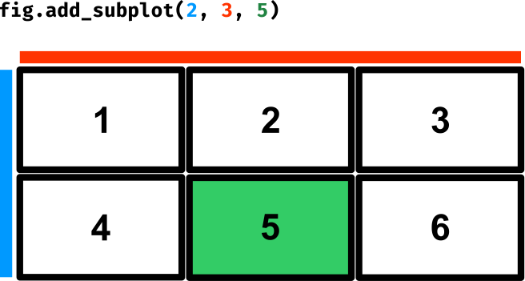

    Creación de marcos dentro de una figura

Para comenzar vamos a trabajar únicamente con un marco::

    >>> fig = plt.figure()

    >>> ax = fig.add_subplot(1, 1, 1)  # equivalente a fig.add_subplot(111)

    >>> ax
    <AxesSubplot:>

    >>> fig
    <Figure size 640x480 with 1 Axes>

.. tip:: Suele ser habitual encontrar ``ax`` como nombre de variable del "axes" devuelto por la función ``add_subplot()``.

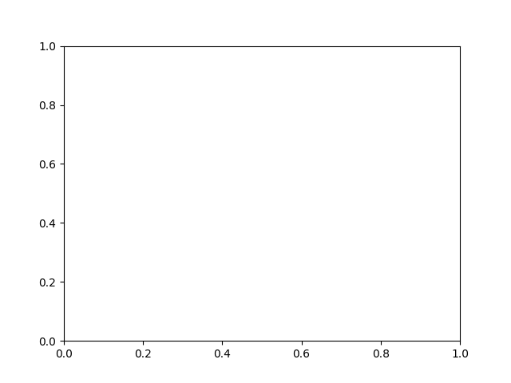

.. note:: La escala por defecto de cada eje va de 0 a 1 con marcas cada 0.2

Ahora vamos a generar 4 marcos sobre los que fijaremos un título identificativo::

    >>> fig = plt.figure()

    >>> for i in range(1, 5):
    ...     ax = fig.add_subplot(2, 2, i)
    ...     ax.set_title(f'Subplot {i}')

    >>> fig.tight_layout(pad=1)  # sólo para que no se solapen los títulos

    >>> fig
    <Figure size 640x480 with 4 Axes>

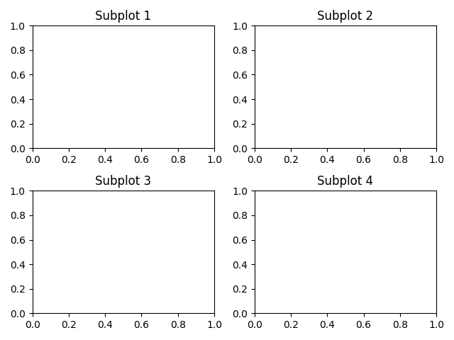

Atajo para subgráficos
======================

Matplotlib nos ofrece una forma compacta de crear a la vez tanto la **figura** como los **marcos** que necesitemos.

Para ello utilizaremos la función ``plt.subplots()`` que recibe como parámetros el *número de filas* y el *número de columnas* para la disposición de los marcos, y devuelve una tupla con la figura y los marcos.

En el siguiente ejemplo creamos **una figura con un único marco**::

    >>> fig, ax = plt.subplots(1, 1)

    >>> fig
    <Figure size 640x480 with 1 Axes>

    >>> ax
    <AxesSubplot:>

.. tip:: Si invocamos la función ``plt.subplots()`` sin parámetros, creará (por defecto) un único marco.

En el siguiente ejemplo creamos **una figura con 6 marcos** en disposición de 2 filas por 3 columnas::

    >>> fig, ax = plt.subplots(2, 3)

    >>> fig
    <Figure size 640x480 with 6 Axes>

    >>> ax
    array([[<AxesSubplot:>, <AxesSubplot:>, <AxesSubplot:>],
           [<AxesSubplot:>, <AxesSubplot:>, <AxesSubplot:>]], dtype=object)

    >>> ax.shape
    (2, 3)

.. note:: Se podría ver la función ``subplots()`` como una combinación de ``figure()`` + ``add_subplot()``.

Etiquetas
=========

Dentro de un marco también es posible fijar las etiquetas de los ejes (X e Y). Veamos cómo hacerlo::

    >>> fig, ax = plt.subplots()

    >>> ax.set_title('Gráfico en blanco')
    Text(0.5, 1.0, 'Gráfico en blanco')

    >>> ax.set_xlabel('Etiqueta para el eje X')
    Text(0.5, 0, 'Etiqueta para el eje X')

    >>> ax.set_ylabel('Etiqueta para el eje Y')
    Text(0, 0.5, 'Etiqueta para el eje Y')

    >>> fig
    <Figure size 640x480 with 1 Axes>

.. image:: img/axis-labels.png

Ejes
====

Un marco (2D) está compuesto por dos ejes: eje X e eje Y. Podemos acceder a cada eje mediante sendos atributos::

    >>> ax.xaxis
    <matplotlib.axis.XAxis at 0x112b34100>

    >>> ax.yaxis
    <matplotlib.axis.YAxis at 0x112b34850>

Rejilla
-------

En cada eje podemos activar o desactivar la rejilla, así como indicar su estilo.

En primer lugar vamos a activar la rejilla en ambos ejes::

    >>> ax.xaxis.grid(True)
    >>> ax.yaxis.grid(True)

Esto sería equivalente a::

    >>> ax.grid(True)

Y obtendríamos una figura con la rejilla (por defecto):

.. image:: img/default-grid.png

.. tip:: Las funciones de matplotlib que actúan como "interruptores" tienen por defecto el valor verdadero. En este sentido ``ax.grid()`` invocada sin parámetros hace que se muestre la rejilla. Esto se puede aplicar a muchas otras funciones.

Supongamos ahora que queremos personalizar la rejilla con **estilos diferentes en cada eje**::

    >>> ax.xaxis.grid(color='r', linestyle='-')  # equivale a color='red',  linestyle='solid'
    >>> ax.yaxis.grid(color='b', linestyle='-')  # equivale a color='blue', linestyle='solid'

.. image:: img/bluered-grid.png

- `Parámetros disponibles para creación del grid`_.
- `Listado de nombres de colores en matplotlib`_.
- `Estilos de línea en matplotlib`_.

Marcas
------

Por defecto, los ejes del marco tienen unas marcas [#axes-ticks]_ equiespaciadas que constituyen las *marcas mayores*. Igualmente existen unas *marcas menores* que, a priori, no están activadas.

Ambos elementos son susceptibles de modificarse. Veamos un ejemplo en el que establecemos las **marcas menores con distinto espaciado en cada eje** y además le damos un estilo diferente a cada rejilla::

    >>> from matplotlib.ticker import MultipleLocator

    >>> ax.xaxis.set_minor_locator(MultipleLocator(0.1))   # X: separación cada 0.1 unidades
    >>> ax.yaxis.set_minor_locator(MultipleLocator(0.05))  # Y: separación cada 0.05 unidades

    >>> ax.xaxis.grid(which='minor', linestyle='dashed', color='gray')
    >>> ax.yaxis.grid(which='minor', linestyle='dashed', color='lightskyblue')

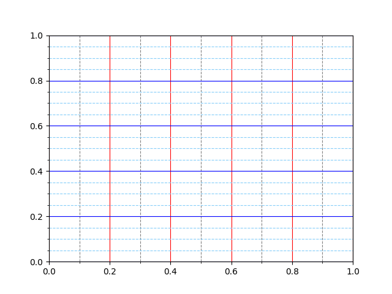

También es posible asignar etiquetas a las marcas menores. En ese sentido, veremos un ejemplo en el que incorporamos los **valores a los ejes con estilos propios**:

- Marcas menores en el eje X: precisión de 1 decimal, tamaño de letra 8 y color gris.
- Marcas menores en el eje Y: precisión de 2 decimales, tamaño de letra 8 y color azul.

.. code-block::

    >>> # Eje X
    >>> ax.xaxis.set_minor_formatter('{x:.1f}')
    >>> ax.tick_params(axis='x', which='minor', labelsize=8, labelcolor='gray')

    >>> # Eje Y
    >>> ax.yaxis.set_minor_formatter('{x:.2f}')
    >>> ax.tick_params(axis='y', which='minor', labelsize=8, labelcolor='lightskyblue')

.. image:: img/label-ticks.png

**************
Primeros pasos
**************

Vamos a empezar por representar la función :math:`f(x) = sin(x)`. Para ello crearemos una variable :math:`x` con valores flotantes equidistantes y una variable :math:`y` aplicando la función senoidal. Nos apoyamos en :ref:`numpy <pypi/datascience/numpy:numpy>` para ello. A continuación usaremos la función ``plot()`` del marco para representar la función creada::

    >>> x = np.linspace(0, 2 * np.pi)
    >>> y = np.sin(x)

    >>> fig, ax = plt.subplots()
    >>> ax.plot(x, y)
    [<matplotlib.lines.Line2D at 0x120914040>]

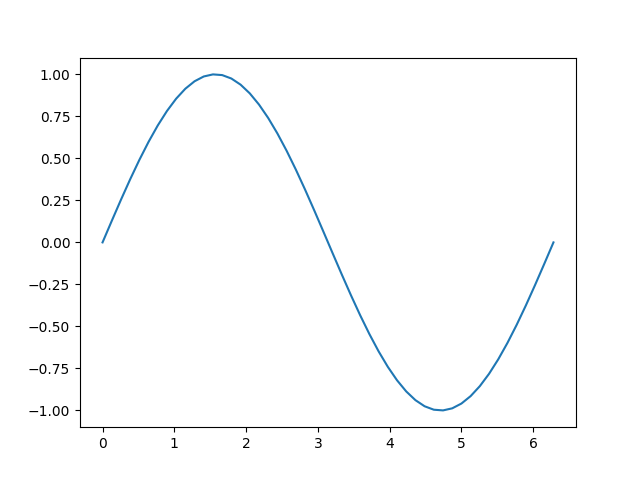

Múltiples funciones
===================

Partiendo de un mismo marco, es posible graficar todas las funciones que necesitemos. A continuación crearemos un marco con las funciones seno y coseno::

    >>> x = np.linspace(0, 2 * np.pi)
    >>> sin = np.sin(x)
    >>> cos = np.cos(x)

    >>> fig, ax = plt.subplots()

    >>> ax.plot(x, sin)
    [<matplotlib.lines.Line2D at 0x1247b6310>]

    >>> ax.plot(x, cos)
    [<matplotlib.lines.Line2D at 0x112b0d4c0>]

.. image:: img/plot-sincos.png

.. note:: Los colores "auto" asignados a las funciones siguen un `ciclo establecido por matplotlib`_ que es igualmente personalizable.

Leyenda
=======

En el caso de que tengamos múltiples gráficos en el mismo marco puede ser deseable mostrar una leyenda identificativa. Para usarla necesitamos asignar etiquetas a cada función. Veamos a continuación cómo incorporar una leyenda::

    >>> ax.plot(x, sin, label='sin')
    [<matplotlib.lines.Line2D at 0x124e07ac0>]

    >>> ax.plot(x, cos, label='cos')
    [<matplotlib.lines.Line2D at 0x123c58f10>]

    >>> ax.legend()
    <matplotlib.legend.Legend at 0x123c8f190>

.. image:: img/plot-legend.png

Es posible incorporar sintaxis `Latex`_ en los distintos elementos textuales de matplotlib. En el siguiente ejemplo usaremos esta notación en las etiquetas de las funciones utilizando el símbolo ``$ ... $`` para ello::

    >>> ax.plot(x, sin, label='$f_1(x) = sin(x)$')
    [<matplotlib.lines.Line2D at 0x11682f3a0>]

    >>> ax.plot(x, cos, label='$f_2(x) = cos(x)$')
    [<matplotlib.lines.Line2D at 0x11682b3a0>]

.. image:: img/latex-legend.png

Ubicación de la leyenda
-----------------------

Matplotlib intenta encontrar la **mejor ubicación** para la leyenda en el marco. Sin embargo, también es posible `personalizar el lugar en el que queremos colocarla <https://matplotlib.org/stable/api/_as_gen/matplotlib.pyplot.legend.html>`_.

Si nos interesa situar la leyenda en la **parte superior central** del marco haríamos lo siguiente::

    >>> ax.legend(loc='upper center')
    <matplotlib.legend.Legend at 0x1167d43a0>

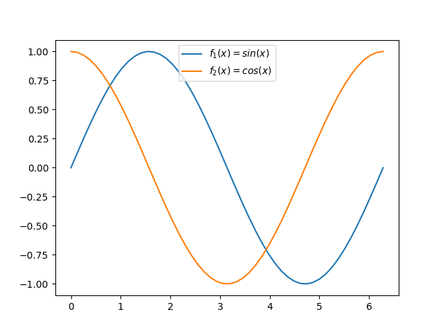

Aplicando estilos
=================

Para cada función que incluimos en el marco es posible establecer un `estilo personalizado con multitud de parámetros <https://matplotlib.org/stable/api/_as_gen/matplotlib.pyplot.plot.html>`_. Veamos la aplicación de algunos de estos parámetros a las funciones seno y coseno con las que hemos estado trabajando::

    >>> sin_style = dict(linewidth=3, color='darkorange')
    >>> cos_style = dict(marker='o', markerfacecolor='limegreen', color='darkgreen')

    >>> ax.plot(x, sin, label='$f_1(x) = sin(x)$', **sin_style)
    [<matplotlib.lines.Line2D at 0x1131e9fd0>]
    >>> ax.plot(x, cos, label='$f_2(x) = cos(x)$', **cos_style)
    [<matplotlib.lines.Line2D at 0x1226d76d0>]

.. image:: img/plot-styles.png

Acotando ejes
=============

Hay veces que nos interesa definir los límites de los ejes. En ese caso, podemos hacerlo de una manera muy sencilla::

    >>> ax.set_xlim(0, np.pi / 2)
    >>> ax.set_ylim(0, 1)

    >>> ax.grid()  # sólo a efectos estéticos

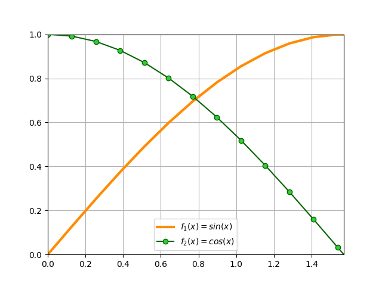

.. tip:: También es posible especificar únicamente límite inferior o superior en ambas funciones ``set_xlim()`` y ``set_ylim()``. En ese caso, el otro valor sería ajustado automáticamente por matplotlib.

Anotaciones
===========

En ocasiones necesitamos añadir `ciertas anotaciones al gráfico <https://matplotlib.org/stable/tutorials/text/annotations.html>`_ que estamos diseñando. Esto permite destacar áreas o detalles que pueden ser relevantes.

Partiendo de las funciones seno y coseno con las que hemos estado trabajando, vamos a suponer que **queremos obtener sus puntos de corte**, es decir, `resolver la siguiente ecuación <https://www.mathway.com/popular-problems/Precalculus/435071>`_:

.. math::

    sin(x) &= cos(x)\\
    &\Downarrow\\
    x &= \frac{\pi}{4} + \pi n, \ n \in \mathbb{Z}

Para el caso que nos ocupa haríamos :math:`n=0` con lo que obtendríamos la siguiente solución::

    >>> xsol = np.pi / 4 + np.pi * 0
    >>> ysol = np.sin(xsol)

    >>> xsol, ysol
    (0.7853981633974483, 0.7071067811865475)

Vamos a insertar una serie de anotaciones en el gráfico:

- Flecha en el punto de corte con etiqueta de ecuación.
- Coordenadas de solución en el punto de corte.
- Proyección del punto de corte hacia ambos ejes.

.. code-block::

    >>> ax.annotate('$sin(x) = cos(x)$',
    ...             xy=(xsol, ysol),
    ...             xytext=(1.2, 0.8),
    ...             arrowprops=dict(facecolor='black', shrink=0.05))

    >>> ax.text(0.47, 0.72, f'({xsol:.2f}, {ysol:.2f})')

    >>> ax.plot([xsol, xsol], [0, ysol], color='gray', linestyle='--')
    >>> ax.plot([0, xsol], [ysol, ysol], color='gray', linestyle='--')

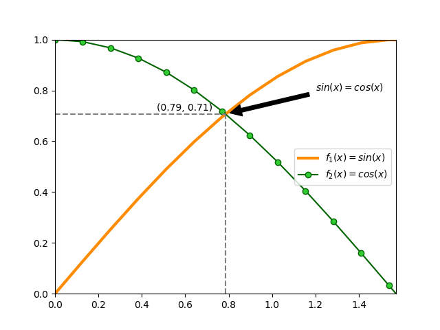

.. admonition:: Ejercicio
    :class: exercise

    Escriba el código Python necesario para obtener el siguiente gráfico:

    .. image:: img/soften-wave.png
    
    Datos:

    - :math:`x \in [0, 2\pi]` (1000 puntos)
    - :math:`y = e^{-\alpha x} sin(\beta x)`, donde :math:`\alpha=0.7` y :math:`\beta=10`.

    Solución: :download:`soften_wave.py <files/soften_wave.py>`

*****************
Tipos de gráficos
*****************

Mediante matplotlib podemos hacer `prácticamente cualquier tipo de gráfico <https://matplotlib.org/stable/gallery/index.html>`_. En esta sección haremos un repaso por algunos de ellos.

Gráficos de barras
==================

Vamos a partir de un "dataset" que contiene los resultados de los `Juegos Olímpicos de Tokio 2020`_. Hemos descargado el fichero :download:`medals.xlsx <files/medals.xlsx>` desde `una página de Kaggle <https://www.kaggle.com/arjunprasadsarkhel/2021-olympics-in-tokyo/version/7?select=Medals.xlsx>`_ [#kaggle]_.

En primer lugar cargaremos este fichero en un DataFrame y haremos una pequeña "limpieza"::

    >>> df = pd.read_excel('pypi/datascience/files/medals.xlsx')

    >>> df.head()
    Rank                       Team/NOC  Gold  Silver  Bronze  Total  Rank by Total
    0     1    United States of America    39      41      33    113              1
    1     2  People's Republic of China    38      32      18     88              2
    2     3                       Japan    27      14      17     58              5
    3     4               Great Britain    22      21      22     65              4
    4     5                         ROC    20      28      23     71              3

    >>> df.rename(columns={'Team/NOC': 'Country'}, inplace=True)
    >>> df.set_index('Country', inplace=True)

    >>> df.head()
                                Rank  Gold  Silver  Bronze  Total  Rank by Total
    Country
    United States of America       1    39      41      33    113              1
    People's Republic of China     2    38      32      18     88              2
    Japan                          3    27      14      17     58              5
    Great Britain                  4    22      21      22     65              4
    ROC                            5    20      28      23     71              3

.. important:: Para la carga de ficheros Excel, es necesario instalar un paquete adicional denominado ``openpyxl``.

A continuación crearemos un **gráfico de barras con las medallas de oro, plata y bronce de los 10 primeros países ordenados por su ranking**. Lo primero será crear el subconjunto de datos sobre el que vamos a trabajar. Hay muchas maneras de hacerlo. Una de ellas::

    >>> df_best = df.nsmallest(10, 'Rank')

    >>> df_best
                                Rank  Gold  Silver  Bronze  Total  Rank by Total
    Country
    United States of America       1    39      41      33    113              1
    People's Republic of China     2    38      32      18     88              2
    Japan                          3    27      14      17     58              5
    Great Britain                  4    22      21      22     65              4
    ROC                            5    20      28      23     71              3
    Australia                      6    17       7      22     46              6
    Netherlands                    7    10      12      14     36              9
    France                         8    10      12      11     33             10
    Germany                        9    10      11      16     37              8
    Italy                         10    10      10      20     40              7

Ahora ya podemos centrarnos en el diseño del gráfico de barras::

    >>> fig, ax = plt.subplots(figsize=(8, 5), dpi=100)  # 800x500 px

    >>> bar_width = 0.30
    >>> x = np.arange(df_best.index.size)

    >>> golden_medals = ax.bar(x - bar_width, df_best['Gold'],
    ...                        bar_width, label='Oro', color='#ffd700')
    >>> silver_medals = ax.bar(x, df_best['Silver'],
    ...                        bar_width, label='Plata', color='#aaa9ad')
    >>> bronze_medals = ax.bar(x + bar_width, df_best['Bronze'],
    ...                        bar_width, label='Bronce', color='#cd7f32')

    >>> ax.set_xticks(x)
    >>> ax.set_xticklabels(df_best.index, rotation=90)
    >>> ax.legend()

    >>> # Etiquetas en barras
    >>> ax.bar_label(golden_medals, padding=3)
    >>> ax.bar_label(silver_medals, padding=3)
    >>> ax.bar_label(bronze_medals, padding=3)

    >>> ax.spines['right'].set_visible(False)  # ocultar borde derecho
    >>> ax.spines['top'].set_visible(False)    # ocultar borde superior

    >>> fig.tight_layout()  # ajustar elementos al tamaño de la figura
    >>> fig

.. image:: img/gbar-plot.png

.. admonition:: Ejercicio
    :class: exercise

    Partiendo del fichero :download:`tiobe-2020-clean.csv <files/tiobe-2020-clean.csv>` que contiene las valoraciones de los lenguajes de programación más usados durante el año 2020 (según el índice `TIOBE`_) [#kaggle-tiobe]_, cree el siguiente gráfico de barras:

    .. image:: img/barplot-tiobe.png

    Solución: :download:`tiobe_2020.py <files/tiobe_2020.py>`

Gráficos de dispersión
======================

Para este gráfico vamos a usar un "dataset" de jugadores de la NBA [#nba]_ extraído desde `esta página de Kaggle <https://www.kaggle.com/justinas/nba-players-data>`__. El fichero :download:`nba-data.csv <files/nba-data.csv>` contiene información desde 1996 hasta 2019.

En primer lugar cargamos los datos y nos quedamos con un subconjunto de las columnas::

    >>> df = pd.read_csv('pypi/datascience/files/nba-data.csv', usecols=['pts', 'reb', 'ast'])

    >>> df.head()
       pts  reb  ast
    0  4.8  4.5  0.5
    1  0.3  0.8  0.0
    2  4.5  1.6  0.9
    3  7.8  4.4  1.4
    4  3.7  1.6  0.5

    >>> df.shape
    (11700, 3)

El objetivo es crear un **gráfico de dispersión en el relacionaremos los puntos anotados con los rebotes capturados, así como las asistencias dadas**::

    >>> fig, ax = plt.subplots(figsize=(8, 6), dpi=100)  # 800x600 px

    >>> # Crear variables auxiliares
    >>> x = df['pts']
    >>> y = df['reb']
    >>> colors = df['ast']

    >>> p = ax.scatter(x, y,
    ...                s=30,  # tamaño de los puntos
    ...                c=colors, cmap='RdBu_r',  # colores
    ...                vmin=colors.min(), vmax=colors.max(),  # normalización de colores
    ...                alpha=0.7,
    ...                edgecolors='none')

    >>> # Barra de colores
    >>> cb = fig.colorbar(p, ax=ax, label='Asistencias', extend='max')
    >>> cb.outline.set_visible(False)

    >>> ax.set_xlabel('Puntos')
    >>> ax.set_ylabel('Rebotes')

    >>> ax.spines['right'].set_visible(False)
    >>> ax.spines['top'].set_visible(False)

    >>> fig.tight_layout()

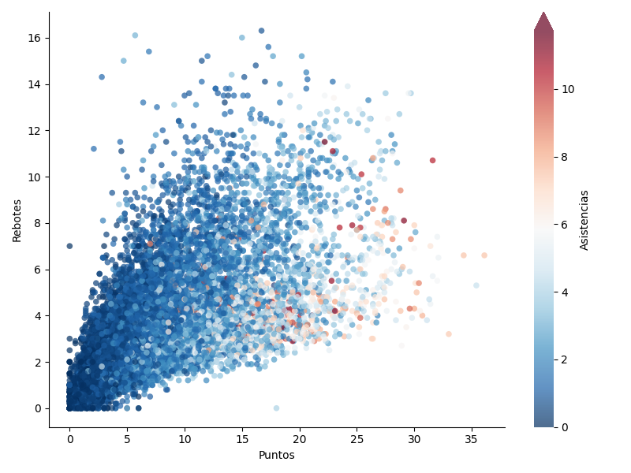

Del gráfico anterior cabe destacar varios aspectos:

- **Normalización**: Cuando aplicamos una estética de color al gráfico basada en los datos de una variable, debemos normalizar dicha variable en el `mapa de color ("colormap")`_ que elijamos. Para ello, matplotlib nos ofrece la `normalización de mapas de color`_. En el caso concreto de ``scatter()`` pasaríamos esta normalización mediante el parámetro ``norm`` pero también podemos usar los parámetros ``vmin`` y ``vmax``.
- **Barra de color**: Se trata de una leyenda particular en la que mostramos el gradiente de color vinculado a una determinada estética/variable del gráfico. Matplotlib también nos permite personalizar estas `barras de color`_.

.. admonition:: Ejercicio
    :class: exercise

    Partiendo del fichero :download:`bmw-clean.csv <files/bmw-clean.csv>` que contiene información sobre vehículos de la marca BMW [#kaggle-bmw]_, cree el siguiente gráfico de dispersión:

    .. image:: img/scatter-bmw.png

    El mapa de color que se ha usado es ``plasma_r``.

    Solución: :download:`bmw_plot.py <files/bmw_plot.py>`

Histogramas
===========

En esta ocasión vamos a trabajar con un "dataset" de "Avengers" [#avengers]_ extraído desde `Kaggle <https://www.kaggle.com/mysarahmadbhat/avengers-marvel>`__. Hemos descargado el fichero :download:`avengers.csv <files/avengers.csv>`.

Como punto de partida vamos a cargar la información y a quedarnos únicamente con la columna que hace referencia al año en el que se crearon los personajes::

    >>> df = pd.read_csv('pypi/datascience/files/avengers.csv', usecols=['Year'])

    >>> df.head()
    Year
    0  1963
    1  1963
    2  1963
    3  1963
    4  1963

    >>> df.shape
    (173, 1)

Igualmente haremos un pequeño filtrado para manejar sólo registros a partir de 1960::

    >>> df = df[df['Year'] >= 1960]

    >>> df.shape
    (159, 1)

Ahora ya podemos construir el histograma, que va a representar las **frecuencias absolutas de creación de personajes Marvel según su año de creación**.

Aunque es posible indicar un número determinado de contenedores ("bins"), en este caso vamos a especificar directamente los intervalos (cada 5 años)::

    >>> df['Year'].min(), df['Year'].max()
    (1963, 2015)

    >>> bins = range(1960, 2021, 5)

Y a continuación el código necesario para montar el gráfico::

    >>> fig, ax = plt.subplots(figsize=(8, 4), dpi=100)  # 800x400 px

    >>> ax.hist(df,
    ...         bins=bins,     # intervalos de agrupación
    ...         rwidth=0.95,   # ancho de cada barra
    ...         zorder=2,      # barras por encima de rejilla
    ...         color='deeppink',
    ...         alpha=0.5)

    >>> ax.spines['right'].set_visible(False)
    >>> ax.spines['top'].set_visible(False)

    >>> ax.set_xticks(bins)  # etiquetas de intervalos en el eje x
    >>> ax.yaxis.grid(color='lightgray', linestyle='--')  # rejilla

    >>> fig.tight_layout()

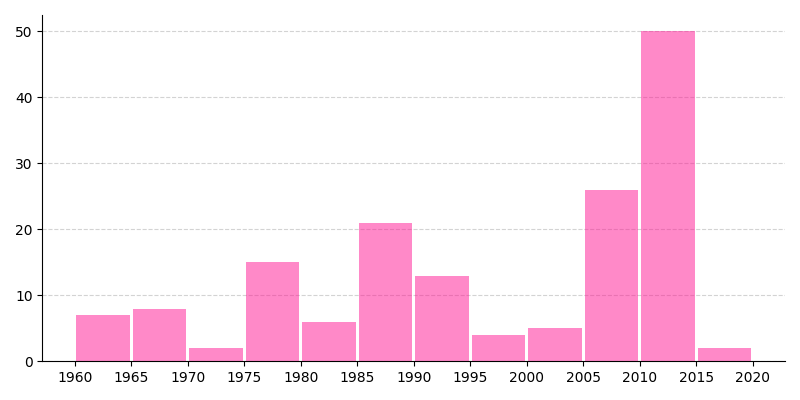

Descargo de responsabilidad: Técnicamente este gráfico no es un histograma ya que los años (fechas en general) no representan categorías válidas, pero sirve a efectos demostrativos de cómo se construyen este tipo de diagramas.

.. admonition:: Ejercicio
    :class: exercise

    Partiendo del fichero :download:`pokemon.csv <files/pokemon.csv>` que contiene información sobre `Pokemon`_ [#kaggle-pokemon]_, cree el siguiente histograma en el que se analiza el número de personajes "pokemons" en función de su velocidad (columna *Speed*):

    .. image:: img/hist-pokemon-speed.png

    Solución: :download:`pokemon_speed.py <files/pokemon_speed.py>`

Gráficos para series temporales
===============================

Vamos a trabajar con un conjunto de datos extraído desde `esta página de Kaggle <https://www.kaggle.com/berkeleyearth/climate-change-earth-surface-temperature-data?select=GlobalTemperatures.csv>`__ que contiene información histórica de temperaturas del planeta Tierra. El fichero :download:`global-temperatures.csv <files/global-temperatures.csv>` se ha descargado para su tratamiento.

En primer lugar cargamos los datos, renombramos las columnas y eliminamos los valores nulos::

    >>> df = pd.read_csv('pypi/datascience/files/global-temperatures.csv',
    ...                  parse_dates=['dt'],  # conversión a tipo datetime
    ...                  usecols=['dt', 'LandAverageTemperature'])

    >>> df.rename(columns={'dt': 'when', 'LandAverageTemperature': 'temp'}, inplace=True)
    >>> df.dropna(inplace=True)

    >>> df.head()
            when    temp
    0 1750-01-01   3.034
    1 1750-02-01   3.083
    2 1750-03-01   5.626
    3 1750-04-01   8.490
    4 1750-05-01  11.573

    >>> df.shape
    (3180, 2)

A continuación montamos un gráfico en el que se representan todas las **mediciones históricas de la temperatura media global del planeta** y añadimos una línea de tendencia::

    >>> # Necesitamos algunas utilidades de gestión de fechas
    >>> from matplotlib.dates import YearLocator, DateFormatter, date2num
    >>> from matplotlib.ticker import MultipleLocator

    >>> fig, ax = plt.subplots(figsize=(8, 4), dpi=100)  # 800x400 px

    >>> # Alias para simplificar el acceso
    >>> x = df.when
    >>> y = df.temp

    >>> ax.plot(x, y,
    ...         linestyle='None', marker='.', color='tomato',  # estilo de línea
    ...         zorder=2)  # orden para colocar sobre rejilla

    >>> # Construcción de la línea de tendencia
    >>> x = date2num(x)
    >>> z = np.polyfit(x, y, 2)  # ajuste polinómico de grado 2
    >>> p = np.poly1d(z)
    >>> plt.plot(x, p(x), linewidth=4, alpha=0.8, color='royalblue')

    >>> # Formateo de los ejes
    >>> ax.xaxis.set_minor_locator(YearLocator(10))
    >>> ax.xaxis.set_minor_formatter(DateFormatter('%Y'))
    >>> ax.tick_params(axis='x', which='minor',
    ...                labelsize=8, labelcolor='lightgray', rotation=90)
    >>> ax.xaxis.grid(which='minor', color='lightgray', linestyle='dashed')
    >>> ax.yaxis.set_major_formatter('{x:.0f}º')
    >>> ax.yaxis.set_minor_locator(MultipleLocator(1))
    >>> ax.tick_params(axis='y', which='minor',
    ...                labelsize=8, labelcolor='lightgray')
    >>> ax.yaxis.grid(which='minor', linestyle='dashed', color='lightgray')
    >>> ax.yaxis.set_minor_formatter('{x:.0f}')
    >>> ax.tick_params(axis='y', which='minor', labelsize=8, labelcolor='lightgray')

    >>> ax.spines['right'].set_visible(False)
    >>> ax.spines['top'].set_visible(False)

    >>> fig.tight_layout()

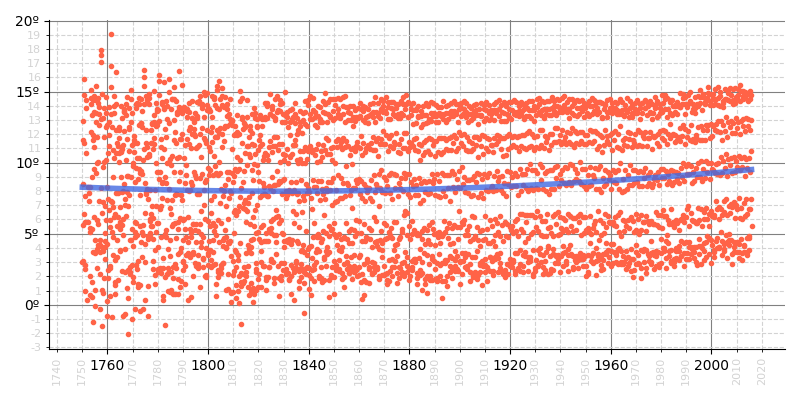

Mapas de calor
==============

Para este tipo de gráfico vamos a utilizar un "dataset" que recoge las 1000 películas más valoradas en IMDB [#imdb-info]_. Está sacado desde `esta página de Kaggle <https://www.kaggle.com/harshitshankhdhar/imdb-dataset-of-top-1000-movies-and-tv-shows>`__ y se ha descargado el fichero de datos en :download:`imdb-top-1000.csv <files/imdb-top-1000.csv>`.

En primer lugar vamos a cargar los datos quedándonos con las columnas *Certificate* (clasificación de la película según edades), *Genre* (géneros de la película) e *IMDB_Rating* (valoración de la película en IMDB)::

    >>> df = pd.read_csv('pypi/datascience/files/imdb-top-1000.csv',
    ...                  usecols=['Certificate', 'Genre', 'IMDB_Rating'])

    >>> df.head()
      Certificate                 Genre  IMDB_Rating
    0           A                 Drama          9.3
    1           A          Crime, Drama          9.2
    2          UA  Action, Crime, Drama          9.0
    3           A          Crime, Drama          9.0
    4           U          Crime, Drama          9.0

Ahora creamos una nueva columna en el DataFrame donde guardaremos únicamente el género principal de cada película::

    >>> df['Main_Genre'] = df['Genre'].str.split(',', expand=True)[0]

    >>> df.head()
      Certificate                 Genre  IMDB_Rating Main_Genre
    0           A                 Drama          9.3      Drama
    1           A          Crime, Drama          9.2      Crime
    2          UA  Action, Crime, Drama          9.0     Action
    3           A          Crime, Drama          9.0      Crime
    4           U          Crime, Drama          9.0      Crime

A continuación agrupamos y obtenemos los valores medios de las valoraciones::

    >>> # unstack permite disponer la agrupación en forma tabular (para el heatmap)
    >>> ratings = df.groupby(['Certificate', 'Main_Genre'])['IMDB_Rating'].mean().unstack()

    >>> # Nos quedamos con un subconjunto de certificados y géneros
    >>> review_certificates = ['U', 'UA', 'PG-13', 'R', 'A']
    >>> review_genres = ['Animation', 'Action', 'Adventure', 'Biography',
    ...                  'Comedy', 'Crime', 'Drama']
    >>> ratings = ratings.loc[review_certificates, review_genres]

    >>> # Recodificamos los certificados (clasificación) con códigos más entendibles
    >>> certs_description = {'U': 'ALL', 'UA': '>12', 'PG-13': '>13', 'R': '>17', 'A': '>18'}
    >>> ratings.index = ratings.reset_index()['Certificate'].replace(certs_description)

    >>> ratings
    Main_Genre   Animation    Action  Adventure  Biography    Comedy     Crime     Drama
    Certificate
    ALL           7.947368  8.165000   7.953571   7.862500  7.940541  8.200000  7.976364
    >12           7.883333  7.992424   7.958333   7.971429  7.885714  7.900000  7.953659
    >13           7.866667  7.783333   7.600000   7.862500  7.785714  8.000000  7.775000
    >17           7.800000  7.812500   7.900000   7.900000  7.824138  7.814286  7.915094
    >18           7.866667  7.873171   7.912500   8.017647  7.877778  8.130233  8.036364

Ahora ya podemos construir el mapa de calor usando el DataFrame ``ratings`` generado previamente::

    >>> fig, ax = plt.subplots(figsize=(8, 4), dpi=100)

    >>> text_colors = ('black', 'white')
    >>> im = ax.imshow(ratings, cmap='Reds')  # mapa de calor
    >>> cbar = fig.colorbar(im, ax=ax, label='IMDB Rating')  # leyenda
    >>> cbar.outline.set_visible(False)

    >>> x = ratings.columns
    >>> y = ratings.index

    >>> # Mostrar las etiquetas. El color del texto cambia en función de su normalización
    >>> for i in range(len(y)):
    ...     for j in range(len(x)):
    ...         value = ratings.iloc[i, j]
    ...         text_color = text_colors[int(im.norm(value) > 0.5)]  # color etiqueta
    ...         ax.text(j, i, f'{value:.2f}', color=text_color, va='center', ha='center')

    >>> # Formateo de los ejes
    >>> ax.set_xticks(range(len(x)))
    >>> ax.set_xticklabels(x, rotation=90)
    >>> ax.set_yticks(range(len(y)))
    >>> ax.set_yticklabels(y)
    >>> ax.invert_yaxis()

    >>> ax.spines[:].set_visible(False)

    >>> fig.tight_layout()

.. image:: img/imdb-heatmap.png

.. admonition:: Ejercicio
    :class: exercise

    Partiendo del fichero :download:`euro-dollar-clean.csv <files/euro-dollar-clean.csv>` que contiene información sobre el cambio euro-dollar durante los últimos 12 años [#kaggle-eurodollar]_, cree el siguiente mapa de calor en el que se analiza la evolución del cambio enfrentando meses y años:

    .. image:: img/heatmap-eurodollar.png

    Solución: :download:`euro_dollar.py <files/euro_dollar.py>`
    

Diagramas de caja
=================

Un diagrama de caja permite visualizar la distribución de los valores de manera rápida y muy visual:

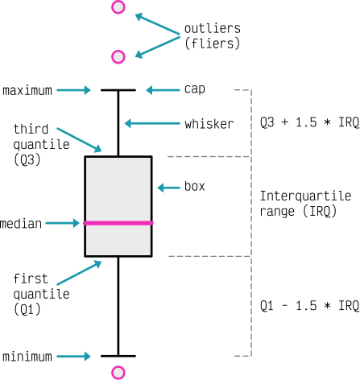

    Anatomía de un diagrama de caja [#boxplot-anatomy]_

Para mostrar el funcionamiento de los diagramas de caja en Matplotlib vamos a hacer uso de distintas distribuciones aleatorias que crearemos mediante funciones de Numpy::

    >>> DIST_SIZE = 100  # tamaño de la muestra

    >>> boxplots = []

    >>> boxplots.append(dict(
    ...     dist=np.random.normal(0, 1, size=DIST_SIZE),
    ...     label='Normal\n$\mu=0, \sigma=1$',
    ...     fill_color='pink',
    ...     brush_color='deeppink'))

    >>> boxplots.append(dict(
    ...     dist=np.random.geometric(0.4, size=DIST_SIZE),
    ...     label='Geometric\n$p=0.4$',
    ...     fill_color='lightblue',
    ...     brush_color='navy'))

    >>> boxplots.append(dict(
    ...     dist=np.random.chisquare(2, size=DIST_SIZE),
    ...     label='Chi-squared\n$df=2$',
    ...     fill_color='lightgreen',
    ...     brush_color='darkgreen'))

Ahora ya podemos construir el gráfico de cajas que nos permite visualizar la distribución de las muestras::

    >>> fig, ax = plt.subplots(figsize=(8, 6), dpi=100)  # 800x600 px

    >>> for i, boxplot in enumerate(boxplots):
    ...     fcolor, bcolor = boxplot['fill_color'], boxplot['brush_color']
    ...     ax.boxplot(boxplot['dist'],
    ...                labels=[boxplot['label']],
    ...                positions=[i],
    ...                widths=[.3],
    ...                notch=True,
    ...                patch_artist=True,
    ...                boxprops=dict(edgecolor=bcolor,
    ...                              facecolor=fcolor,
    ...                              linewidth=2),
    ...                capprops=dict(color=bcolor, linewidth=2),
    ...                flierprops=dict(color=bcolor,
    ...                                markerfacecolor=fcolor,
    ...                                linestyle='none',
    ...                                markeredgecolor='none',
    ...                                markersize=9),
    ...                medianprops=dict(color=bcolor),
    ...                whiskerprops=dict(color=bcolor,
    ...                                  linewidth=1))
      
    >>> ax.yaxis.grid(color='lightgray')    
    >>> ax.xaxis.set_ticks_position('none')
    >>> ax.yaxis.set_ticks_position('none')
        
    >>> ax.spines[:].set_visible(False)

    >>> fig.tight_layout()

.. image:: img/dist-boxplot.png

.. hint:: El código para preparar el gráfico se ha complicado porque se ha incidido en mejorar la estética. En cualquier caso, una vez hecho, se puede refactorizar en una función y reutilizarlo para futuros trabajos.

Gráficos de evolución
=====================

Partiendo de un conjunto de datos temporales, vamos a aprovechar para elaborar un gráfico de evolución del precio de criptomonedas. En esta ocasión hemos utilizado el "dataset" :download:`eth-usd.csv <files/eth-usd.csv>` descargado desde `esta página de Kaggle <https://www.kaggle.com/varpit94/ethereum-data>`_. Contiene la valoración de la criptomoneda **Ethereum** en función de una marca temporal, así como el volumen de "moneda" existente en cada momento.

El objetivo será crear un **gráfico que represente el valor de la criptomoneda (a lo largo del tiempo) en contraposición al volumen de unidades**.

Lo primero que haremos, además de cargar los datos, será lo siguiente:

- Seleccionar las columnas *Date* (fecha de referencia), *Open* (precio de la moneda a la apertura) y *Volume* (volumen de moneda).
- Parsear el campo fecha.
- Filtrar sólo aquellos registros a partir del 1 de enero de 2017 (por simplicidad).
- Dividir la columna de volumen por 10M de cara a equiparar cantidades con la valoración (ajuste de gráfico).
- Aplicar una media móvil para suavizar las curvas a representar.

.. code-block::

    >>> import datetime

    >>> df = pd.read_csv('pypi/datascience/files/eth-usd.csv',
    ...                   parse_dates=['Date'],
    ...                   usecols=['Date', 'Open', 'Volume'],
    ...                   index_col='Date')

    >>> min_date = datetime.datetime(year=2017, month=1, day=1)
    >>> df = df.loc[df.index > min_date]

    >>> df['Volume'] /= 1e7

    >>> df_smooth = df.rolling(20).mean().dropna()

    >>> df_smooth.head()
                    Open    Volume
    Date
    2017-01-21   9.968611  2.146882
    2017-01-22  10.105573  2.117377
    2017-01-23  10.222339  1.985587
    2017-01-24  10.273270  1.821968
    2017-01-25  10.239854  1.647938

Ahora ya podemos montar el gráfico dedicando algo de esfuerzo a la parte estética::

    >>> fig, ax = plt.subplots(figsize=(8, 4), dpi=100)  # 800x400px

    >>> # Alias para facilitar el acceso
    >>> x = df_smooth.index
    >>> y_open = df_smooth['Open']
    >>> y_vol = df_smooth['Volume']

    >>> # Líneas de evolución
    >>> ax.plot(x, y_open, label='Value ($)', color='skyblue', linewidth=1.5)
    >>> ax.plot(x, -y_vol, label='Volume (10M ud.)', color='pink', linewidth=1.5)
    >>> # Relleno del área
    >>> plt.fill_between(x, y_open, alpha=0.5, color='skyblue', zorder=3)
    >>> plt.fill_between(x, -y_vol, alpha=0.5, color='pink', zorder=3)

    >>> # Formateo de los ejes
    >>> ax.xaxis.set_ticks_position('none')
    >>> ax.yaxis.set_ticks_position('none')
    >>> y_ticks = [-4000, -2000, 0, 2000, 4000]
    >>> y_tick_labels = ['4000', '2000', '0', '2000', '4000']
    >>> ax.set_yticks(y_ticks)
    >>> ax.set_yticklabels(y_tick_labels)
    >>> ax.set_ylim(-6000, 6000)

    >>> # Rejilla
    >>> ax.xaxis.grid(color='lightgray', linewidth=.5)
    >>> for y_tick in y_ticks:
    ...     if y_tick != 0:
    ...         ax.axhline(y_tick, color='lightgray', linewidth=.5)

    >>> ax.legend()
    >>> ax.spines[:].set_visible(False)

    >>> fig.tight_layout()

.. image:: img/eth-evolution.png

.. admonition:: Ejercicio
    :class: exercise

    Partiendo del fichero :download:`mwh-spain-2021-clean.csv <files/mwh-spain-2021-clean.csv>` que contiene información sobre el precio de la energía en España durante el año 2021 [#epdata-mwh]_, cree el siguiente diagrama de evolución que representa la variación del precio del MWh [#mwh]_ en función del tiempo:

    .. image:: img/mwh-spain-2021.png

    Las marcas (en el eje x) tienen una separación de 10 días.

    Solución: :download:`mwh_spain.py <files/mwh_spain.py>`

.. --------------- Footnotes ---------------

.. [#drawing-unsplash] Foto original de portada por `Customerbox`_ en Unsplash.
.. [#inches] Se suele usar el término inglés "inches".
.. [#axes-ticks] Se suele usar el término inglés "ticks".
.. [#kaggle] Kaggle es un servicio web que ofrece una gran variedad de "datasets", así como código, cursos y otros recursos en relación con la ciencia de datos.
.. [#nba] National Basketball League (liga estadounidense de baloncesto).
.. [#avengers] `Los Vengadores`_ son un equipo de superhéroes publicados por Marvel Comics.
.. [#imdb-info] `IMDB`_ es una reconocida página web que contiene valoraciones sobre películas y series.
.. [#kaggle-tiobe] Datos extraídos desde `esta página de Kaggle <https://www.kaggle.com/jyotmakadiya/top-20-programming-languages-2021>`__.
.. [#kaggle-bmw] Datos extraídos desde `esta página de Kaggle <https://www.kaggle.com/mysarahmadbhat/bmw-used-car-listing>`__.
.. [#kaggle-pokemon] Datos extraídos desde `esta página de Kaggle <https://www.kaggle.com/abcsds/pokemon>`__.
.. [#kaggle-eurodollar] Datos extraídos desde `esta página de Kaggle <https://www.kaggle.com/lsind18/euro-exchange-daily-rates-19992020>`__.
.. [#epdata-mwh] Datos extraídos desde `esta página de El País <https://www.epdata.es/datos/precio-factura-luz-datos-estadisticas/594>`__.
.. [#mwh] Mega Watio Hora (medida de consumo de energía)
.. [#boxplot-anatomy] Inspirado en `este artículo de Towards Data Science <https://towardsdatascience.com/how-to-fetch-the-exact-values-from-a-boxplot-python-8b8a648fc813>`__.

.. --------------- Hyperlinks ---------------

.. _Customerbox: https://unsplash.com/@customerbox?utm_source=unsplash&utm_medium=referral&utm_content=creditCopyTex
.. _Listado de nombres de colores en matplotlib: https://matplotlib.org/stable/gallery/color/named_colors.html
.. _Estilos de línea en matplotlib: https://matplotlib.org/stable/gallery/lines_bars_and_markers/linestyles.html
.. _Parámetros disponibles para creación del grid: https://matplotlib.org/stable/api/_as_gen/matplotlib.pyplot.grid.html
.. _ciclo establecido por matplotlib: https://matplotlib.org/stable/users/dflt_style_changes.html#colors-in-default-property-cycle
.. _Latex: https://matplotlib.org/stable/gallery/text_labels_and_annotations/tex_demo.html
.. _Juegos Olímpicos de Tokio 2020: https://olympics.com/tokyo-2020/es/
.. _Jupyter: https://jupyter.org/
.. _normalización de mapas de color: https://matplotlib.org/stable/tutorials/colors/colormapnorms.html
.. _barras de color: https://matplotlib.org/stable/api/_as_gen/matplotlib.pyplot.colorbar.html
.. _mapa de color ("colormap"): https://matplotlib.org/stable/gallery/color/colormap_reference.html
.. _Los Vengadores: https://es.wikipedia.org/wiki/Los_Vengadores
.. _IMDB: https://www.imdb.com/
.. _TIOBE: https://www.tiobe.com/tiobe-index/ 
.. _Pokemon: https://www.pokemon.com/es/
