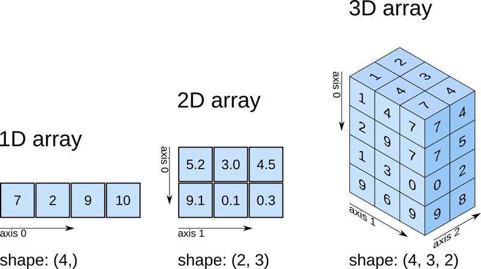
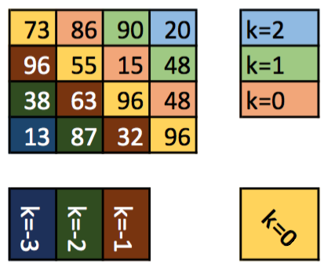

#####
numpy
#####

`NumPy <https://numpy.org/>`__ es el paquete fundamental para computación científica en Python y manejo de arrays numéricos multi-dimensionales. [#blocks-unsplash]_

.. code-block:: console

    $ pip install numpy

*******
ndarray
*******

En el núcleo de NumPy está el ``ndarray``, donde "nd" es por n-dimensional. Un ndarray es un array multidimensional de **elementos del mismo tipo**.

Aquí tenemos una diferencia fundamental con las :ref:`listas <core/datastructures/lists:Listas>` en Python que pueden mantener objetos heterogéneos. Y esta característica propicia que el rendimiento de un ndarray sea bastante mejor que el de una lista convencional.

Para crear un array podemos usar::

    >>> import numpy as np

    >>> x = np.array([1, 2, 3, 4, 5])

    >>> x
    array([1, 2, 3, 4, 5])

    >>> type(x)
    numpy.ndarray

Si queremos obtener información sobre el array creado, podemos acceder a distintos atributos del mismo::

    >>> x.ndim  # dimensión
    1

    >>> x.size  # tamaño total del array
    5

    >>> x.shape  # forma
    (5,)

    >>> x.dtype  # tipo de sus elementos
    dtype('int64')

Datos heterogéneos
==================

Hemos dicho que los ndarray son estructuras de datos que almacenan un único tipo de datos. A pesar de esto, es posible crear un array con los siguientes valores:

.. code-block::

    >>> x = np.array([4, 'Einstein', 1e-7])

Aunque, a priori, puede parecer que estamos mezclando tipos enteros, flotantes y cadenas de texto, lo que realmente se produce (de forma implícita) es una coerción [#coercion]_ de tipos a **Unicode**::

    >>> x
    array(['4', 'Einstein', '1e-07'], dtype='<U32')

    >>> x.dtype
    dtype('<U32')

Tipos de datos
==============

NumPy maneja gran cantidad de tipos de datos. A diferencia de los :ref:`tipos de datos numéricos en Python <core/datatypes:Tipos de datos>` que no establecen un tamaño de bytes de almacenamiento, aquí sí hay una diferencia clara.

Algunos de los tipos de datos numéricos en NumPy se presentan en la siguiente tabla:

.. csv-table:: Tipos de datos numéricos en NumPy
    :file: tables/np_datatypes.csv
    :widths: 10, 20, 70
    :header-rows: 1
    :class: longtable

.. tip:: NumPy entiende por defecto que ``int`` hace referencia a ``np.int64`` y que ``float`` hace referencia a ``np.float64``. Son "alias" bastante utilizados.

Si creamos un array de **números enteros**, el tipo de datos por defecto será ``int64``::

    >>> a = np.array(range(10))

    >>> a
    array([0, 1, 2, 3, 4, 5, 6, 7, 8, 9])

    >>> a.dtype
    dtype('int64')

Sin embargo podemos especificar el tipo de datos que nos interese::

    >>> b = np.array(range(10), dtype='int32')  # 'int32' hace referencia a np.int32

    >>> b
    array([0, 1, 2, 3, 4, 5, 6, 7, 8, 9], dtype=int32)

    >>> b.dtype
    dtype('int32')

Lo mismo ocurre con **valores flotantes**, donde ``float64`` es el tipo de datos por defecto.

Es posible convertir el tipo de datos que almacena un array mediante el método ``astype``. Por ejemplo::

    >>> a
    array([0, 1, 2, 3, 4, 5, 6, 7, 8, 9])

    >>> c = a.astype(float)

    >>> c.dtype
    dtype('float64')

ndarray vs list
===============

Como ya se ha comentado en la introducción de esta sección, el uso de ``ndarray`` frente a ``list`` está justificado por cuestiones de rendimiento. Pero veamos un ejemplo clarificador en el que sumamos 10 millones de valores enteros::

    >>> array_as_list = list(range(int(10e6)))
    >>> array_as_ndarray = np.array(array_as_list)

    >>> %timeit sum(array_as_list)
    48 ms ± 203 µs per loop (mean ± std. dev. of 7 runs, 10 loops each)

    >>> %timeit array_as_ndarray.sum()
    3.83 ms ± 4.84 µs per loop (mean ± std. dev. of 7 runs, 100 loops each)

.. note:: El cómputo es casi 12 veces más rápido utilizando ndarray frente a listas clásicas.

En cualquier caso, existe la posibilidad de **convertir a lista** cualquier ndarray mediante el método ``tolist()``::

    >>> a = np.array([10, 20, 30])

    >>> a
    array([10, 20, 30])

    >>> b = a.tolist()

    >>> b
    [10, 20, 30]

    >>> type(b)
    list

Matrices
========

Una matriz no es más que un array bidimensional. Como ya se ha comentado, NumPy provee ``ndarray`` que se comporta como un array multidimensional con lo que podríamos crear una matriz sin mayor problema.

Veamos un ejemplo en el que tratamos de construir la siguiente matriz:

.. math::

    M=
    \begin{bmatrix}
        1 & 2 & 3 \\
        4 & 5 & 6 \\
        7 & 8 & 9 \\
        10 & 11 & 12
    \end{bmatrix}

Nos apoyamos en una :ref:`lista de listas <core/datastructures/lists:listas de listas>` para la creación de la matriz::

    >>> M = np.array([[1, 2, 3], [4, 5, 6], [7, 8, 9], [10, 11, 12]])

    >>> M
    array([[ 1,  2,  3],
           [ 4,  5,  6],
           [ 7,  8,  9],
           [10, 11, 12]])

    >>> M.ndim  # bidimensional
    2

    >>> M.size
    12

    >>> M.shape  # 4 filas x 3 columnas
    (4, 3)

    >>> M.dtype
    dtype('int64')

.. admonition:: Ejercicio
    :class: exercise

    Cree los siguientes arrays en NumPy:

    .. math::

        \text{array1} &=
        \begin{bmatrix}
            88 & 23 & 39 & 41
        \end{bmatrix} \\
        \text{array2} &=
        \begin{bmatrix}
            76.4 & 21.7 & 38.4 \\
            41.2 & 52.8 & 68.9
        \end{bmatrix}\\
        \text{array3} &=
        \begin{bmatrix}
            12 \\
            4 \\
            9 \\
            8
        \end{bmatrix}

    Obtenga igualmente las siguientes características de cada uno de ellos: dimensión, tamaño, forma y tipo de sus elementos.

    .. only:: html

        |solution| :download:`np_matrix.py <files/np_matrix.py>`

Cambiando la forma
------------------

Dado un array, podemos cambiar su forma mediante la función ``np.reshape()``::

    >>> a = np.array([1, 2, 3, 4, 5, 6, 7, 8, 9, 10, 11, 12])

    >>> np.reshape(a, (3, 4))  # 3 x 4
    array([[ 1,  2,  3,  4],
           [ 5,  6,  7,  8],
           [ 9, 10, 11, 12]])

Si sólo queremos especificar un número determinado de filas o columnas, podemos dejar la otra dimensión a -1::

    >>> np.reshape(a, (6, -1))  # 6 filas
    array([[ 1,  2],
           [ 3,  4],
           [ 5,  6],
           [ 7,  8],
           [ 9, 10],
           [11, 12]])

    >>> np.reshape(a, (-1, 3))  # 3 columnas
    array([[ 1,  2,  3],
           [ 4,  5,  6],
           [ 7,  8,  9],
           [10, 11, 12]])

.. warning:: En el caso de que no exista posibilidad de cambiar la forma del array por el número de filas y/o columnas especificado, obtendremos un error de tipo ``ValueError: cannot reshape array``.

Almacenando arrays
==================

Es posible que nos interese almacenar (de forma persistente) los arrays que hemos ido creando. Para ello NumPy nos provee, al menos, de dos mecanismos:

Almacenamiento en formato binario propio:
    Mediante el método ``save()`` podemos guardar la estructura de datos en `ficheros .npy`_. Veamos un ejemplo:

    .. code-block::
        :emphasize-lines: 7,12

        >>> M
        array([[ 1,  2,  3],
               [ 4,  5,  6],
               [ 7,  8,  9],
               [10, 11, 12]])

        >>> np.save('my_matrix', M)

        >>> !ls my_matrix.npy
        my_matrix.npy

        >>> M_reloaded = np.load('my_matrix.npy')

        >>> M_reloaded
        array([[ 1,  2,  3],
               [ 4,  5,  6],
               [ 7,  8,  9],
               [10, 11, 12]])

Almacenamiento en formato de texto plano:
    NumPy proporciona el método ``savetxt()`` con el que podremos volcar la estructura de datos a un fichero de texto csv. Veamos un ejemplo:

    .. code-block::
        :emphasize-lines: 7,15

        >>> M
        array([[ 1,  2,  3],
               [ 4,  5,  6],
               [ 7,  8,  9],
               [10, 11, 12]])

        >>> np.savetxt('my_matrix.csv', M, fmt='%d')

        >>> !cat my_matrix.csv
        1 2 3
        4 5 6
        7 8 9
        10 11 12

        >>> M_reloaded = np.loadtxt('my_matrix.csv', dtype=int)

        >>> M_reloaded
        array([[ 1,  2,  3],
               [ 4,  5,  6],
               [ 7,  8,  9],
               [10, 11, 12]])

    .. tip:: Por defecto el almacenamiento y la carga de arrays en formato texto usa tipos de **datos flotantes**. Es por ello que hemos usado el parámetro ``fmt`` en el almacenamiento y el parámetro ``dtype`` en la carga.

    Es posible cargar un array **desempaquetando sus valores** a través del parámetro ``unpack``. En el siguiente ejemplo separamos las columnas en tres variables diferentes::

        >>> M
        array([[ 1,  2,  3],
               [ 4,  5,  6],
               [ 7,  8,  9],
               [10, 11, 12]])

        >>> col1, col2, col3 = np.loadtxt('my_matrix.csv', unpack=True, dtype=int)

        >>> col1
        array([ 1,  4,  7, 10])
        >>> col2
        array([ 2,  5,  8, 11])
        >>> col3
        array([ 3,  6,  9, 12])

**********************************************
Funciones predefinidas para creación de arrays
**********************************************

NumPy ofrece una gran variedad de funciones predefinidas para creación de arrays que nos permiten simplificar el proceso de construcción de este tipo de estructuras de datos.

Valores fijos
=============

A continuación veremos una serie de funciones para crear arrays con valores fijos.

Ceros
-----

.. code-block::

    >>> np.zeros((3, 4))
    array([[0., 0., 0., 0.],
           [0., 0., 0., 0.],
           [0., 0., 0., 0.]])

Por defecto, ésta y otras funciones del estilo, devuelven **valores flotantes**. Si quisiéramos trabajar con valores enteros basta con usar el parámetro ``dtype``::

    >>> np.zeros((3, 4), dtype=int)
    array([[0, 0, 0, 0],
           [0, 0, 0, 0],
           [0, 0, 0, 0]])

Existe la posibilidad de crear un array de **ceros con las mismas dimensiones** (y forma) que otro array:

.. code-block::
    :emphasize-lines: 7

    >>> M = np.array([[1, 2, 3], [4, 5, 6]])

    >>> M
    array([[1, 2, 3],
           [4, 5, 6]])

    >>> np.zeros_like(M)
    array([[0, 0, 0],
           [0, 0, 0]])

Lo cual sería equivalente a pasar la "forma" del array a la función predefinida de creación de ceros::

    >>> np.zeros(M.shape, dtype=int)
    array([[0, 0, 0],
           [0, 0, 0]])

Unos
----

.. code-block::

    >>> np.ones((3, 4))  # también existe np.ones_like()
    array([[1., 1., 1., 1.],
           [1., 1., 1., 1.],
           [1., 1., 1., 1.]])

Mismo valor
-----------

.. code-block::

    >>> np.full((3, 4), 7)  # también existe np.full_like()
    array([[7, 7, 7, 7],
           [7, 7, 7, 7],
           [7, 7, 7, 7]])

Matriz identidad
----------------

.. code-block::

    >>> np.eye(5)
    array([[1., 0., 0., 0., 0.],
           [0., 1., 0., 0., 0.],
           [0., 0., 1., 0., 0.],
           [0., 0., 0., 1., 0.],
           [0., 0., 0., 0., 1.]])

Matriz diagonal
---------------

.. code-block::

    >>> np.diag([5, 4, 3, 2, 1])
    array([[5, 0, 0, 0, 0],
           [0, 4, 0, 0, 0],
           [0, 0, 3, 0, 0],
           [0, 0, 0, 2, 0],
           [0, 0, 0, 0, 1]])

.. admonition:: Ejercicio
    :class: exercise

    Cree la siguiente matriz mediante código Python:

    .. math::
    
        \text{diagonal} =
        \begin{bmatrix} 
            0      & 0      & 0 & \dots & 0\\
            0      & 1      & 0 & \dots & 0\\
            0      & 0      & 2 & \dots & 0\\
            \vdots & \vdots & 0 & \ddots & 0\\
            0      & 0      & 0 & \dots & 49\\
        \end{bmatrix}

    Obtenga igualmente las siguientes características de cada uno de ellos: dimensión, tamaño, forma y tipo de sus elementos.

    .. only:: html
    
        |solution| :download:`diag.py <files/diag.py>`

Valores equiespaciados
======================

A continuación veremos una serie de funciones para crear arrays con valores equiespaciados o en intervalos definidos.

Valores enteros equiespaciados
------------------------------

La función que usamos para este propósito es ``np.arange()`` cuyo comportamiento es totalmente análogo a la función "built-in" :ref:`range() <core/controlflow/loops:Secuencias de números>`.

Especificando límite superior:
    >>> np.arange(21)
    array([ 0,  1,  2,  3,  4,  5,  6,  7,  8,  9, 10, 11, 12, 13, 14, 15, 16,
           17, 18, 19, 20])

Especificando límite inferior y superior:
    >>> np.arange(6, 60)
    array([ 6,  7,  8,  9, 10, 11, 12, 13, 14, 15, 16, 17, 18, 19, 20, 21, 22,
           23, 24, 25, 26, 27, 28, 29, 30, 31, 32, 33, 34, 35, 36, 37, 38, 39,
           40, 41, 42, 43, 44, 45, 46, 47, 48, 49, 50, 51, 52, 53, 54, 55, 56,
           57, 58, 59])

Especificando límite inferior, superior y paso:
    >>> np.arange(6, 60, 3)
    array([ 6,  9, 12, 15, 18, 21, 24, 27, 30, 33, 36, 39, 42, 45, 48, 51, 54,
           57])

Es posible especificar un **paso flotante** en la función ``arange()``::

    >>> np.arange(6, 16, .3)
    array([ 6. ,  6.3,  6.6,  6.9,  7.2,  7.5,  7.8,  8.1,  8.4,  8.7,  9. ,
            9.3,  9.6,  9.9, 10.2, 10.5, 10.8, 11.1, 11.4, 11.7, 12. , 12.3,
           12.6, 12.9, 13.2, 13.5, 13.8, 14.1, 14.4, 14.7, 15. , 15.3, 15.6,
           15.9])

Valores flotantes equiespaciados
--------------------------------

La función que usamos para este propósito es ``np.linspace()`` cuyo comportamiento es "similar" a ``np.arange()`` pero para valores flotantes.

Especificando límite inferior y superior:
    >>> np.linspace(6, 60)  # [6, 60] con 50 valores
    array([ 6.        ,  7.10204082,  8.20408163,  9.30612245, 10.40816327,
           11.51020408, 12.6122449 , 13.71428571, 14.81632653, 15.91836735,
           17.02040816, 18.12244898, 19.2244898 , 20.32653061, 21.42857143,
           22.53061224, 23.63265306, 24.73469388, 25.83673469, 26.93877551,
           28.04081633, 29.14285714, 30.24489796, 31.34693878, 32.44897959,
           33.55102041, 34.65306122, 35.75510204, 36.85714286, 37.95918367,
           39.06122449, 40.16326531, 41.26530612, 42.36734694, 43.46938776,
           44.57142857, 45.67346939, 46.7755102 , 47.87755102, 48.97959184,
           50.08163265, 51.18367347, 52.28571429, 53.3877551 , 54.48979592,
           55.59183673, 56.69387755, 57.79591837, 58.89795918, 60.        ])

    .. note:: Por defecto ``np.linspace()`` genera 50 elementos.

Especificando límite inferior, superior y total de elementos:
    >>> np.linspace(6, 60, 20)  # [6, 60] con 20 valores
    array([ 6.        ,  8.84210526, 11.68421053, 14.52631579, 17.36842105,
           20.21052632, 23.05263158, 25.89473684, 28.73684211, 31.57894737,
           34.42105263, 37.26315789, 40.10526316, 42.94736842, 45.78947368,
           48.63157895, 51.47368421, 54.31578947, 57.15789474, 60.        ])

    .. important:: A diferencia de ``np.arange()``, la función ``np.linspace()`` incluye siempre entre los valores generados el límte superior especificado.

Especificando un intervalo abierto :math:`[a,b)`:
    >>> np.linspace(6, 60, 20, endpoint=False)  # [6, 60) con 20 elementos
    array([ 6. ,  8.7, 11.4, 14.1, 16.8, 19.5, 22.2, 24.9, 27.6, 30.3, 33. ,
           35.7, 38.4, 41.1, 43.8, 46.5, 49.2, 51.9, 54.6, 57.3])

Valores aleatorios
==================

A continuación veremos una serie de funciones para crear arrays con valores aleatorios y distribuciones de probabilidad.

Valores aleatorios enteros
--------------------------

Valores aleatorios enteros en :math:`[a, b)`:
    >>> np.random.randint(3, 30)  # escalar
    4

    >>> np.random.randint(3, 30, size=9)  # vector
    array([29,  7,  8, 21, 27, 23, 29, 15, 28])

    >>> np.random.randint(3, 30, size=(3, 3))  # matriz
    array([[24,  4, 29],
           [10, 22, 27],
           [27,  7, 20]])
           
Valores aleatorios flotantes
----------------------------

Por simplicidad, en el resto de ejemplos vamos a obviar la salida *escalar* y *matriz*.

Valores aleatorios flotantes en :math:`[0, 1)`:
    >>> np.random.random(9)
    array([0.53836208, 0.78315275, 0.6931254 , 0.97194325, 0.01523289,
           0.47692141, 0.27653964, 0.82297655, 0.70502383])

Valores aleatorios flotantes en :math:`[a, b)`:
    >>> np.random.uniform(1, 100, size=9)
    array([17.00450378, 67.08416159, 56.99930273,  9.19685998, 35.27334323,
           97.34651516, 25.89283558, 53.59685476, 72.74943888])

Distribuciones de probabilidad
------------------------------

Distribución normal:
    Ejemplo en el que generamos un millón de valores usando como parámetros de la distribución :math:`\mu = 0, \sigma = 5` 

    .. code-block::
        :emphasize-lines: 1

        >>> dist = np.random.normal(0, 5, size=1_000_000)

        >>> dist[:20]
        array([ 2.5290643 ,  1.46577658,  1.65170437, -1.36970819, -2.24547757,
                7.19905613, -4.4666239 , -1.05505116,  2.42351298, -4.45314272,
                1.13604077, -2.85054948,  4.34589478, -2.81235743, -0.8215143 ,
                0.57796411, -2.56594122, -7.14899388,  3.49197644,  1.80691996])

        >>> dist.mean()
        0.004992046432131982

        >>> dist.std()
        4.998583810032169

Muestra aleatoria:
    Ejemplo en el que generamos una muestra aleatoria de un millón de lanzamientos de una moneda::

        >>> coins = np.random.choice(['head', 'tail'], size=1_000_000)

        >>> coins
        array(['tail', 'head', 'tail', ..., 'tail', 'head', 'tail'], dtype='<U4')

        >>> sum(coins == 'head')
        499874
        >>> sum(coins == 'tail')
        500126

Muestra aleatoria con probabilidades no uniformes:
    Ejemplo en el que generamos una muestra aleatoria de un millón de lanzamientos con un dado **"trucado"**::

        >>> # La cara del "1" tiene un 50% de probabilidades de salir
        >>> dices = np.random.choice(range(1, 7), size=1_000_000, p=[.5, .1, .1, .1, .1, .1])

        >>> dices
        array([6, 5, 4, ..., 1, 6, 1])

        >>> sum(dices == 1)
        500290
        >>> sum(dices == 6)
        99550

Muestra aleatoria sin reemplazo:
    Ejemplo en el que seleccionamos 5 principios aleatorios del :ref:`Zen de Python <core/introduction/python:Zen de Python>` sin reemplazo::

        >>> import this
        >>> import codecs

        >>> zen = codecs.decode(this.s, 'rot-13').splitlines()[3:]  # https://bit.ly/3xhsucQ

        >>> np.random.choice(zen, size=5, replace=False)
        array(['Unless explicitly silenced.',
               "Although that way may not be obvious at first unless you're Dutch.",
               'Sparse is better than dense.',
               'If the implementation is easy to explain, it may be a good idea.',
               'Complex is better than complicated.'], dtype='<U69')

.. seealso::
    `Listado de distribuciones aleatorias`_ que se pueden utilizar en NumPy.    

.. admonition:: Ejercicio
    :class: exercise

    Cree:

    - Una matriz de 20 filas y 5 columnas con valores flotantes equiespaciados en el intervalo cerrado :math:`[1, 10]`.
    - Un array unidimensional con 128 valores aleatorios de una distribución normal :math:`\mu=1, \sigma=2`.
    - Un array unidimensional con 15 valores aleatorios de una muestra *1, X, 2* donde la probabilidad de que gane el equipo local es del 50%, la probabilidad de que empaten es del 30% y la probabilidad de que gane el visitante es del 20%.

    .. only:: html
    
        |solution| :download:`np_random.py <files/np_random.py>`

*********************
Manipulando elementos
*********************

Los arrays multidimensionales de NumPy están indexados por unos ejes que establecen la forma en la que debemos acceder a sus elementos. Véase el siguiente diagrama:

    Esquema de ejes sobre los arrays de NumPy [#axis-diagram]_
   
Arrays unidimensionales
=======================

Acceso a arrays unidimensionales
--------------------------------

.. code-block::

    >>> values
    array([10, 11, 12, 13, 14, 15])

    >>> values[2]
    12
    >>> values[-3]
    13

Modificación a arrays unidimensionales
--------------------------------------

.. code-block::

    >>> values
    array([10, 11, 12, 13, 14, 15])

    >>> values[0] = values[1] + values[5]

    >>> values
    array([26, 11, 12, 13, 14, 15])

Borrado en arrays unidimensionales
----------------------------------

.. code-block::

    >>> values
    array([10, 11, 12, 13, 14, 15])

    >>> np.delete(values, 2)  # índice (como escalar)
    array([10, 11, 13, 14, 15])

    >>> np.delete(values, (2, 3, 4))  # índices (como tupla)
    array([10, 11, 15])

.. note:: La función ``np.delete()`` no es destructiva. Devuelve una copia modificada del array.

Inserción en arrays unidimensionales
------------------------------------

.. code-block::

    >>> values
    array([10, 11, 12, 13, 14, 15])

    >>> np.append(values, 16)  # añade elementos al final
    array([10, 11, 12, 13, 14, 15, 16])

    >>> np.insert(values, 1, 101)  # añade elementos en una posición
    array([ 10, 101,  11,  12,  13,  14,  15])

Para ambas funciones también es posible añadir varios elementos de una sola vez::

    >>> values
    array([10, 11, 12, 13, 14, 15])

    >>> np.append(values, [16, 17, 18])
    array([10, 11, 12, 13, 14, 15, 16, 17, 18])

.. note:: La funciones ``np.append()`` y ``np.insert()`` no son destructivas. Devuelven una copia modificada del array.

Arrays multidimensionales
=========================

Partimos del siguiente array bidimensional (matriz) para ejemplificar las distintas operaciones::

    >>> values = np.arange(1, 13).reshape(3, 4)
    >>> values
    array([[ 1,  2,  3,  4],
           [ 5,  6,  7,  8],
           [ 9, 10, 11, 12]])

Acceso a arrays multidimensionales
----------------------------------

.. code-block::

    >>> values
    array([[ 1,  2,  3,  4],
           [ 5,  6,  7,  8],
           [ 9, 10, 11, 12]])

Acceso a elementos individuales::
    >>> values[0, 0]
    1
    >>> values[-1, -1]
    12
    >>> values[1, 2]
    7

Acceso a múltiples elementos::
    >>> values[[0, 2], [1, 2]]  # Elementos [0, 1] y [2, 2]
    array([ 2, 11])

Acceso a filas o columnas completas:
    .. code-block::

        >>> values[2]  # tercera fila
        array([ 9, 10, 11, 12])

        >>> values[:, 1]  # segunda columna
        array([ 2,  6, 10])

Acceso a zonas parciales del array:
    .. code-block::

        >>> values[0:2, 0:2]
        array([[1, 2],
               [5, 6]])

        >>> values[0:2, [1, 3]]
        array([[2, 4],
               [6, 8]])

.. important:: Todos estos accesos crean una copia (vista) del array original. Esto significa que, si modificamos un valor en el array copia, se ve reflejado en el original. Para evitar esta situación podemos usar la función ``np.copy()`` y desvincular la vista de su fuente.

Modificación de arrays multidimensionales
-----------------------------------------

.. code-block::

    >>> values
    array([[ 1,  2,  3,  4],
        [ 5,  6,  7,  8],
        [ 9, 10, 11, 12]])

    >>> values[0, 0] = 100

    >>> values[1] = [55, 66, 77, 88]

    >>> values[:,2] = [30, 70, 110]

    >>> values
    array([[100,   2,  30,   4],
        [ 55,  66,  70,  88],
        [  9,  10, 110,  12]])

Borrado en arrays multidimensionales
------------------------------------

.. code-block::

    >>> values
    array([[ 1,  2,  3,  4],
           [ 5,  6,  7,  8],
           [ 9, 10, 11, 12]])

    >>> np.delete(values, 0, axis=0)  # Borrado de la primera fila
    array([[ 5,  6,  7,  8],
           [ 9, 10, 11, 12]])

    >>> np.delete(values, (1, 3), axis=1)  # Borrado de la segunda y cuarta columna
    array([[ 1,  3],
           [ 5,  7],
           [ 9, 11]])

.. tip:: Tener en cuenta que ``axis=0`` hace referencia a **filas** y ``axis=1`` hace referencia a **columnas** tal y como describe el :ref:`diagrama <pypi/datascience/numpy:Manipulando elementos>` del comienzo de la sección.

Inserción en arrays multidimensionales
--------------------------------------

Añadir elementos al final del array:
    .. code-block::

        >>> values
        array([[1, 2],
               [3, 4]])

        >>> np.append(values, [[5, 6]], axis=0)
        array([[1, 2],
               [3, 4],
               [5, 6]])

        >>> np.append(values, [[5], [6]], axis=1)
        array([[1, 2, 5],
               [3, 4, 6]])

Insertar elementos en posiciones arbitrarias del array:
    .. code-block::

        >>> values
        array([[1, 2],
               [3, 4]])

        >>> np.insert(values, 0, [0, 0], axis=0)
        array([[0, 0],
               [1, 2],
               [3, 4]])

        >>> np.insert(values, 1, [0, 0], axis=1)
        array([[1, 0, 2],
               [3, 0, 4]])

.. admonition:: Ejercicio
    :class: exercise

    Utilizando las operaciones de modificación, borrado e inserción, convierta la siguiente matriz:

    .. math::
    
        \begin{bmatrix}
          17 & 12 & 31 \\
          49 & 11 & 51 \\
          21 & 31 & 62 \\
          63 & 75 & 22
        \end{bmatrix}    

    en esta:

    .. math::

        \begin{bmatrix}
          17 & 12 & 31 & 63\\
          49 & 11 & 51 & 75\\
          21 & 31 & 62 & 22\\
        \end{bmatrix}

    y luego en esta:

    .. math::

        \begin{bmatrix}
          17 & 12 & 31 & 63\\
          49 & 49 & 49 & 63\\
          21 & 31 & 62 & 63\\
        \end{bmatrix}

    .. only:: html
    
        |solution| :download:`np_transform.py <files/np_transform.py>`

Apilando matrices
=================

Hay veces que nos interesa combinar dos matrices (arrays en general). Una de los mecanismos que nos proporciona NumPy es el **apilado**.

Apilado vertical:
    .. code-block::
        :emphasize-lines: 11
    
        >>> m1 = np.random.randint(1, 100, size=(3, 2))
        >>> m2 = np.random.randint(1, 100, size=(1, 2))

        >>> m1
        array([[68, 68],
               [10, 50],
               [87, 92]])
        >>> m2
        array([[63, 80]])

        >>> np.vstack((m1, m2))
        array([[68, 68],
               [10, 50],
               [87, 92],
               [63, 80]])

Apilado horizontal:
    .. code-block::
        :emphasize-lines: 13

        >>> m1 = np.random.randint(1, 100, size=(3, 2))
        >>> m2 = np.random.randint(1, 100, size=(3, 1))

        >>> m1
        array([[51, 50],
              [52, 15],
              [14, 21]])
        >>> m2
        array([[18],
               [52],
               [ 1]])

        >>> np.hstack((m1, m2))
        array([[51, 50, 18],
               [52, 15, 52],
               [14, 21,  1]])

Repitiendo elementos
====================

Repetición por ejes:
    El parámetro de repetición indica el número de veces que repetimos el array completo por cada eje::

        >>> values
        array([[1, 2],
               [3, 4],
               [5, 6]])

        >>> np.tile(values, 3)  # x3 en filas y columnas
        array([[1, 2, 1, 2, 1, 2],
               [3, 4, 3, 4, 3, 4],
               [5, 6, 5, 6, 5, 6]])

        >>> np.tile(values, (2, 3))  # x2 en filas; x3 en columnas
        array([[1, 2, 1, 2, 1, 2],
               [3, 4, 3, 4, 3, 4],
               [5, 6, 5, 6, 5, 6],
               [1, 2, 1, 2, 1, 2],
               [3, 4, 3, 4, 3, 4],
               [5, 6, 5, 6, 5, 6]])

Repetición por elementos:
    El parámetro de repetición indica el número de veces que repetimos cada elemento del array::

        >>> values
        array([[1, 2],
               [3, 4],
               [5, 6]])

        >>> np.repeat(values, 2)
        array([1, 1, 2, 2, 3, 3, 4, 4, 5, 5, 6, 6])

        >>> np.repeat(values, 2, axis=0)  # x2 en filas
        array([[1, 2],
               [1, 2],
               [3, 4],
               [3, 4],
               [5, 6],
               [5, 6]])

        >>> np.repeat(values, 3, axis=1)  # x3 en columnas
        array([[1, 1, 1, 2, 2, 2],
               [3, 3, 3, 4, 4, 4],
               [5, 5, 5, 6, 6, 6]])

Acceso por diagonal
===================

Es bastante común acceder a elementos de una matriz (array en general) tomando como referencia su diagonal. Para ello, NumPy nos provee de ciertos mecanismos que veremos a continuación.

Para ejemplificarlo, partiremos del siguiente array::

    >>> values
    array([[73, 86, 90, 20],
           [96, 55, 15, 48],
           [38, 63, 96, 95],
           [13, 87, 32, 96]])

Extracción de elementos por diagonal
------------------------------------

La función ``np.diag()`` permite acceder a los elementos de un array especificando un parámetro ``k`` que indica la "distancia" con la diagonal principal:

    Acceso a elementos de un array por su diagonal

Veamos cómo variando el parámetro ``k`` obtenemos distintos resultados::

    >>> np.diag(values)  # k = 0
    array([73, 55, 96, 96])

    >>> for k in range(1, values.shape[0]):
    ...     print(f'k={k}', np.diag(values, k=k))
    ...
    k=1 [86 15 95]
    k=2 [90 48]
    k=3 [20]

    >>> for k in range(1, values.shape[0]):
    ...     print(f'k={-k}', np.diag(values, k=-k))
    ...
    k=-1 [96 63 32]
    k=-2 [38 87]
    k=-3 [13]

Modificación de elementos por diagonal
--------------------------------------

NumPy también provee un método ``np.diag_indices()`` que retorna los índices de los elementos de la diagonal principal, con lo que podemos modificar sus valores directamente::

    >>> values
    array([[73, 86, 90, 20],
           [96, 55, 15, 48],
           [38, 63, 96, 95],
           [13, 87, 32, 96]])

    >>> di = np.diag_indices(values.shape[0])

    >>> di
    (array([0, 1, 2, 3]), array([0, 1, 2, 3]))

    >>> values[di] = 0

    >>> values
    array([[ 0, 86, 90, 20],
           [96,  0, 15, 48],
           [38, 63,  0, 95],
           [13, 87, 32,  0]])

.. tip:: Existen igualmente las funciones ``np.triu_indices()`` y ``np.tril_indices()`` para obtener los índices de la diagonal superior e inferior de una matriz.

************************
Operaciones sobre arrays
************************

Operaciones lógicas
===================

Indexado booleano
-----------------

El indexado booleano es una operación que permite conocer (a nivel de elemento) si un array cumple o no con una determinada condición::

    >>> values
    array([[60, 47, 34, 38],
           [43, 63, 37, 68],
           [58, 28, 31, 43],
           [32, 65, 32, 96]])

    >>> values > 50  # indexado booleano
    array([[ True, False, False, False],
           [False,  True, False,  True],
           [ True, False, False, False],
           [False,  True, False,  True]])

    >>> values[values > 50]  # uso de máscara
    array([60, 63, 68, 58, 65, 96])

    >>> values[values > 50] = -1  # modificación de valores

    >>> values
    array([[-1, 47, 34, 38],
           [43, -1, 37, -1],
           [-1, 28, 31, 43],
           [32, -1, 32, -1]])

Las condiciones pueden ser más complejas e incorporar operadores lógicos ``|`` (or) y ``&`` (and)::

    >>> values
    array([[60, 47, 34, 38],
           [43, 63, 37, 68],
           [58, 28, 31, 43],
           [32, 65, 32, 96]])

    >>> (values < 25) | (values > 75)
    array([[False, False, False, False],
           [False, False, False, False],
           [False, False, False, False],
           [False, False, False,  True]])

    >>> (values > 25) & (values < 75)
    array([[ True,  True,  True,  True],
           [ True,  True,  True,  True],
           [ True,  True,  True,  True],
           [ True,  True,  True, False]])

.. hint:: El uso de paréntesis es obligatorio si queremos mantener la precedencia y que funcione correctamente.

.. admonition:: Ejercicio
    :class: exercise

    Extraiga todos los números impares de la siguiente matriz:

    .. math::

        \text{values} =
        \begin{bmatrix}
          10 & 11 & 12 & 13\\
          14 & 15 & 16 & 17\\
          18 & 19 & 20 & 21\\
        \end{bmatrix}
    
    .. only:: html
    
        |solution| :download:`np_odds.py <files/np_odds.py>`

Si lo que nos interesa es **obtener los índices** del array que satisfacen una determinada condición, NumPy nos proporciona el método ``where()`` cuyo comportamiento se ejemplifica a continuación:

.. code-block::
    :emphasize-lines: 7

    >>> values
    array([[60, 47, 34, 38],
           [43, 63, 37, 68],
           [58, 28, 31, 43],
           [32, 65, 32, 96]])

    >>> idx = np.where(values > 50)

    >>> idx
    (array([0, 1, 1, 2, 3, 3]), array([0, 1, 3, 0, 1, 3]))

    >>> values[idx]
    array([60, 63, 68, 58, 65, 96])

.. admonition:: Ejercicio
    :class: exercise

    Partiendo de una matriz de 10 filas y 10 columnas con valores aleatorios enteros en el intervalo :math:`[0, 100]`, realice las operaciones necesarias para obtener una matriz de las mismas dimensiones donde:

    - Todos los elementos de la diagonal sean 50.
    - Los elementos mayores que 50 tengan valor 100.
    - Los elementos menores que 50 tengan valor 0.

    .. only:: html
    
        |solution| :download:`diag_transform.py <files/diag_transform.py>`

Comparando arrays
-----------------

Dados dos arrays podemos compararlos usando el operador ``==`` del mismo modo que con cualquier otro objeto en Python. La cuestión es que el resultado se evalúa a nivel de elemento::

    >>> m1 = np.array([[1, 2], [3, 4]])
    >>> m3 = np.array([[1, 2], [3, 4]])

    >>> m1 == m2
    array([[ True,  True],
           [ True,  True]])

Si queremos comparar arrays en su totalidad, podemos hacer uso de la siguiente función::

    >>> np.array_equal(m1, m2)
    True

Operaciones de conjunto
=======================

Al igual que existen :ref:`operaciones sobre conjuntos <core/datastructures/sets:Conjuntos>` en Python, también podemos llevarlas a cabo sobre arrays en NumPy.

Unión de arrays
---------------

:math:`x \cup y`

.. code-block::

    >>> x
    array([ 9,  4, 11,  3, 14,  5, 13, 12,  7, 14])
    >>> y
    array([17,  9, 19,  4, 18,  4,  7, 13, 11, 10])

    >>> np.union1d(x, y)
    array([ 3,  4,  5,  7,  9, 10, 11, 12, 13, 14, 17, 18, 19])

Intersección de arrays
----------------------

:math:`x \cap y`

.. code-block::

    >>> x
    array([ 9,  4, 11,  3, 14,  5, 13, 12,  7, 14])
    >>> y
    array([17,  9, 19,  4, 18,  4,  7, 13, 11, 10])

    >>> np.intersect1d(x, y)
    array([ 4,  7,  9, 11, 13])

Diferencia de arrays
--------------------

:math:`x \setminus y`

.. code-block::

    >>> x
    array([ 9,  4, 11,  3, 14,  5, 13, 12,  7, 14])
    >>> y
    array([17,  9, 19,  4, 18,  4,  7, 13, 11, 10])

    >>> np.setdiff1d(x, y)
    array([ 3,  5, 12, 14])

Ordenación de arrays
====================

En términos generales, existen dos formas de ordenar cualquier estructura de datos, una que modifica "in-situ" los valores (destructiva) y otra que devuelve "nuevos" valores (no destructiva). En el caso de NumPy también es así.

Ordenación sobre arrays unidimensionales
----------------------------------------

.. code-block::

    >>> values
    array([23, 24, 92, 88, 75, 68, 12, 91, 94, 24,  9, 21, 42,  3, 66])

    >>> np.sort(values)  # no destructivo
    array([ 3,  9, 12, 21, 23, 24, 24, 42, 66, 68, 75, 88, 91, 92, 94])

    >>> values.sort()  # destructivo

    >>> values
    array([ 3,  9, 12, 21, 23, 24, 24, 42, 66, 68, 75, 88, 91, 92, 94])

Ordenación sobre arrays multidimensionales
------------------------------------------

.. code-block::

    >>> values
    array([[52, 23, 90, 46],
           [61, 63, 74, 59],
           [75,  5, 58, 70],
           [21,  7, 80, 52]])

    >>> np.sort(values, axis=1)  # equivale a np.sort(values)
    array([[23, 46, 52, 90],
           [59, 61, 63, 74],
           [ 5, 58, 70, 75],
           [ 7, 21, 52, 80]])

    >>> np.sort(values, axis=0)
    array([[21,  5, 58, 46],
           [52,  7, 74, 52],
           [61, 23, 80, 59],
           [75, 63, 90, 70]])

.. note:: También existe ``values.sort(axis=1)`` y ``values.sort(axis=0)`` como métodos "destructivos" de ordenación.

Contando valores
================

Otra de las herramientas útiles que proporciona NumPy es la posibilidad de contar el número de valores que existen en un array en base a ciertos criterios.

Para ejemplificarlo, partiremos de un array unidimensional con valores de una distribución aleatoria uniforme en el intervalo :math:`[1, 10]`::

    >>> randomized = np.random.randint(1, 11, size=1000)

    >>> randomized
    array([ 7,  9,  7,  8,  3,  7,  6,  4,  3,  9,  3,  1,  6,  7, 10,  4,  8,
            1,  3,  3,  8,  5,  4,  7,  5,  8,  8,  3, 10,  1,  7, 10,  3, 10,
            2,  9,  5,  1,  2,  4,  4, 10,  5, 10,  5,  2,  5,  2, 10,  3,  4,
    ...

Valores únicos:
    >>> np.unique(randomized)
    array([ 1,  2,  3,  4,  5,  6,  7,  8,  9, 10])

Valores únicos (incluyendo frecuencias):
    >>> np.unique(randomized, return_counts=True)
    (array([ 1,  2,  3,  4,  5,  6,  7,  8,  9, 10]),
    array([101,  97, 117,  94, 101,  88,  94, 110,  93, 105]))

Valores distintos de cero:
    >>> np.count_nonzero(randomized)
    1000

Valores distintos de cero (incluyendo condición):
    >>> np.count_nonzero(randomized > 5)
    490

Operaciones aritméticas
=======================

Una de las grandes ventajas del uso de arrays numéricos en NumPy es la posibilidad de trabajar con ellos como si fueran objetos "simples" pero sacando partido de la aritmética vectorial. Esto redunda en una mayor eficiencia y rapidez de cómputo.

Operaciones aritméticas con mismas dimensiones
----------------------------------------------

Cuando operamos entre arrays de las mismas dimensiones, las operaciones aritméticas se realizan elemento a elemento (ocupando misma posición) y el resultado, obviamente, tiene las mismas dimensiones::

    >>> m1
    array([[21, 86, 45],
           [31, 36, 78],
           [31, 64, 70]])

    >>> m2
    array([[58, 67, 17],
           [99, 53,  9],
           [92, 42, 75]])

    >>> m1 + m2
    array([[ 79, 153,  62],
           [130,  89,  87],
           [123, 106, 145]])

    >>> m1 - m2
    array([[-37,  19,  28],
           [-68, -17,  69],
           [-61,  22,  -5]])

    >>> m1 * m2
    array([[1218, 5762,  765],
           [3069, 1908,  702],
           [2852, 2688, 5250]])

    >>> m1 / m2  # división flotante
    array([[0.36206897, 1.28358209, 2.64705882],
           [0.31313131, 0.67924528, 8.66666667],
           [0.33695652, 1.52380952, 0.93333333]])

    >>> m1 // m2  # división entera
    array([[0, 1, 2],
           [0, 0, 8],
           [0, 1, 0]])

Operaciones aritméticas con distintas dimensiones
-------------------------------------------------

Cuando operamos entre arrays con dimensiones diferentes, siempre y cuando se cumplan ciertas restricciones en tamaños de filas y/o columnas, lo que se produce es un "broadcasting" (o difusión) de los valores.

Suma con array "fila":
    .. code-block::

        >>> m
        array([[9, 8, 1],
               [7, 6, 7]])

        >>> v
        array([[2, 3, 6]])

        >>> m + v  # broadcasting
        array([[11, 11,  7],
               [ 9,  9, 13]])

Suma con array "columna":
    .. code-block::

        >>> m
        array([[9, 8, 1],
               [7, 6, 7]])

        >>> v
        array([[1],
               [6]])

        >>> m + v  # broadcasting
        array([[10,  9,  2],
               [13, 12, 13]])

.. warning:: En el caso de que no coincidan dimensiones de filas y/o columnas, NumPy no podrá ejecutar la operación y obtendremos un error ``ValueError: operands could not be broadcast together with shapes``.

Operaciones entre arrays y escalares
------------------------------------

Al igual que ocurría en los casos anteriores, si operamos con un array y un escalar, éste último será difundido para abarcar el tamaño del array::

    >>> m
    array([[9, 8, 1],
           [7, 6, 7]])

    >>> m + 5
    array([[14, 13,  6],
           [12, 11, 12]])

    >>> m - 5
    array([[ 4,  3, -4],
           [ 2,  1,  2]])

    >>> m * 5
    array([[45, 40,  5],
           [35, 30, 35]])

    >>> m / 5
    array([[1.8, 1.6, 0.2],
           [1.4, 1.2, 1.4]])

    >>> m // 5
    array([[1, 1, 0],
           [1, 1, 1]])

    >>> m ** 5
    array([[59049, 32768,     1],
           [16807,  7776, 16807]])

Operaciones unarias
===================

Existen multitud de operaciones sobre un único array. A continuación veremos algunas de las más utilizas en NumPy.

Funciones universales
---------------------

Las funciones universales "ufunc" son funciones que operan sobre arrays **elemento a elemento**. Existen `muchas funciones universales definidas en Numpy <https://docs.scipy.org/doc/numpy/reference/ufuncs.html#available-ufuncs>`_, parte de ellas operan sobre dos arrays y parte sobre un único array.

Un ejemplo de algunas de estas funciones::

    >>> values
    array([[48.32172375, 24.89651106, 77.49724241],
           [77.81874191, 22.54051494, 65.11282444],
           [ 5.54960482, 59.06720303, 62.52817198]])

    >>> np.sqrt(values)
    array([[6.95138287, 4.98964037, 8.80325181],
           [8.82149318, 4.74768522, 8.06925179],
           [2.35575992, 7.68551905, 7.9074757 ]])

    >>> np.sin(values)
    array([[-0.93125201, -0.23403917,  0.86370435],
           [ 0.66019205, -0.52214693,  0.75824777],
           [-0.66953344,  0.58352079, -0.29903488]])

    >>> np.ceil(values)
    array([[49., 25., 78.],
           [78., 23., 66.],
           [ 6., 60., 63.]])

    >>> np.floor(values)
    array([[48., 24., 77.],
           [77., 22., 65.],
           [ 5., 59., 62.]])

    >>> np.log(values)
    array([[3.87788123, 3.21472768, 4.35024235],
           [4.3543823 , 3.11531435, 4.17612153],
           [1.71372672, 4.07867583, 4.13561721]])

Reduciendo el resultado
-----------------------

NumPy nos permite aplicar cualquier función sobre un array **reduciendo** el resultado por alguno de sus ejes. Esto abre una amplia gama de posibilidades.

A modo de ilustración, veamos un par de ejemplos con la suma y el producto::

    >>> values
    array([[8, 2, 7],
           [2, 0, 6],
           [6, 3, 4]])

    >>> np.sum(values, axis=0)  # suma por columnas
    array([16,  5, 17])

    >>> np.sum(values, axis=1)  # suma por filas
    array([17,  8, 13])

    >>> np.prod(values, axis=0)  # producto por columnas
    array([ 96,   0, 168])

    >>> np.prod(values, axis=1)  # producto por filas
    array([112,   0,  72])

.. admonition:: Ejercicio
    :class: exercise

    Compruebe que, para :math:`\theta=2\pi` (*radianes*) y :math:`k=20` se cumple la siguiente igualdad del *producto infinito de Euler*:

    .. math::
    
        \cos\left({\frac{\theta}{2}}\right) \cdot
        \cos\left({\frac{\theta}{4}}\right) \cdot
        \cos\left({\frac{\theta}{8}}\right) \cdots
        =
        \prod_{i=1}^k \cos\left(\frac{\theta}{2^i}\right)
        \approx
        \frac{\sin(\theta)}{\theta}

    .. only:: html
    
        |solution| :download:`euler_product.py <files/euler_product.py>`

Funciones estadísticas
----------------------

NumPy proporciona una gran cantidad de `funciones estadísticas`_ que pueden ser aplicadas sobre arrays.

Veamos algunas de ellas::

    >>> dist
    array([[-6.79006504, -0.01579498, -0.29182173,  0.3298951 , -5.30598975],
           [ 3.10720923, -4.09625791, -7.60624152,  2.3454259 ,  9.23399023],
           [-7.4394269 , -9.68427195,  3.04248586, -5.9843767 ,  1.536578  ],
           [ 3.33953286, -8.41584411, -9.530274  , -2.42827813, -7.34843663],
           [ 7.1508544 ,  5.51727548, -3.20216834, -5.00154367, -7.15715252]])

    >>> np.mean(dist)
    -2.1877878715377777

    >>> np.std(dist)
    5.393254994089515

    >>> np.median(dist)
    -3.2021683412383295

Máximos y mínimos
-----------------

Una de las operaciones más comunes en el manejo de datos es encontrar máximos o mínimos. Para ello, disponemos de las típicas funciones con las ventajas del uso de arrays multidimensionales::

    >>> values
    array([[66, 54, 33, 15, 58],
           [55, 46, 39, 16, 38],
           [73, 75, 79, 25, 83],
           [81, 30, 22, 32,  8],
           [92, 25, 82, 10, 90]])

    >>> np.min(values)
    8

    >>> np.min(values, axis=0)
    array([55, 25, 22, 10,  8])
    >>> np.min(values, axis=1)
    array([15, 16, 25,  8, 10])

    >>> np.max(values)
    92

    >>> np.max(values, axis=0)
    array([92, 75, 82, 32, 90])
    >>> np.max(values, axis=1)
    array([66, 55, 83, 81, 92])

Si lo que interesa es obtener los **índices** de aquellos elementos con valores máximos o mínimos, podemos hacer uso de las funciones ``argmax()`` y ``argmin()`` respectivamente.

Veamos un ejemplo donde obtenemos los valores máximos por columnas (mediante sus índices):

.. code-block::
    :emphasize-lines: 8

    >>> values
    array([[66, 54, 33, 15, 58],
           [55, 46, 39, 16, 38],
           [73, 75, 79, 25, 83],
           [81, 30, 22, 32,  8],
           [92, 25, 82, 10, 90]])

    >>> idx = np.argmax(values, axis=0)

    >>> idx
    array([4, 2, 4, 3, 4])

    >>> values[idx, range(values.shape[1])]
    array([92, 75, 82, 32, 90])

Vectorizando funciones
======================

Una de las ventajas de trabajar con arrays numéricos en NumPy es sacar provecho de la optimización que se produce a nivel de la propia estructura de datos. En el caso de que queramos implementar una función propia para realizar una determinada acción, sería deseable seguir aprovechando esa característica.

Veamos un ejemplo en el que queremos realizar el siguiente cálculo entre dos matrices :math:`A` y :math:`B`:

.. math::

    A_{ij} * B_{ij} =
    \begin{cases}
        A_{ij} + B_{ij}   &, \text{si}\ A_{ij} > B_{ij}\\
        A_{ij} - B_{ij}   &, \text{si}\ A_{ij} < B_{ij}\\
        0                 &, \text{e.o.c.}
    \end{cases}

Esta función, definida en Python, quedaría tal que así::

    >>> def customf(a, b):
    ...     if a > b:
    ...         return a + b
    ...     elif a < b:
    ...         return a - b
    ...     else:
    ...         return 0
    ...

Las dos matrices de partida tienen 9M de valores aleatorios entre -100 y 100::

    >>> A = np.random.randint(-100, 100, size=(3000, 3000))
    >>> B = np.random.randint(-100, 100, size=(3000, 3000))

Una primera aproximación para aplicar esta función a cada elemento de las matrices de entrada sería la siguiente::

    >>> result = np.zeros_like(A)

    >>> %%timeit
    ... for i in range(A.shape[0]):
    ...     for j in range(A.shape[1]):
    ...         result[i, j] = customf(A[i, j], B[i, j])
    ...
    3 s ± 23.8 ms per loop (mean ± std. dev. of 7 runs, 1 loop each)

Mejorando rendimiento con funciones vectorizadas
------------------------------------------------

Con un pequeño detalle podemos mejorar el rendimiento de la función que hemos diseñado anteriormente. Se trata de decorarla con ``np.vectorize`` con lo que estamos otorgándole un comportamiento distinto y enfocado al procesamiento de arrays numéricos::

    >>> @np.vectorize
    ... def customf(a, b):
    ...     if a > b:
    ...         return a + b
    ...     elif a < b:
    ...         return a - b
    ...     else:
    ...         return 0
    ...

Dado que ahora ya se trata de una **función vectorizada** podemos aplicarla directamente a las matrices de entrada (aprovechamos para medir su tiempo de ejecución)::

    >>> %timeit customf(A, B)
    1.29 s ± 7.33 ms per loop (mean ± std. dev. of 7 runs, 1 loop each)

Hemos obtenido una mejora de ``2.32x`` con respecto al uso de funciones simples.

.. tip:: La mejora de rendimiento se aprecia más claramente a medida que los tamaños de las matrices (arrays) de entrada son mayores.

.. hint:: El uso de :ref:`funciones lambda <core/modularity/functions:Funciones anónimas "lambda">` puede ser muy útil en vectorización: ``np.vectorize(lambda a, b: return a + b)``.

.. admonition:: Ejercicio
    :class: exercise

    1. Cree dos matrices cuadradas de 20x20 con valores aleatorios flotantes uniformes en el intervalo :math:`[0, 1000)`
    2. Vectorice una función que devuelva la media (elemento a elemento) entre las dos matrices.
    3. Realice la misma operación que en 2) pero usando suma de matrices y división por escalar.
    4. Compute los tiempos de ejecución de 2) y 3)

    .. only:: html
    
        |solution| :download:`vectorize.py <files/vectorize.py>`

**************
Álgebra lineal
**************

NumPy tiene una sección dedicada al `álgebra lineal`_ cuyas funciones pueden resultar muy interesantes según el contexto en el que estemos trabajando.

Producto de matrices
====================

Si bien hemos hablado del producto de arrays elemento a elemento, NumPy nos permite hacer la `multiplicación clásica de matrices`_::

    >>> m1
    array([[1, 8, 4],
           [8, 7, 1],
           [1, 3, 8]])

    >>> m2
    array([[1, 5, 7],
           [9, 4, 2],
           [1, 4, 2]])

    >>> np.dot(m1, m2)
    array([[77, 53, 31],
           [72, 72, 72],
           [36, 49, 29]])

.. admonition:: Ejercicio
    :class: exercise

    Compruebe que la matriz :math:`\begin{bmatrix}1 & 2\\3 & 5\end{bmatrix}` satisface la ecuación matricial: :math:`X^2 - 6X - I = 0` donde :math:`I` es la matriz identidad de orden 2.

    .. only:: html
    
        |solution| :download:`identity_equation.py <files/identity_equation.py>`

Determinante de una matriz
==========================

El `cálculo del determinante`_ es una operación muy utilizada en álgebra lineal. Lo podemos realizar en NumPy de la siguiente manera::

    >>> m
    array([[4, 1, 6],
           [4, 8, 8],
           [2, 1, 7]])

    >>> np.linalg.det(m)
    108.00000000000003

Inversa de una matriz
=====================

La `inversa de una matriz`_ se calcula de la siguiente manera::

    >>> m
    array([[4, 1, 6],
           [4, 8, 8],
           [2, 1, 7]])
    
    >>> m_inv = np.linalg.inv(m)
    
    >>> m_inv
    array([[ 0.44444444, -0.00925926, -0.37037037],
           [-0.11111111,  0.14814815, -0.07407407],
           [-0.11111111, -0.01851852,  0.25925926]])

Una propiedad de la matriz inversa es que si la multiplicamos por la matriz de partida obtenemos la matriz identidad. Vemos que se cumple :math:`\mathcal{A} \cdot \mathcal{A}^{-1} = \mathcal{I}`::

    >>> np.dot(m, m_inv)
    array([[1., 0., 0.],
           [0., 1., 0.],
           [0., 0., 1.]])

Traspuesta de una matriz
========================

La traspuesta de una matriz :math:`\mathcal{A}` se denota por: :math:`(\mathcal{A}^t)_{ij} = \mathcal{A}_{ji},\ 1\le i\le n,\ 1\le j\le m`, pero básicamente consiste en intercambiar filas por columnas.

Aún más fácil es computar la traspuesta de una matriz con NumPy::

    >>> m
    array([[1, 2, 3],
           [4, 5, 6]])

    >>> m.T
    array([[1, 4],
           [2, 5],
           [3, 6]])

.. admonition:: Ejercicio
    :class: exercise

    Dadas las matrices:

    .. math::
    
        A=
        \begin{bmatrix}
          1 & -2 & 1 \\
          3 & 0 & 1
        \end{bmatrix}
        ;\
        B=
        \begin{bmatrix}
          4 & 0 & -1 \\
          -2 & 1 & 0
        \end{bmatrix}
    
    , compruebe que se cumplen las siguientes igualdades:

    - :math:`(A + B)^t = A^t + B^t`
    - :math:`(3A)^t = 3A^t` 

    .. only:: html
    
        |solution| :download:`transpose.py <files/transpose.py>`

Elevar matriz a potencia
========================

En el mundo del álgebra lineal es muy frecuente recurrir a la exponenciación de matrices a a través de su producto clásico. En este sentido, NumPy nos proporciona una función para computarlo::

    >>> m
    array([[4, 1, 6],
           [4, 8, 8],
           [2, 1, 7]])
    
    >>> np.linalg.matrix_power(m, 3)  # más eficiente que np.dot(m, np.dot(m, m))
    array([[ 348,  250,  854],
           [ 848,  816, 2000],
           [ 310,  231,  775]])

.. admonition:: Ejercicio
    :class: exercise

    Dada la matriz :math:`A = \begin{bmatrix} 4 & 5 & -1 \\ -3 & -4 & 1 \\ -3 & -4 & 0 \end{bmatrix}` calcule: :math:`A^2, A^3, \dots, A^{128}` 

    ¿Nota algo especial en los resultados?

    .. only:: html
    
        |solution| :download:`flip_powers.py <files/flip_powers.py>`

Sistemas de ecuaciones lineales
===============================

NumPy también nos permite resolver sistemas de ecuaciones lineales. Para ello debemos modelar nuestro sistema a través de arrays.

Veamos un ejemplo en el que queremos resolver el siguiente sistema de ecuaciones lineales:

.. math::

    \begin{cases}
        -x_1 + 2x_3 = 1\\
        x_1 - x_2 = -2\\
        x_2 + x_3 = -1
    \end{cases}
    \Longrightarrow
    \begin{pmatrix}
        1 & 0 & 2 \\
        1 & -1 & 0 \\
        0 & 1 & 1
    \end{pmatrix}
    \begin{pmatrix}
        x_1 \\
        x_2 \\
        x_3
    \end{pmatrix}=
    \begin{pmatrix}
        1 \\
        -2 \\
        -1
    \end{pmatrix}
    \Longrightarrow
    \mathcal{A} \mathcal{X} = \mathcal{B}

Podemos almacenar las matrices de coeficientes :math:`\mathcal{A}` y :math:`\mathcal{B}` de la siguiente manera::

    >>> A = np.array([[1, 0, 2], [1, -1, 0], [0, 1, 1]])
    >>> B = np.array([1, -2, -1]).reshape(-1, 1)
    
    >>> A
    array([[ 1,  0,  2],
           [ 1, -1,  0],
           [ 0,  1,  1]])
    >>> B
    array([[ 1],
           [-2],
           [-1]])

La solución al sistema viene dada por la siguiente función::

    >>> np.linalg.solve(A, B)
    array([[-7.],
           [-5.],
           [ 4.]])

La solución del sistema debe ser la misma que si obtenemos :math:`\mathcal{X} = \mathcal{A}^{-1} \cdot B`::

    >>> np.dot(np.linalg.inv(A), B)
    array([[-7.],
           [-5.],
           [ 4.]])

.. admonition:: Ejercicio
    :class: exercise

    Resuelva el siguiente sistema de ecuaciones lineales:

    .. math::

        \begin{cases}
            3x + 4y - z = 8\\
            5x - 2y + z = 4\\
            2x - 2y + z = 1
        \end{cases}
    
    .. only:: html
    
        |solution| :download:`lineq.py <files/lineq.py>`

        

.. --------------- Footnotes ---------------

.. [#blocks-unsplash] Foto original de portada por `Vlado Paunovic`_ en Unsplash.
.. [#coercion] Característica de los lenguajes de programación que permite, implícita o explícitamente, convertir un elemento de un tipo de datos en otro, sin tener en cuenta la comprobación de tipos.
.. [#axis-diagram] Imagen de Harriet Dashnow, Stéfan van der Walt y Juan Núñez-Iglesias en O'Reilly.

.. --------------- Hyperlinks ---------------

.. _Vlado Paunovic: https://unsplash.com/@vlado?utm_source=unsplash&utm_medium=referral&utm_content=creditCopyText
.. _ficheros .npy: https://www.numpy.org/devdocs/reference/generated/numpy.lib.format.html
.. _funciones estadísticas: https://numpy.org/doc/stable/reference/routines.statistics.html
.. _álgebra lineal: https://numpy.org/doc/stable/reference/routines.linalg.html
.. _multiplicación clásica de matrices: https://es.wikipedia.org/wiki/Multiplicaci%C3%B3n_de_matrices
.. _cálculo del determinante: https://es.wikipedia.org/wiki/Determinante_(matem%C3%A1tica)
.. _inversa de una matriz: https://es.wikipedia.org/wiki/Matriz_invertible
.. _Listado de distribuciones aleatorias: https://numpy.org/doc/stable/reference/random/generator.html#distributions
