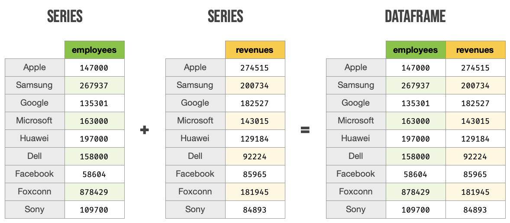
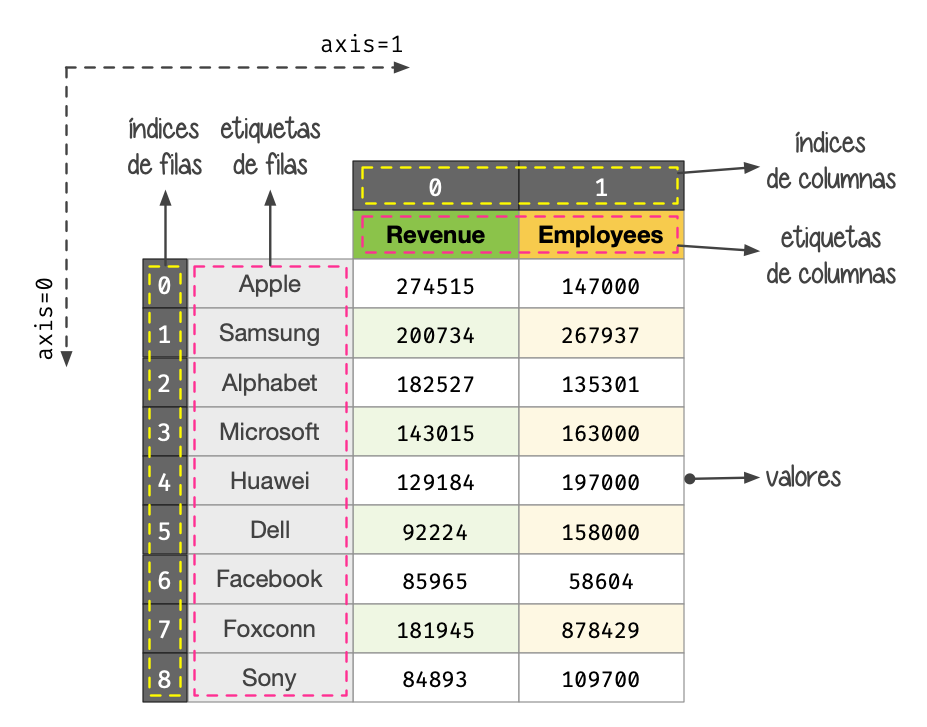
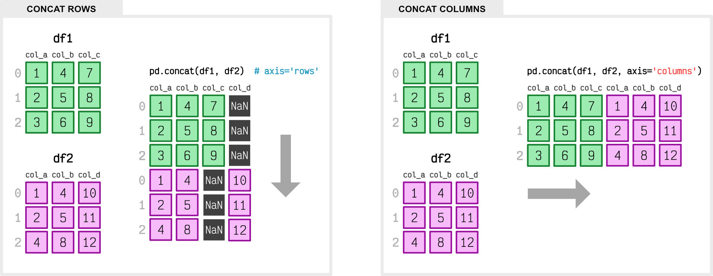

######
pandas
######


`pandas <https://pandas.pydata.org/docs/>`__ es un paquete open-source que nos proporciona una forma sencilla y potente de trabajar con estructuras de datos a través de múltiples herramientas para su análisis. [#panda-unsplash]_

.. code-block:: console

    $ pip install pandas

La forma más común de importar esta librería es usar el alias ``pd``::

    >>> import pandas as pd

Si bien en :ref:`Numpy <pypi/datascience/numpy:numpy>` la estructura de datos fundamental es el ``ndarray``, en pandas existen dos estructuras de datos sobre las que giran todas las operaciones:

- Series.
- Dataframes.

******
Series
******

Podríamos pensar en una **serie** como un :ref:`ndarray <pypi/datascience/numpy:ndarray>` en el que cada valor tiene asignada una etiqueta (índice) y además admite un título (nombre).

Creación de una serie
=====================

Veamos varios ejemplos de creación de la serie :math:`[1, 2, 3]`.

Creación de series usando listas:
    .. code-block::

        >>> pd.Series([1, 2, 3])
        0    1
        1    2
        2    3
        dtype: int64

    .. note:: El índice por defecto se crea con números enteros positivos empezando desde 0.

Especificando un índice personalizado (etiqueta a cada valor):
    .. code-block::

        >>> pd.Series(range(1, 4), index=['a', 'b', 'c'])
        a    1
        b    2
        c    3
        dtype: int64
    
Especificando un diccionario con etiquetas y valores:
    .. code-block::
    
        >>> items = {'a': 1, 'b': 2, 'c': 3}

        >>> pd.Series(items)
        a    1
        b    2
        c    3
        dtype: int64

Todas las series que hemos visto hasta ahora no tienen asignado ningún nombre. Lo podemos hacer usando el parámetro ``name`` en la creación de la serie::

    >>> pd.Series([1, 2, 3], name='integers')
    0    1
    1    2
    2    3
    Name: integers, dtype: int64

.. admonition:: Ejercicio
    :class: exercise

    Cree una serie de pandas con valores enteros en el intervalo :math:`[1, 26]` y etiquetas ``'ABCDEFGHIJKLMNOPQRSTUVWXYZ'``. Busque una manera programática (no manual) de hacerlo (recuerde el :ref:`módulo string <stdlib/text_processing/string:Constantes>`).

    .. only:: html
    
        |solution| :download:`create_series.py <files/create_series.py>`

Atributos de una serie
======================

Las `series`_ en pandas contienen gran cantidad de atributos. A continuación destacaremos algunos de ellos.

Trabajaremos con datos que contienen el número de empleados/as de diferentes empresas tecnológicas [#tech-employment]_::

    >>> data
    {'Apple': 147000,
    'Samsung': 267937,
    'Google': 135301,
    'Microsoft': 163000,
    'Huawei': 197000,
    'Dell': 158000,
    'Facebook': 58604,
    'Foxconn': 878429,
    'Sony': 109700}

    >>> employees = pd.Series(data, name='Tech Employees')


Índice de la serie:
    .. code-block::

        >>> employees.index
        Index(['Apple', 'Samsung', 'Google', 'Microsoft', 'Huawei', 'Dell', 'Facebook',
            'Foxconn', 'Sony'],
            dtype='object')

Valores de la serie:
    .. code-block::

        >>> employees.values
        array([147000, 267937, 135301, 163000, 197000, 158000,  58604, 878429,
            109700])

Tipo de la serie:
    .. code-block::
    
        >>> employees.dtype
        dtype('int64')

Nombre de la serie:
    .. code-block::

        >>> employees.name
        'Tech Employees'

Memoria ocupada por la serie:
    .. code-block::

        >>> employees.nbytes
        72

Número de registros de la serie:
    .. code-block::

        >>> employees.size
        9


Selección de registros
======================

La selección de los datos se puede realizar desde múltiples aproximaciones. A continuación veremos las posiblidades que nos ofrece pandas para seleccionar/filtrar los registros de una serie.

.. code-block::

    >>> employees
    Apple        147000
    Samsung      267937
    Google       135301
    Microsoft    163000
    Huawei       197000
    Dell         158000
    Facebook      58604
    Foxconn      878429
    Sony         109700
    Name: Tech Employees, dtype: int64

Selección usando indexado numérico
----------------------------------

Para acceder a los registros por su posición (índice numérico) basta usar corchetes como ya se ha visto en cualquier secuencia::

    >>> employees[0]
    147000

    >>> employees[-1]
    109700

    >>> employees[2:5]
    Google       135301
    Microsoft    163000
    Huawei       197000
    Name: Tech Employees, dtype: int64

    >>> employees[1:6:2]
    Samsung      267937
    Microsoft    163000
    Dell         158000
    Name: Tech Employees, dtype: int64

El atributo ``iloc`` es un alias (algo más expresivo) que permite realizar las mismas operaciones de indexado (con corchetes) que hemos visto anteriormente::

    >>> employees.iloc[1:6:2]
    Samsung      267937
    Microsoft    163000
    Dell         158000
    Name: Tech Employees, dtype: int64
    
.. tip::
    Python, y en este caso pandas, se dicen "0-index" porque sus índices (posiciones) comienzan en cero.

Selección usando etiquetas
--------------------------

En el caso de aquellas series que dispongan de un índice con etiquetas, podemos acceder a sus registros utilizando las mismas::

    >>> employees['Apple']  # equivalente a employees.Apple
    147000

    >>> employees['Apple':'Huawei']
    Apple        147000
    Samsung      267937
    Google       135301
    Microsoft    163000
    Huawei       197000
    Name: Tech Employees, dtype: int64

    >>> employees['Apple':'Huawei':2]
    Apple     147000
    Google    135301
    Huawei    197000
    Name: Tech Employees, dtype: int64

El atributo ``loc`` es un alias (algo más expresivo) que permite realizar las mismas operaciones de indexado (con corchetes) que hemos visto anteriormente::

    >>> employees.loc['Apple':'Huawei':2]
    Apple     147000
    Google    135301
    Huawei    197000
    Name: Tech Employees, dtype: int64

Fragmentos de comienzo y fin
----------------------------

A nivel exploratorio, es bastante cómodo acceder a una porción inicial (o final) de los datos que manejamos. Esto se puede hacer de forma muy sencillo con series::

    >>> employees.head(3)
    Apple      147000
    Samsung    267937
    Google     135301
    Name: Tech Employees, dtype: int64

    >>> employees.tail(3)
    Facebook     58604
    Foxconn     878429
    Sony        109700
    Name: Tech Employees, dtype: int64

Operaciones con series
======================

Si tenemos en cuenta que una serie contiene valores en formato ``ndarray`` podemos concluir que las :ref:`operaciones sobre arrays <pypi/datascience/numpy:Operaciones sobre arrays>` son aplicables al caso de las series. Veamos algunos ejemplos de operaciones que podemos aplicar sobre series.

Operaciones lógicas
-------------------

Supongamos que queremos filtrar aquellas empresas que tengan más de 200000 trabajadores/as::

    >>> employees > 200_000
    Apple        False
    Samsung       True
    Google       False
    Microsoft    False
    Huawei       False
    Dell         False
    Facebook     False
    Foxconn       True
    Sony         False
    Name: Tech Employees, dtype: bool

Hemos obtenido una serie "booleana". Si queremos aplicar esta "máscara", podemos hacerlo con indexado::

    >>> employees[employees > 200_000]  # empresas con más de 200K trabajadores/as
    Samsung    267937
    Foxconn    878429
    Name: Tech Employees, dtype: int64

Ordenación
----------

Ordenación de una serie por sus valores:
    .. code-block::

        >>> employees.sort_values()
        Facebook      58604
        Sony         109700
        Google       135301
        Apple        147000
        Dell         158000
        Microsoft    163000
        Huawei       197000
        Samsung      267937
        Foxconn      878429
        Name: Tech Employees, dtype: int64

Ordenación de una serie por su índice:
    .. code-block::

        >>> employees.sort_index()
        Apple        147000
        Dell         158000
        Facebook      58604
        Foxconn      878429
        Google       135301
        Huawei       197000
        Microsoft    163000
        Samsung      267937
        Sony         109700
        Name: Tech Employees, dtype: int64

.. tip::
    Ambos métodos admiten el parámetro ``ascending`` para indicar si la ordenación es ascendente (``True``) o descendente (``False``); y también admiten el parámetro ``inplace`` para indicar si se quiere modificar los valores de la serie (``True``) o devolver una nueva ya ordenada (``False``).

Contando valores
----------------

Si queremos obtener una "tabla de frecuencias" podemos contar los valores que existen en nuestra serie::

    >>> marks = pd.Series([5, 5, 3, 6, 5, 2, 8, 3, 8, 7, 6])

    >>> marks.value_counts()
    5    3
    3    2
    6    2
    8    2
    2    1
    7    1
    dtype: int64

Vinculado con el caso anterior, podemos obtener el número de valores únicos en la serie::

    >>> marks.nunique()
    6

El método ``count()`` devuelve el número de valores "no nulos" que contiene la serie::

    >>> marks.count()  # en este caso es equivalente a marks.size
    11

Operaciones aritméticas
-----------------------

Operaciones entre series y escalares
^^^^^^^^^^^^^^^^^^^^^^^^^^^^^^^^^^^^

Podemos operar entre series y escalares sin ningún tipo de problema::

    >>> employees / 1000
    Apple        147.000
    Samsung      267.937
    Google       135.301
    Microsoft    163.000
    Huawei       197.000
    Dell         158.000
    Facebook      58.604
    Foxconn      878.429
    Sony         109.700
    Name: Tech Employees, dtype: float64

Operaciones entre series
^^^^^^^^^^^^^^^^^^^^^^^^

Para el caso de operaciones entre series, vamos a ejemplificarlo con las dos siguientes [#billions]_::

    >>> employees
    Apple        147000
    Samsung      267937
    Google       135301
    Microsoft    163000
    Huawei       197000
    Dell         158000
    Facebook      58604
    Foxconn      878429
    Sony         109700
    Name: Tech Employees, dtype: int64

    >>> revenues
    Apple        274515
    Samsung      200734
    Google       182527
    Microsoft    143015
    Huawei       129184
    Dell          92224
    Facebook      85965
    Foxconn      181945
    Sony          84893
    Name: Tech Revenues, dtype: int64

Supongamos que queremos calcular la ratio de ingresos por trabajador/a::

    >>> revenues / employees
    Apple        1.867449
    Samsung      0.749184
    Google       1.349044
    Microsoft    0.877393
    Huawei       0.655756
    Dell         0.583696
    Facebook     1.466879
    Foxconn      0.207125
    Sony         0.773865
    dtype: float64

.. tip::
    Tener en cuenta que las operaciones se realizan entre registros que tienen el mismo índice (etiqueta).

Funciones estadísticas
----------------------

Existen multitud de funciones estadísticas que podemos aplicar a una serie. Dependiendo del tipo de dato con el que estamos trabajando, serán más útiles unas que otras. Veamos dos funciones a modo de ejemplo::

    >>> employees.mean()
    234996.77777777778

    >>> employees.std()
    248027.7840619765

Máximos y mínimos
-----------------

El abanico de posibilidades es muy amplio en cuanto a la búsqueda de valores máximos y mínimos en una serie. Veamos lo que nos ofrece pandas a este respecto.

Obtener valor mínimo/máximo de una serie:
    .. code-block::

        >>> employees.min()
        58604
        >>> employees.max()
        878429

Posición (índice) del valor mínimo/máximo de una serie:
    .. code-block::

        >>> employees.argmin()  # employees[6] = 58604 
        6
        >>> employees.argmax()  # employees[7] = 878429
        7

Etiqueta (índice) del valor mínimo/máximo de una serie:
    .. code-block::

        >>> employees.idxmin()
        'Facebook'
        >>> employees.idxmax()
        'Foxconn'

Obtener los :math:`n` valores menores/mayores de una serie:
    .. code-block::

        >>> employees.nsmallest(3)
        Facebook     58604
        Sony        109700
        Google      135301
        Name: Tech Employees, dtype: int64

        >>> employees.nlargest(3)
        Foxconn    878429
        Samsung    267937
        Huawei     197000
        Name: Tech Employees, dtype: int64

Exportación de series
=====================

Suele ser bastante habitual intercambiar datos en distintos formatos (y aplicaciones). Para ello, pandas nos permite exportar una serie a multitud de formatos. Veamos algunos de ellos:

Exportación de serie a lista:
    .. code-block::
    
        >>> employees.to_list()
        [147000, 267937, 135301, 163000, 197000, 158000, 58604, 878429, 109700]

Exportación de serie a diccionario:
    .. code-block::

        >>> employees.to_dict()
        {'Apple': 147000,
        'Samsung': 267937,
        'Google': 135301,
        'Microsoft': 163000,
        'Huawei': 197000,
        'Dell': 158000,
        'Facebook': 58604,
        'Foxconn': 878429,
        'Sony': 109700}

Exportación de serie a csv:
    .. code-block::

        >>> employees.to_csv()
        ',Tech Employees\nApple,147000\nSamsung,267937\nGoogle,135301\nMicrosoft,163000\nHuawei,197000\nDell,158000\nFacebook,58604\nFoxconn,878429\nSony,109700\n'

Exportación de serie a json:
    .. code-block::

        >>> employees.to_json()
        '{"Apple":147000,"Samsung":267937,"Google":135301,"Microsoft":163000,"Huawei":197000,"Dell":158000,"Facebook":58604,"Foxconn":878429,"Sony":109700}'

Exportación de serie a ``pandas.DataFrame``:
    .. code-block::

        >>> employees.to_frame()
                   Tech Employees
        Apple              147000
        Samsung            267937
        Google             135301
        Microsoft          163000
        Huawei             197000
        Dell               158000
        Facebook            58604
        Foxconn            878429
        Sony               109700

Y muchos otros como: ``to_clipboard()``, ``to_numpy()``, ``to_pickle()``, ``to_string()``, ``to_xarray()``, ``to_excel()``, ``to_hdf()``, ``to_latex()``, ``to_markdown()``, ``to_period()``, ``to_sql()`` o ``to_timestamp()``.

**********
DataFrames
**********

Un DataFrame es una estructura tabular compuesta por series. Se trata del tipo de datos fundamental en pandas y sobre el que giran la mayoría de operaciones que podemos realizar.



    Estructura de un DataFrame a partir de Series

Creación de un DataFrame
========================

Existen múltiples formas de crear un DataFrame en pandas. Veamos algunas de ellas.

DataFrame desde diccionario de listas
-------------------------------------

Cada elemento del diccionario se convierte en una **columna**, donde su clave es el nombre y sus valores se despliegan en "vertical"::

    >>> data = {'A': [1, 2, 3], 'B': [4, 5, 6]}

    >>> pd.DataFrame(data)
       A  B
    0  1  4
    1  2  5
    2  3  6

DataFrame desde lista de diccionarios
-------------------------------------

Cada elemento de la lista se convierte en una **fila**. Las claves de cada diccionario serán los nombres de las columnas y sus valores se despliegan en "horizontal"::

    >>> data = [{'A': 1, 'B': 2, 'C': 3}, {'A': 4, 'B': 5, 'C': 6}]

    >>> pd.DataFrame(data)
       A  B  C
    0  1  2  3
    1  4  5  6

DataFrame desde lista de listas
-------------------------------

Cada elemento de la lista se convierte en una **fila** y sus valores se despliegan en "horizontal". Los nombres de las columnas deben pasarse como parámetro opcional::

    >>> data = [[1, 2], [3, 4], [5, 6]]

    >>> pd.DataFrame(data, columns=['A', 'B'])
       A  B
    0  1  2
    1  3  4
    2  5  6

DataFrame desde series
----------------------

.. code-block::
    :emphasize-lines: 25

    >>> employees
    Apple        147000
    Samsung      267937
    Google       135301
    Microsoft    163000
    Huawei       197000
    Dell         158000
    Facebook      58604
    Foxconn      878429
    Sony         109700
    Name: Tech Employees, dtype: int64

    >>> revenues
    Apple        274515
    Samsung      200734
    Google       182527
    Microsoft    143015
    Huawei       129184
    Dell          92224
    Facebook      85965
    Foxconn      181945
    Sony          84893
    Name: Tech Revenues, dtype: int64

    >>> pd.DataFrame({'employees': employees, 'revenues': revenues})
               employees  revenues
    Apple         147000    274515
    Samsung       267937    200734
    Google        135301    182527
    Microsoft     163000    143015
    Huawei        197000    129184
    Dell          158000     92224
    Facebook       58604     85965
    Foxconn       878429    181945
    Sony          109700     84893

.. admonition:: Ejercicio
    :class: exercise

    Cree el siguiente DataFrame en Pandas [#wikipedia-canarias]_:

    .. image:: img/canary-dataframe.png

    La superficie (*Area*) está expresada en :math:`\text{km}^2` y las provincias corresponden con ``LPGC``: Las Palmas de Gran Canaria y ``SCTF``: Santa Cruz de Tenerife.

    .. only:: html
    
        |solution| :download:`create_dataframe.py <files/create_dataframe.py>`
    
    .. important:: Nos referiremos a este DataFrame como ``democan`` de ahora en adelante.


Gestión del índice
------------------

Cuando creamos un DataFrame, pandas autocompleta el índice con un valor entero autoincremental comenzando desde cero::

    >>> pd.DataFrame({'A': [1, 2], 'B': [3, 4]})
       A  B
    0  1  3
    1  2  4

Si queremos convertir alguna columna en el índice de la tabla, podemos hacerlo así::

    >>> stats = pd.DataFrame({'A': [1, 2], 'B': [3, 4]})

    >>> stats.set_index('A')  # columna A como índice
       B
    A
    1  3
    2  4

Podemos añadir un parámetro (en la creación) para especificar el índice que queremos incluir::

    >>> pd.DataFrame({'A': [1, 2], 'B': [3, 4]}, index=['R1', 'R2'])
        A  B
    R1  1  3
    R2  2  4

En aquellos DataFrames que disponen de un índice etiquetado, es posible resetearlo::

    >>> pd.DataFrame({'A': [1, 2], 'B': [3, 4]}, index=['R1', 'R2']).reset_index()
      index  A  B
    0    R1  1  3
    1    R2  2  4

.. admonition:: Ejercicio
    :class: exercise

    Convierta la columna *Island* en el índice de ``democan``. El DataFrame debería de quedar así::

        >>> df
                       Population     Area Province
        Island
        Gran Canaria       855521  1560.10     LPGC
        Tenerife           928604  2034.38     SCTF
        La Palma            83458   708.32     SCTF
        Lanzarote          155812   845.94     LPGC
        La Gomera           21678   369.76     SCTF
        El Hierro           11147   278.71     SCTF
        Fuerteventura      119732  1659.00     LPGC
    
    .. only:: html
    
        |solution| :download:`index_dataframe.py <files/index_dataframe.py>`


Lectura de fuentes externas
---------------------------

Lo más habitual cuando se trabaja en ciencia de datos es tener la información en distintas fuentes auxiliares: bases de datos, ficheros, llamadas remotas a APIs, etc. pandas nos ofrece una variedad enorme de funciones para cargar datos desde, prácticamente, cualquier origen.

.. csv-table:: Funciones para lectura de datos en pandas
    :file: tables/pandas_read.csv
    :widths: 30, 70
    :header-rows: 1
    :class: longtable

.. note:: Todas estas funciones tienen su equivalente para escribir datos en los distintos formatos. En vez de ``read_`` habría que usar el prefijo ``to_``. Por ejemplo: ``.to_csv()``, ``.to_json()`` o ``.to_sql()``

A modo de ilustración, vamos a leer el contenido del fichero :download:`tech.csv <files/tech.csv>` que contiene la lista de las mayores empresas tecnológicas por ingresos totales [#tech-employment]_.

Este fichero está delimitado por tabuladores, con lo que especificaremos esta circunstancia al usar la función correspondiente. Igualmente, vamos a indicar que se use la primera columna *Company* como índice del DataFrame::

    >>> df = pd.read_csv('tech.csv', delimiter='\t', index_col='Company')

    >>> df
                         Revenue  Employees             City        Country
    Company
    Apple                 274515     147000       California  United States
    Samsung Electronics   200734     267937            Suwon    South Korea
    Alphabet              182527     135301       California  United States
    Foxconn               181945     878429  New Taipei City         Taiwan
    Microsoft             143015     163000       Washington  United States
    Huawei                129184     197000         Shenzhen          China
    Dell Technologies      92224     158000            Texas  United States
    Facebook               85965      58604       California  United States
    Sony                   84893     109700            Tokyo          Japan
    Hitachi                82345     350864            Tokyo          Japan
    Intel                  77867     110600       California  United States
    IBM                    73620     364800         New York  United States
    Tencent                69864      85858         Shenzhen          China
    Panasonic              63191     243540            Osaka          Japan
    Lenovo                 60742      71500        Hong Kong          China
    HP Inc.                56639      53000       California  United States
    LG Electronics         53625      75000            Seoul    South Korea

.. tip:: Se suele usar ``df`` como nombre para las variables tipo DataFrame.

.. admonition:: Ejercicio
    :class: exercise

    Cargue el conjunto de datos ``democan`` desde :download:`democan.csv <files/democan.csv>` en un DataFrame ``df`` indicando que la columna *Island* es el índice.

    .. only:: html
    
        |solution| :download:`load_dataframe.py <files/load_dataframe.py>`


Características de un DataFrame
===============================

Visualización de los datos
--------------------------

Para "echar un vistazo" a los datos, existen dos funciones muy recurridas::

    >>> df.head()
                         Revenue  Employees             City        Country
    Company
    Apple                 274515     147000       California  United States
    Samsung Electronics   200734     267937            Suwon    South Korea
    Alphabet              182527     135301       California  United States
    Foxconn               181945     878429  New Taipei City         Taiwan
    Microsoft             143015     163000       Washington  United States

    >>> df.tail()
                    Revenue  Employees        City        Country
    Company
    Tencent           69864      85858    Shenzhen          China
    Panasonic         63191     243540       Osaka          Japan
    Lenovo            60742      71500   Hong Kong          China
    HP Inc.           56639      53000  California  United States
    LG Electronics    53625      75000       Seoul    South Korea

.. tip:: Estas funciones admiten como parámetro el número de registros a visualizar.

Información sobre los datos
---------------------------

Pandas ofrece algunas funciones que proporcionan un cierto "resumen" de los datos a nivel descriptivo. Veamos algunas de ellas.

Información sobre columnas::

    >>> df.info()
    <class 'pandas.core.frame.DataFrame'>
    Index: 17 entries, Apple to LG Electronics
    Data columns (total 4 columns):
    #   Column     Non-Null Count  Dtype
    ---  ------     --------------  -----
    0   Revenue    17 non-null     int64
    1   Employees  17 non-null     int64
    2   City       17 non-null     object
    3   Country    17 non-null     object
    dtypes: int64(2), object(2)
    memory usage: 680.0+ bytes

Descripción de las variables numéricas::

    >>> df.describe()
                 Revenue      Employees
    count      17.000000      17.000000
    mean   112523.235294  204125.470588
    std     63236.957691  198345.912495
    min     53625.000000   53000.000000
    25%     69864.000000   85858.000000
    50%     84893.000000  147000.000000
    75%    143015.000000  243540.000000
    max    274515.000000  878429.000000

Uso de memoria::

    >>> df.memory_usage()
    Index        692
    Revenue      136
    Employees    136
    City         136
    Country      136
    dtype: int64

Atributos de un DataFrame
-------------------------

Tamaños y dimensiones::

    >>> df.shape  # filas por columnas
    (17, 4)

    >>> df.size   # número total de datos
    68

    >>> df.ndim   # número de dimensiones
    2

Índice, columnas y valores::

    >>> df.index
    Index(['Apple', 'Samsung Electronics', 'Alphabet', 'Foxconn', 'Microsoft',
        'Huawei', 'Dell Technologies', 'Facebook', 'Sony', 'Hitachi', 'Intel',
        'IBM', 'Tencent', 'Panasonic', 'Lenovo', 'HP Inc.', 'LG Electronics'],
        dtype='object', name='Company')

    >>> df.columns
    Index(['Revenue', 'Employees', 'City', 'Country'], dtype='object')

    >>> df.values
    array([[274515, 147000, 'California', 'United States'],
        [200734, 267937, 'Suwon', 'South Korea'],
        [182527, 135301, 'California', 'United States'],
        [181945, 878429, 'New Taipei City', 'Taiwan'],
        [143015, 163000, 'Washington', 'United States'],
        [129184, 197000, 'Shenzhen', 'China'],
        [92224, 158000, 'Texas', 'United States'],
        [85965, 58604, 'California', 'United States'],
        [84893, 109700, 'Tokyo', 'Japan'],
        [82345, 350864, 'Tokyo', 'Japan'],
        [77867, 110600, 'California', 'United States'],
        [73620, 364800, 'New York', 'United States'],
        [69864, 85858, 'Shenzhen', 'China'],
        [63191, 243540, 'Osaka', 'Japan'],
        [60742, 71500, 'Hong Kong', 'China'],
        [56639, 53000, 'California', 'United States'],
        [53625, 75000, 'Seoul', 'South Korea']], dtype=object)

Acceso a un DataFrame
=====================

Es fundamental conocer la estructura de un DataFrame para su adecuado manejo:



    Componentes de un DataFrame

Para todos los ejemplos subsiguientes continuamos utilizando el conjunto de datos de empresas tecnológicas cargado previamente::

    >>> df
                         Revenue  Employees             City        Country
    Company
    Apple                 274515     147000       California  United States
    Samsung Electronics   200734     267937            Suwon    South Korea
    Alphabet              182527     135301       California  United States
    Foxconn               181945     878429  New Taipei City         Taiwan
    Microsoft             143015     163000       Washington  United States
    Huawei                129184     197000         Shenzhen          China
    Dell Technologies      92224     158000            Texas  United States
    Facebook               85965      58604       California  United States
    Sony                   84893     109700            Tokyo          Japan
    Hitachi                82345     350864            Tokyo          Japan
    Intel                  77867     110600       California  United States
    IBM                    73620     364800         New York  United States
    Tencent                69864      85858         Shenzhen          China
    Panasonic              63191     243540            Osaka          Japan
    Lenovo                 60742      71500        Hong Kong          China
    HP Inc.                56639      53000       California  United States
    LG Electronics         53625      75000            Seoul    South Korea

Acceso a filas
--------------

Si queremos acceder a las filas de un conjunto de datos **mediante la posición (índice numérico)** del registro usamos el atributo ``iloc``::

    >>> df.iloc[0]
    Revenue             274515
    Employees           147000
    City            California
    Country      United States
    Name: Apple, dtype: object

    >>> df.iloc[-1]
    Revenue            53625
    Employees          75000
    City               Seoul
    Country      South Korea
    Name: LG Electronics, dtype: object

    >>> df.iloc[3:5]
             Revenue  Employees             City        Country
    Company
    Foxconn     181945     878429  New Taipei City         Taiwan
    Microsoft   143015     163000       Washington  United States

    >>> df.iloc[::5]  # Salto de 5 en 5 filas
             Revenue  Employees        City        Country
    Company
    Apple     274515     147000  California  United States
    Huawei    129184     197000    Shenzhen          China
    Intel      77867     110600  California  United States
    HP Inc.    56639      53000  California  United States

.. note:: El acceso a un registro individual nos devuelve una serie.

Si queremos acceder a las filas de un conjunto de datos **mediante la etiqueta del registro** usamos el atributo ``loc``::

    >>> df.loc['Apple']
    Revenue             274515
    Employees           147000
    City            California
    Country      United States
    Name: Apple, dtype: object

    >>> df.loc['IBM']
    Revenue              73620
    Employees           364800
    City              New York
    Country      United States
    Name: IBM, dtype: object

    >>> df.loc['Sony':'Intel']
             Revenue  Employees        City        Country
    Company
    Sony       84893     109700       Tokyo          Japan
    Hitachi    82345     350864       Tokyo          Japan
    Intel      77867     110600  California  United States

.. note:: El acceso a un registro individual nos devuelve una serie.

Acceso a columnas
-----------------

El acceso a columnas se realiza directamente utilizando corchetes, como si fuera un diccionario::

    >>> df['Revenue']  # equivalente a df.Revenue
    Company
    Apple                  274515
    Samsung Electronics    200734
    Alphabet               182527
    Foxconn                181945
    Microsoft              143015
    Huawei                 129184
    Dell Technologies       92224
    Facebook                85965
    Sony                    84893
    Hitachi                 82345
    Intel                   77867
    IBM                     73620
    Tencent                 69864
    Panasonic               63191
    Lenovo                  60742
    HP Inc.                 56639
    LG Electronics          53625
    Name: Revenue, dtype: int64

.. note:: El acceso a una columna individual nos devuelve una serie.

Se pueden seleccionar varias columnas a la vez pasando una lista::

    >>> df[['Employees', 'City']].head()
                         Employees             City
    Company
    Apple                   147000       California
    Samsung Electronics     267937            Suwon
    Alphabet                135301       California
    Foxconn                 878429  New Taipei City
    Microsoft               163000       Washington

Esta misma sintaxis permite la **reordenación de las columnas** de un DataFrame, si asignamos el resultado a la misma (u otra) variable::

    >>> df_reordered = df[['City', 'Country', 'Revenue', 'Employees']]

    >>> df_reordered.head()
                                    City        Country  Revenue  Employees
    Company
    Apple                     California  United States   274515     147000
    Samsung Electronics            Suwon    South Korea   200734     267937
    Alphabet                  California  United States   182527     135301
    Foxconn              New Taipei City         Taiwan   181945     878429
    Microsoft                 Washington  United States   143015     163000

Acceso a filas y columnas
-------------------------

Si mezclamos los dos accesos anteriores podemos seleccionar datos de forma muy precisa. Como siempre, partimos del "dataset" de empresas tecnológicas::

    >>> df.head()
                         Revenue  Employees             City        Country
    Company
    Apple                 274515     147000       California  United States
    Samsung Electronics   200734     267937            Suwon    South Korea
    Alphabet              182527     135301       California  United States
    Foxconn               181945     878429  New Taipei City         Taiwan
    Microsoft             143015     163000       Washington  United States

Acceso al **primer valor del número de empleados/as**. Formas equivalentes de hacerlo::

    >>> df.iloc[0, 0]
    274515

    >>> df.loc['Apple', 'Revenue']
    274515

Acceso a **ciudad y país de las empresas Sony, Panasonic y Lenovo**::

    >>> df.loc[['Sony', 'Panasonic', 'Lenovo'], ['City', 'Country']]
                    City Country
    Company
    Sony           Tokyo   Japan
    Panasonic      Osaka   Japan
    Lenovo     Hong Kong   China

Acceso a la **última columna** del DataFrame::

    >>> df.iloc[:, -1]
    Company
    Apple                  United States
    Samsung Electronics      South Korea
    Alphabet               United States
    Foxconn                       Taiwan
    Microsoft              United States
    Huawei                         China
    Dell Technologies      United States
    Facebook               United States
    Sony                           Japan
    Hitachi                        Japan
    Intel                  United States
    IBM                    United States
    Tencent                        China
    Panasonic                      Japan
    Lenovo                         China
    HP Inc.                United States
    LG Electronics           South Korea
    Name: Country, dtype: object

Acceso a las **tres últimas filas (empresas) y a las dos primeras columnas**::

    >>> df.iloc[-3:, :2]
                    Revenue  Employees
    Company
    Lenovo            60742      71500
    HP Inc.           56639      53000
    LG Electronics    53625      75000

Acceso a **las filas que van desde "Apple" a "Huawei" y a las columnas que van desde "Revenue" hasta "City"**:

    >>> df.loc['Apple':'Huawei', 'Revenue':'City']
                         Revenue  Employees             City
    Company
    Apple                 274515     147000       California
    Samsung Electronics   200734     267937            Suwon
    Alphabet              182527     135301       California
    Foxconn               181945     878429  New Taipei City
    Microsoft             143015     163000       Washington
    Huawei                129184     197000         Shenzhen

.. tip:: Es posible usar "slicing" (troceado) en el acceso a registros y columnas.

Selección condicional
---------------------

Es posible aplicar ciertas condiciones en la selección de los datos para obtener el subconjunto que estemos buscando. Veremos distintas aproximaciones a esta técnica.

Supongamos que queremos seleccionar aquellas **empresas con base en Estados Unidos**. Si aplicamos la condición sobre la columna obtendremos una serie de tipo "booleano" en la que se indica para qué registros se cumple la condición (incluyendo el índice)::

    >>> df['Country'] == 'United States'
    Company
    Apple                   True
    Samsung Electronics    False
    Alphabet                True
    Foxconn                False
    Microsoft               True
    Huawei                 False
    Dell Technologies       True
    Facebook                True
    Sony                   False
    Hitachi                False
    Intel                   True
    IBM                     True
    Tencent                False
    Panasonic              False
    Lenovo                 False
    HP Inc.                 True
    LG Electronics         False
    Name: Country, dtype: bool

Si aplicamos esta "máscara" al conjunto original de datos, obtendremos las empresas que estamos buscando::

    >>> df[df['Country'] == 'United States']
                       Revenue  Employees        City        Country
    Company
    Apple               274515     147000  California  United States
    Alphabet            182527     135301  California  United States
    Microsoft           143015     163000  Washington  United States
    Dell Technologies    92224     158000       Texas  United States
    Facebook             85965      58604  California  United States
    Intel                77867     110600  California  United States
    IBM                  73620     364800    New York  United States
    HP Inc.              56639      53000  California  United States

También es posible aplicar condiciones compuestas. Supongamos que necesitamos selecionar aquellas **empresas con más de 100000 billones de dólares de ingresos y más de 100000 empleados/as**:

.. code-block::
    :emphasize-lines: 4
    
    >>> revenue_condition = df['Revenue'] > 100_000
    >>> employees_condition = df['Employees'] > 100_000

    >>> df[revenue_condition & employees_condition]
                         Revenue  Employees             City        Country
    Company
    Apple                 274515     147000       California  United States
    Samsung Electronics   200734     267937            Suwon    South Korea
    Alphabet              182527     135301       California  United States
    Foxconn               181945     878429  New Taipei City         Taiwan
    Microsoft             143015     163000       Washington  United States
    Huawei                129184     197000         Shenzhen          China

Los operadores lógicos que se pueden utilizar para combinar condiciones de selección son los siguientes:

+----------+--------------+
| Operador | Significado  |
+==========+==============+
| ``|``    | "or" lógico  |
+----------+--------------+
| ``&``    | "and" lógico |
+----------+--------------+
| ``~``    | "not" lógico |
+----------+--------------+
| ``^``    | "xor" lógico |
+----------+--------------+

Imaginemos ahora que estamos buscando aquellas **empresas establecidas en California o Tokyo**. Una posible aproximación sería utilizar una condición compuesta, pero existe la función ``isin()`` que nos permite comprobar si un valor está dentro de una lista de opciones::

    >>> mask = df['City'].isin(['California', 'Tokyo'])

    >>> df[mask]
              Revenue  Employees        City        Country
    Company
    Apple      274515     147000  California  United States
    Alphabet   182527     135301  California  United States
    Facebook    85965      58604  California  United States
    Sony        84893     109700       Tokyo          Japan
    Hitachi     82345     350864       Tokyo          Japan
    Intel       77867     110600  California  United States
    HP Inc.     56639      53000  California  United States

.. admonition:: Ejercicio
    :class: exercise

    Obtenga los siguientes subconjuntos del "dataset" :download:`democan <files/democan.csv>`:

    .. code-block::

        # Use .loc
                   Population    Area Province
        Island
        El Hierro       11147  278.71     SCTF
        La Gomera       21678  369.76     SCTF

    .. code-block::

        # Use .loc
        Island
        Gran Canaria     LPGC
        Tenerife         SCTF
        La Palma         SCTF
        Lanzarote        LPGC
        La Gomera        SCTF
        El Hierro        SCTF
        Fuerteventura    LPGC
        Name: Province, dtype: object

    .. code-block::

        # Use .iloc
        Island
        Gran Canaria     1560.10
        La Palma          708.32
        La Gomera         369.76
        Fuerteventura    1659.00
        Name: Area, dtype: float64

    .. code-block::

        # Islas con más de 1000 km2 de extensión
                       Population     Area Province
        Island
        Gran Canaria       855521  1560.10     LPGC
        Tenerife           928604  2034.38     SCTF
        Fuerteventura      119732  1659.00     LPGC
    
    .. only:: html
    
        |solution| :download:`df_access.py <files/df_access.py>`

Seleción usando "query"
^^^^^^^^^^^^^^^^^^^^^^^

Pandas provee una alternativa para la selección condicional de registros a través de la función `query()`_. Admite una sintaxis de consulta a través de expresiones de comparación.

Veamos las mismas consultas de ejemplo que para el apartado anterior::

    >>> df.query('Country == "United States"')
                    Revenue  Employees        City        Country
    Company
    Apple               274515     147000  California  United States
    Alphabet            182527     135301  California  United States
    Microsoft           143015     163000  Washington  United States
    Dell Technologies    92224     158000       Texas  United States
    Facebook             85965      58604  California  United States
    Intel                77867     110600  California  United States
    IBM                  73620     364800    New York  United States
    HP Inc.              56639      53000  California  United States

    >>> df.query('Revenue > 100_000 & Employees > 100_000')
                         Revenue  Employees             City        Country
    Company
    Apple                 274515     147000       California  United States
    Samsung Electronics   200734     267937            Suwon    South Korea
    Alphabet              182527     135301       California  United States
    Foxconn               181945     878429  New Taipei City         Taiwan
    Microsoft             143015     163000       Washington  United States
    Huawei                129184     197000         Shenzhen          China

    >>> df.query('City in ["California", "Tokyo"]')
              Revenue  Employees        City        Country
    Company
    Apple      274515     147000  California  United States
    Alphabet   182527     135301  California  United States
    Facebook    85965      58604  California  United States
    Sony        84893     109700       Tokyo          Japan
    Hitachi     82345     350864       Tokyo          Japan
    Intel       77867     110600  California  United States
    HP Inc.     56639      53000  California  United States

.. tip::
    Si los nombres de columna contienen espacios, se puede hacer referencias a ellas con comillas invertidas. Por ejemplo: ```Total Stock```.

Modificación de un DataFrame
============================

Modificando valores existentes
------------------------------

Partiendo del :ref:`acceso a los datos <pypi/datascience/pandas:Acceso a un DataFrame>` que ya hemos visto, podemos asignar valores sin mayor dificultad.

Pero antes de modificar el DataFrame original, vamos a hacer una copia del mismo::

    >>> df_mod = df.copy()

    >>> df_mod.equals(df)  # comprueba que todos los valores del DataFrame son iguales
    True

Supongamos que hemos cometido un **error en el número de empleados/as de Apple** y queremos corregirlo:

.. code-block::
    :emphasize-lines: 6

    >>> df_mod.head(1)
             Revenue  Employees        City        Country
    Company
    Apple     274515     147000  California  United States

    >>> df_mod.loc['Apple', 'Employees'] = 137000

    >>> df_mod.head(1)
             Revenue  Employees        City        Country
    Company
    Apple     274616     137000  California  United States

Supongamos que no se había contemplado una **subida del 20% en los ingresos** y queremos reflejarla:

.. code-block::
    :emphasize-lines: 1

    >>> df_mod['Revenue'] *= 1.20

    >>> df_mod['Revenue'].head()
    Company
    Apple                  329418.0
    Samsung Electronics    240880.8
    Alphabet               219032.4
    Foxconn                218334.0
    Microsoft              171618.0
    Name: Revenue, dtype: float64

Supongamos que todas las empresas tecnológicas **mueven su sede a Vigo (España)** y queremos reflejarlo::

    >>> df_mod['City'] = 'Vigo'
    >>> df_mod['Country'] = 'Spain'

    >>> df_mod.head()
                          Revenue  Employees  City Country
    Company
    Apple                329418.0     137000  Vigo   Spain
    Samsung Electronics  240880.8     267937  Vigo   Spain
    Alphabet             219032.4     135301  Vigo   Spain
    Foxconn              218334.0     878429  Vigo   Spain
    Microsoft            171618.0     163000  Vigo   Spain

.. note:: En este último ejemplo se produce un "broadcast" o difusión del valor escalar a todos los registros del "dataset".

Reemplazo de valores
^^^^^^^^^^^^^^^^^^^^

Hay una función muy importante en lo relativo a la modificación de valores. Se trata de ``replace()`` y admite una amplia variedad de parámetros. Se puede usar tanto para tipos numéricos como textuales.

Uno de los usos más habituales es la recodificación. Supongamos que queremos **recodificar los países en ISO3166 Alpha-3** para el DataFrame de empresas tecnológicas::

    >>> iso3166 = {
        'United States': 'USA',
        'South Korea': 'KOR',
        'Taiwan': 'TWN',
        'China': 'CHN',
        'Japan': 'JPN'
    }

    >>> df.replace(iso3166)
                         Revenue  Employees             City Country
    Company
    Apple                 274515     147000       California     USA
    Samsung Electronics   200734     267937            Suwon     KOR
    Alphabet              182527     135301       California     USA
    Foxconn               181945     878429  New Taipei City     TWN
    Microsoft             143015     163000       Washington     USA
    Huawei                129184     197000         Shenzhen     CHN
    Dell Technologies      92224     158000            Texas     USA
    Facebook               85965      58604       California     USA
    Sony                   84893     109700            Tokyo     JPN
    Hitachi                82345     350864            Tokyo     JPN
    Intel                  77867     110600       California     USA
    IBM                    73620     364800         New York     USA
    Tencent                69864      85858         Shenzhen     CHN
    Panasonic              63191     243540            Osaka     JPN
    Lenovo                 60742      71500        Hong Kong     CHN
    HP Inc.                56639      53000       California     USA
    LG Electronics         53625      75000            Seoul     KOR

.. admonition:: Ejercicio
    :class: exercise

    Recodifique la columna *Province* del "dataset" :download:`democan <files/democan.csv>` de tal manera que aparezcan las provincias con el texto completo: *Santa Cruz de Tenerife* y *Las Palmas de Gran Canaria*.

    .. only:: html
    
        |solution| :download:`recoding.py <files/recoding.py>`


Insertando y borrando filas
---------------------------

Podemos insertar datos en un DataFrame como filas o como columnas.

Supongamos que queremos incluir una **nueva empresa Cisco** [#old-data]_:

.. code-block::
    :emphasize-lines: 11

    >>> cisco = pd.Series(data=[51_904, 75_900, 'California', 'United States'],
    ...                   index=df_mod.columns, name='Cisco')

    >>> cisco
    Revenue              51904
    Employees            75900
    City            California
    Country      United States
    Name: Cisco, dtype: object

    >>> df_mod = df_mod.append(cisco)

    >>> df_mod.tail(3)
                    Revenue  Employees        City        Country
    Company
    HP Inc.         67966.8      53000        Vigo          Spain
    LG Electronics  64350.0      75000        Vigo          Spain
    Cisco           51904.0      75900  California  United States


.. tip:: El método ``append()`` devuelve un nuevo DataFrame con los datos añadidos. Es por eso que si queremos consolidar los cambios, debemos realizar una asignación.

Imaginemos ahora que **Facebook, Tencent e Hitachi caen en bancarrota** y debemos eliminarlas de nuestro conjunto de datos:

.. code-block::
    :emphasize-lines: 1

    >>> df_mod = df_mod.drop(labels=['Facebook', 'Tencent', 'Hitachi'])

    >>> df_mod.index  # ya no aparecen en el índice
    Index(['Apple', 'Samsung Electronics', 'Alphabet', 'Foxconn', 'Microsoft',
        'Huawei', 'Dell Technologies', 'Sony', 'Intel', 'IBM', 'Panasonic',
        'Lenovo', 'HP Inc.', 'LG Electronics', 'Cisco'],
        dtype='object', name='Company')

Insertando y borrando columnas
------------------------------

Insertar una columna en un DataFrame es equivalente a :ref:`añadir una clave en un diccionario <core/datastructures/dicts:Añadir o modificar un elemento>`.

Supongamos que queremos **añadir una columna "Expenses" (gastos)**. No manejamos esta información, así que, a modo de ejemplo, utilizaremos unos valores aleatorios:

.. code-block::
    :emphasize-lines: 7

    >>> expenses = np.random.randint(50_000, 300_000, size=15)

    >>> expenses
    array([139655,  97509, 220777, 260609, 121145, 112338,  72815, 159843,
        205695,  97672,  89614, 260028, 171650, 152049,  57006])

    >>> df_mod['Expenses'] = expenses

    >>> df_mod.head()
                          Revenue  Employees  City Country  Expenses
    Company
    Apple                329418.0     137000  Vigo   Spain    139655
    Samsung Electronics  240880.8     267937  Vigo   Spain     97509
    Alphabet             219032.4     135301  Vigo   Spain    220777
    Foxconn              218334.0     878429  Vigo   Spain    260609
    Microsoft            171618.0     163000  Vigo   Spain    121145

.. tip:: También existe la función `insert()`_ que nos permite insertar una columna en una posición determinada.

En el caso de que no nos haga falta una columna podemos borrarla fácilmente. Una opción sería utilizar la función "built-in" ``del()``, pero seguiremos con el uso de funciones propias de pandas. Imaginemos que queremos **eliminar la columna "Expenses"**:

.. code-block::
    :emphasize-lines: 4

    >>> df_mod.columns
    Index(['Revenue', 'Employees', 'City', 'Country', 'Expenses'], dtype='object')

    >>> df_mod = df_mod.drop(labels='Expenses', axis=1)

    >>> df_mod.columns
    Index(['Revenue', 'Employees', 'City', 'Country'], dtype='object')

.. tip:: Recordar que el parámetro ``axis`` indica en qué "dirección" estamos trabajando. Véase :ref:`el acceso a un DataFrame <pypi/datascience/pandas:Acceso a un dataframe>`.

El parámetro inplace
^^^^^^^^^^^^^^^^^^^^

Muchas de las funciones de pandas se dicen "no destructivas" en el sentido de que no modifican el conjunto de datos original, sino que devuelven uno nuevo con las modificaciones realizadas. Pero este comportamiento se puede modificar utilizando el parámetro ``inplace``.

Veamos un ejemplo con el borrado de columnas:

.. code-block::
    :emphasize-lines: 10

    >>> df_mod.head()
                          Revenue  Employees  City Country
    Company
    Apple                329418.0     137000  Vigo   Spain
    Samsung Electronics  240880.8     267937  Vigo   Spain
    Alphabet             219032.4     135301  Vigo   Spain
    Foxconn              218334.0     878429  Vigo   Spain
    Microsoft            171618.0     163000  Vigo   Spain

    >>> df_mod.drop(labels=['City', 'Country'], axis=1, inplace=True)

    >>> df_mod.head()
                          Revenue  Employees
    Company
    Apple                329418.0     137000
    Samsung Electronics  240880.8     267937
    Alphabet             219032.4     135301
    Foxconn              218334.0     878429
    Microsoft            171618.0     163000

.. admonition:: Ejercicio
    :class: exercise

    Añada una nueva columna *Density* a :download:`democan <files/democan.csv>` de tal manera que represente la densidad de población de cada isla del archipiélago canario.

    .. only:: html
    
        |solution| :download:`pop_density.py <files/pop_density.py>`

También es posible **renombrar columnas** utilizando la función `rename()`_ de Pandas.

Supongamos un caso de uso en el que queremos **renombrar las columnas a sus tres primeras letras en minúsculas**. Tenemos dos maneras de hacerlo. La primera sería directamente creando un "mapping" entre los nombres de columna actuales y los nombres nuevos::

    >>> new_columns = {'Revenue': 'rev', 'Employees': 'emp', 'City': 'cit', 'Country': 'cou'}

    >>> df.rename(columns=new_columns).head(3)
                            rev     emp         cit            cou
    Company
    Apple                274515  147000  California  United States
    Samsung Electronics  200734  267937       Suwon    South Korea
    Alphabet             182527  135301  California  United States

Otro camino para conseguir el mismo resultado es aplicar una función que realice esta tarea de manera automatizada::

    >>> df.rename(columns=lambda c: c.lower()[:3]).head(3)
                            rev     emp         cit            cou
    Company
    Apple                274515  147000  California  United States
    Samsung Electronics  200734  267937       Suwon    South Korea
    Alphabet             182527  135301  California  United States

.. seealso::
    Si en vez del parámetro nominal ``columns`` utilizamos el parámetro ``index`` estaremos renombrando los valores del índice. Se aplica el mismo comportamiento ya visto.

Nada impide **asignar directamente una lista (tupla) de nombres a las columnas** de un DataFrame::

    >>> df.columns = ('Ingresos', 'Empleados', 'Ciudad', 'País')

    >>> df.head(3)
                         Ingresos  Empleados      Ciudad           País
    Company
    Apple                  274515     147000  California  United States
    Samsung Electronics    200734     267937       Suwon    South Korea
    Alphabet               182527     135301  California  United States


Otras operaciones con un DataFrame
==================================

Manejando cadenas de texto
--------------------------

A menudo solemos trabajar con datos que incluyen información textual. Pandas también nos ofrece herramientas para cubrir estos casos.

De hecho, simplemente debemos utilizar el manejador ``str`` y tendremos a disposición la gran mayoría de funciones vistas en la sección de :ref:`cadenas de texto <core/datatypes/strings:Cadenas de texto>`.

Veamos un primer ejemplo en el que **pasamos a mayúsculas las ciudades en las que se localizan las empresas** tecnológicas::

    >>> df['City'].str.upper()
    Company
    Apple                       CALIFORNIA
    Samsung Electronics              SUWON
    Alphabet                    CALIFORNIA
    Foxconn                NEW TAIPEI CITY
    Microsoft                   WASHINGTON
    Huawei                        SHENZHEN
    Dell Technologies                TEXAS
    Facebook                    CALIFORNIA
    Sony                             TOKYO
    Hitachi                          TOKYO
    Intel                       CALIFORNIA
    IBM                           NEW YORK
    Tencent                       SHENZHEN
    Panasonic                        OSAKA
    Lenovo                       HONG KONG
    HP Inc.                     CALIFORNIA
    LG Electronics                   SEOUL
    Name: City, dtype: object

Otro supuesto sería el de **sustituir espacios por subguiones en los países de las empresas**::

    >>> df['Country'].str.replace(' ', '_')
    Company
    Apple                  United_States
    Samsung Electronics      South_Korea
    Alphabet               United_States
    Foxconn                       Taiwan
    Microsoft              United_States
    Huawei                         China
    Dell Technologies      United_States
    Facebook               United_States
    Sony                           Japan
    Hitachi                        Japan
    Intel                  United_States
    IBM                    United_States
    Tencent                        China
    Panasonic                      Japan
    Lenovo                         China
    HP Inc.                United_States
    LG Electronics           South_Korea
    Name: Country, dtype: object

Expresiones regulares
^^^^^^^^^^^^^^^^^^^^^

El uso de expresiones regulares aporta una gran expresividad. Veamos su aplicación con tres casos de uso:

- Filtrado de filas.
- Reemplazo de valores.
- Extracción de columnas.

Supongamos que queremos **filtrar las empresas y quedarnos con las que comienzan por vocal**::

    >>> mask = df.index.str.match(r'^[aeiou]', flags=re.IGNORECASE)

    >>> df[mask]
              Revenue  Employees        City        Country
    Company
    Apple      274515     147000  California  United States
    Alphabet   182527     135301  California  United States
    Intel       77867     110600  California  United States
    IBM         73620     364800    New York  United States

.. note:: Dado que el nombre de la empresa está actuando como índice del "dataset", hemos aplicado la búsqueda sobre ``.index``.

Ahora imaginemos que vamos a **sustituir aquellas ciudades que empiezan con "S" o "T" por "Stanton"**::

    >>> df['City'].str.replace(r'^[ST].*', 'Stanton', regex=True)
    Company
    Apple                   California
    Samsung Electronics        Stanton
    Alphabet                California
    Foxconn                New Stanton
    Microsoft               Washington
    Huawei                     Stanton
    Dell Technologies          Stanton
    Facebook                California
    Sony                       Stanton
    Hitachi                    Stanton
    Intel                   California
    IBM                       New York
    Tencent                    Stanton
    Panasonic                    Osaka
    Lenovo                   Hong Kong
    HP Inc.                 California
    LG Electronics             Stanton
    Name: City, dtype: object

Por último supongamos que queremos **dividir la columna "Country"** en dos columnas usando el espacio como separador::

    >>> df['Country'].str.split(' ', expand=True)
                              0       1
    Company
    Apple                United  States
    Samsung Electronics   South   Korea
    Alphabet             United  States
    Foxconn              Taiwan    None
    Microsoft            United  States
    Huawei                China    None
    Dell Technologies    United  States
    Facebook             United  States
    Sony                  Japan    None
    Hitachi               Japan    None
    Intel                United  States
    IBM                  United  States
    Tencent               China    None
    Panasonic             Japan    None
    Lenovo                China    None
    HP Inc.              United  States
    LG Electronics        South   Korea

Existen otras funciones interesantes de Pandas que trabajan sobre expresiones regulares:

- `count()`_ para contar el número de ocurrencias de un patrón.
- `contains()`_ para comprobar si existe un determinado patrón.
- `extract()`_ para extraer grupos de captura sobre un patrón.
- `findall()`_ para encontrar todas las ocurrencias de un patrón.

Manejando fechas
----------------

Suele ser habitual tener que manejar datos en formato fecha (o fecha-hora). Pandas ofrece un amplio abanico de posibilidades para ello. Veamos algunas de las herramientas disponibles.

Para ejemplificar este apartado hemos añadido al "dataset" de empresas tecnológicas una nueva columna con las fechas de fundación de las empresas (en formato "string")::

    >>> df['Founded'] = ['1/4/1976',   '13/1/1969', '4/9/1998',  '20/2/1974',
    ...                  '4/4/1975',   '15/9/1987', '1/2/1984',  '4/2/2004',
    ...                  '7/5/1946',   '1/10/1962', '18/7/1968', '16/6/1911',
    ...                  '11/11/1998', '13/3/1918', '1/11/1984', '1/1/1939',
    ...                  '5/1/1947']

    >>> df.head()
                         Revenue  Employees             City        Country    Founded
    Company
    Apple                 274515     147000       California  United States   1/4/1976
    Samsung Electronics   200734     267937            Suwon    South Korea  13/1/1969
    Alphabet              182527     135301       California  United States   4/9/1998
    Foxconn               181945     878429  New Taipei City         Taiwan  20/2/1974
    Microsoft             143015     163000       Washington  United States   4/4/1975

    >>> df['Founded'].dtype  # tipo "object"
    dtype('O')

Lo primero que deberíamos hacer es convertir la columna "Founded" al tipo "datetime" usando la función `to_datetime()`_::

    >>> df['Founded'] = pd.to_datetime(df['Founded'])

    >>> df['Founded'].head()
    Company
    Apple                 1976-01-04
    Samsung Electronics   1969-01-13
    Alphabet              1998-04-09
    Foxconn               1974-02-20
    Microsoft             1975-04-04
    Name: Founded, dtype: datetime64[ns]

Es posible acceder a cada elemento de la fecha::

    >>> df['fyear'] = df['Founded'].dt.year
    >>> df['fmonth'] = df['Founded'].dt.month
    >>> df['fday'] = df['Founded'].dt.day

    >>> df.loc[:, 'Founded':].head()
                           Founded  fyear  fmonth  fday
    Company
    Apple               1976-01-04   1976       1     4
    Samsung Electronics 1969-01-13   1969       1    13
    Alphabet            1998-04-09   1998       4     9
    Foxconn             1974-02-20   1974       2    20
    Microsoft           1975-04-04   1975       4     4

Por ejemplo, podríamos querer calcular el **número de años que llevan activas las empresas**::

    >>> pd.to_datetime('today').year - df['Founded'].dt.year
    Company
    Apple                   46
    Samsung Electronics     53
    Alphabet                24
    Foxconn                 48
    Microsoft               47
    Huawei                  35
    Dell Technologies       38
    Facebook                18
    Sony                    76
    Hitachi                 60
    Intel                   54
    IBM                    111
    Tencent                 24
    Panasonic              104
    Lenovo                  38
    HP Inc.                 83
    LG Electronics          75
    Name: Founded, dtype: int64

Los tipos de datos "datetime" dan mucha flexibilidad a la hora de hacer consultas::

    >>> # Empresas creadas antes de 1950
    >>> df.query('Founded <= 1950')
                    Revenue  Employees        City        Country    Founded
    Company
    Sony              84893     109700       Tokyo          Japan 1946-07-05
    IBM               73620     364800    New York  United States 1911-06-16
    Panasonic         63191     243540       Osaka          Japan 1918-03-13
    HP Inc.           56639      53000  California  United States 1939-01-01
    LG Electronics    53625      75000       Seoul    South Korea 1947-05-01

    >>> # Empresas creadas en Enero
    >>> df.query('Founded.dt.month == 1')
                         Revenue  Employees        City        Country    Founded
    Company
    Apple                 274515     147000  California  United States 1976-01-04
    Samsung Electronics   200734     267937       Suwon    South Korea 1969-01-13
    Dell Technologies      92224     158000       Texas  United States 1984-01-02
    Hitachi                82345     350864       Tokyo          Japan 1962-01-10
    Lenovo                 60742      71500   Hong Kong          China 1984-01-11
    HP Inc.                56639      53000  California  United States 1939-01-01

    >>> # Empresas creadas en el último cuatrimestre del año
    >>> df.query('9 <= Founded.dt.month <= 12')
             Revenue  Employees      City Country    Founded
    Company
    Huawei    129184     197000  Shenzhen   China 1987-09-15
    Tencent    69864      85858  Shenzhen   China 1998-11-11

Hay ocasiones en las que necesitamos que la fecha se convierta en el índice del DataFrame::

    >>> df = df.reset_index().set_index('Founded').sort_index()

    >>> df.head()
                       Company  Revenue  Employees        City        Country
    Founded
    1911-06-16             IBM    73620     364800    New York  United States
    1918-03-13       Panasonic    63191     243540       Osaka          Japan
    1939-01-01         HP Inc.    56639      53000  California  United States
    1946-07-05            Sony    84893     109700       Tokyo          Japan
    1947-05-01  LG Electronics    53625      75000       Seoul    South Korea

Esto nos permite indexar de forma mucho más precisa::

    >>> # Empresas creadas en 1988
    >>> df.loc['1998']
                 Company  Revenue  Employees        City        Country
    Founded
    1998-04-09  Alphabet   182527     135301  California  United States
    1998-11-11   Tencent    69864      85858    Shenzhen          China

    >>> # Empresas creadas entre 1970 y 1980
    >>> df.loc['1970':'1980']
                  Company  Revenue  Employees             City        Country
    Founded
    1974-02-20    Foxconn   181945     878429  New Taipei City         Taiwan
    1975-04-04  Microsoft   143015     163000       Washington  United States
    1976-01-04      Apple   274515     147000       California  United States

    >>> # Empresas creadas entre enero de 1975 y marzo de 1984
    >>> df.loc['1975-1':'1984-3']
                          Company  Revenue  Employees        City        Country
    Founded
    1975-04-04          Microsoft   143015     163000  Washington  United States
    1976-01-04              Apple   274515     147000  California  United States
    1984-01-02  Dell Technologies    92224     158000       Texas  United States
    1984-01-11             Lenovo    60742      71500   Hong Kong          China

.. admonition:: Ejercicio
    :class: exercise

    Partiendo del fichero :download:`oasis.csv <files/oasis.csv>` que contiene información sobre la discografía del grupo de pop británico `Oasis`_, se pide:

    - Cargue el fichero en un DataFrame.
    - Convierta la columna "album_release_date" a tipo "dataframe".
    - Obtenga los nombres de los álbumes publicados entre 2000 y 2005.

    .. only:: html
    
        |solution| :download:`oasis.py <files/oasis.py>`

Usando funciones estadísticas
-----------------------------

Vamos a aplicar las funciones estadísticas que proporciona pandas sobre la columna **Revenue** de nuestro "dataset", aunque podríamos hacerlo sobre todas aquellas variables numéricas susceptibles::

    >>> df['Revenue']
    Company
    Apple                  274515
    Samsung Electronics    200734
    Alphabet               182527
    Foxconn                181945
    Microsoft              143015
    Huawei                 129184
    Dell Technologies       92224
    Facebook                85965
    Sony                    84893
    Hitachi                 82345
    Intel                   77867
    IBM                     73620
    Tencent                 69864
    Panasonic               63191
    Lenovo                  60742
    HP Inc.                 56639
    LG Electronics          53625
    Name: Revenue, dtype: int64

.. csv-table:: Funciones estadísticas en pandas
    :file: tables/pandas_stats.csv
    :widths: 30, 10, 60
    :header-rows: 1
    :class: longtable

.. admonition:: Ejercicio
    :class: exercise

    Partiendo del conjunto de datos :download:`democan <files/democan.csv>`, obtenga aquellas islas cuya población está por encima de la media del archipiélago canario.

    Resultado esperado: ``['Gran Canaria', 'Tenerife']``

    .. only:: html
    
        |solution| :download:`above_mean.py <files/above_mean.py>`

Ordenando valores
-----------------

Una operación muy típica cuando trabajamos con datos es la de ordenarlos en base a ciertos criterios. Veamos cómo podemos hacerlo utilizando pandas. Volvemos a nuestro "dataset" tecnológico::

    >>> df
                         Revenue  Employees             City        Country
    Company
    Apple                 274515     147000       California  United States
    Samsung Electronics   200734     267937            Suwon    South Korea
    Alphabet              182527     135301       California  United States
    Foxconn               181945     878429  New Taipei City         Taiwan
    Microsoft             143015     163000       Washington  United States
    Huawei                129184     197000         Shenzhen          China
    Dell Technologies      92224     158000            Texas  United States
    Facebook               85965      58604       California  United States
    Sony                   84893     109700            Tokyo          Japan
    Hitachi                82345     350864            Tokyo          Japan
    Intel                  77867     110600       California  United States
    IBM                    73620     364800         New York  United States
    Tencent                69864      85858         Shenzhen          China
    Panasonic              63191     243540            Osaka          Japan
    Lenovo                 60742      71500        Hong Kong          China
    HP Inc.                56639      53000       California  United States
    LG Electronics         53625      75000            Seoul    South Korea

Supongamos que queremos tener el conjunto de datos **ordenado por el nombre de empresa**. Como, en este caso, la columna Company constituye el índice, debemos ordenar por el índice::

    >>> df.sort_index()
                         Revenue  Employees             City        Country
    Company
    Alphabet              182527     135301       California  United States
    Apple                 274515     147000       California  United States
    Dell Technologies      92224     158000            Texas  United States
    Facebook               85965      58604       California  United States
    Foxconn               181945     878429  New Taipei City         Taiwan
    HP Inc.                56639      53000       California  United States
    Hitachi                82345     350864            Tokyo          Japan
    Huawei                129184     197000         Shenzhen          China
    IBM                    73620     364800         New York  United States
    Intel                  77867     110600       California  United States
    LG Electronics         53625      75000            Seoul    South Korea
    Lenovo                 60742      71500        Hong Kong          China
    Microsoft             143015     163000       Washington  United States
    Panasonic              63191     243540            Osaka          Japan
    Samsung Electronics   200734     267937            Suwon    South Korea
    Sony                   84893     109700            Tokyo          Japan
    Tencent                69864      85858         Shenzhen          China

Ahora imaginemos que necesitamos tener las **empresas ordenadas de mayor a menor número de ingresos**::

    >>> df.sort_values(by='Revenue', ascending=False)
                         Revenue  Employees             City        Country
    Company
    Apple                 274515     147000       California  United States
    Samsung Electronics   200734     267937            Suwon    South Korea
    Alphabet              182527     135301       California  United States
    Foxconn               181945     878429  New Taipei City         Taiwan
    Microsoft             143015     163000       Washington  United States
    Huawei                129184     197000         Shenzhen          China
    Dell Technologies      92224     158000            Texas  United States
    Facebook               85965      58604       California  United States
    Sony                   84893     109700            Tokyo          Japan
    Hitachi                82345     350864            Tokyo          Japan
    Intel                  77867     110600       California  United States
    IBM                    73620     364800         New York  United States
    Tencent                69864      85858         Shenzhen          China
    Panasonic              63191     243540            Osaka          Japan
    Lenovo                 60742      71500        Hong Kong          China
    HP Inc.                56639      53000       California  United States
    LG Electronics         53625      75000            Seoul    South Korea

También es posible utilizar varias columnas en la ordenación. Pongamos que deseamos **ordenar los datos por país y por ciudad**. Veamos cómo afrontarlo::

    >>> df.sort_values(by=['Country', 'City'])
                         Revenue  Employees             City        Country
    Company
    Lenovo                 60742      71500        Hong Kong          China
    Huawei                129184     197000         Shenzhen          China
    Tencent                69864      85858         Shenzhen          China
    Panasonic              63191     243540            Osaka          Japan
    Sony                   84893     109700            Tokyo          Japan
    Hitachi                82345     350864            Tokyo          Japan
    LG Electronics         53625      75000            Seoul    South Korea
    Samsung Electronics   200734     267937            Suwon    South Korea
    Foxconn               181945     878429  New Taipei City         Taiwan
    Apple                 274515     147000       California  United States
    Alphabet              182527     135301       California  United States
    Facebook               85965      58604       California  United States
    Intel                  77867     110600       California  United States
    HP Inc.                56639      53000       California  United States
    IBM                    73620     364800         New York  United States
    Dell Technologies      92224     158000            Texas  United States
    Microsoft             143015     163000       Washington  United States

Buscando máximos y mínimos
--------------------------

Al igual que veíamos :ref:`en el caso de las series <pypi/datascience/pandas:Máximos y mínimos>`, podemos aplicar muchas de estas funciones de máximos y mínimos sobre un DataFrame de Pandas.

Podemos obtener los **valores mínimos y máximos de todas las columnas**::

    >>> df.min()
    Revenue           53625
    Employees         53000
    City         California
    Country           China
    dtype: object

    >>> df.max()
    Revenue             274515
    Employees           878429
    City            Washington
    Country      United States
    dtype: object

También podría ser de utilidad saber **qué empresa tiene el valor mínimo o máximo** para una determinada columna::

    # LG tiene los menores ingresos
    >>> df['Revenue'].idxmin()
    'LG Electronics'

    # Foxconn tiene el mayor número de empleados/as
    >>> df['Employees'].idxmax()
    'Foxconn'

.. note:: En este caso nos devuelve una cadena de texto con el nombre de la empresa ya que tenemos definido así nuestro índice (etiquetas). En otro caso devolvería la posición (numérica) con un índice por defecto.

Si queremos acceder al registro completo, basta con acceder a través de la etiqueta devuelta::

    >>> company = df['Revenue'].idxmin()

    >>> df.loc[company]
    Revenue            53625
    Employees          75000
    City               Seoul
    Country      South Korea
    Name: LG Electronics, dtype: object

Otra de las operaciones muy usuales es encontrar los :math:`n` registros con mayores/menores valores. Supongamos que nos interesa conocer las **3 empresas con mayores ingresos y las 3 empresas con menor número de empleados/as**::

    >>> df['Revenue'].nlargest(3)
    Company
    Apple                  274515
    Samsung Electronics    200734
    Alphabet               182527
    Name: Revenue, dtype: int64

    >>> df['Employees'].nsmallest(3)
    Company
    HP Inc.     53000
    Facebook    58604
    Lenovo      71500
    Name: Employees, dtype: int64

.. note:: Si no especificamos un número de registros, estas funciones lo tienen definido por defecto a 5.

Si queremos acceder al registro completo, podemos aplicar estas funciones de otro modo::

    >>> df.nlargest(3, 'Revenue')
                         Revenue  Employees        City        Country
    Company
    Apple                 274515     147000  California  United States
    Samsung Electronics   200734     267937       Suwon    South Korea
    Alphabet              182527     135301  California  United States

    >>> df.nsmallest(3, 'Employees')
              Revenue  Employees        City        Country
    Company
    HP Inc.     56639      53000  California  United States
    Facebook    85965      58604  California  United States
    Lenovo      60742      71500   Hong Kong          China

.. admonition:: Ejercicio
    :class: exercise

    Partiendo del conjunto de datos :download:`democan <files/democan.csv>` obtenga las 3 islas con menor densidad de población.

    El resultado debería ser el siguiente::

                       Population     Area Province    Density
        Island
        El Hierro           11147   278.71     SCTF  39.994977
        La Gomera           21678   369.76     SCTF  58.627218
        Fuerteventura      119732  1659.00     LPGC  72.171187
    
    .. only:: html
    
        |solution| :download:`smallest_density.py <files/smallest_density.py>`


Gestionando valores nulos
-------------------------

La limpieza de un "dataset" suele estar vinculado, en muchas ocasiones, a la gestión de los valores nulos. En este sentido, pandas ofrece varias funciones.

Para ejemplificar este apartado, vamos a hacer uso del siguiente DataFrame::

    >>> df
       A    B    C
    0  1  4.0  7.0
    1  2  NaN  8.0
    2  3  6.0  NaN

Si queremos **detectar aquellos valores nulos**, haremos lo siguiente::

    >>> df.isna()
           A      B      C
    0  False  False  False
    1  False   True  False
    2  False  False   True

.. note:: También existe la función ``isnull()`` que funciona de manera análoga a ``isna()``. En StackExchange puedes ver `una explicación de estas funciones <https://datascience.stackexchange.com/a/37879>`_.

En caso de que nos interese **descartar los registros con valores nulos**, procedemos así::

    >>> df.dropna()
       A    B    C
    0  1  4.0  7.0

Sin embargo, también existe la posiblidad de **rellenar los valores nulos** con algún sustituto. En este caso podemos ejecutar lo siguiente::

    >>> df.fillna(0)
       A    B    C
    0  1  4.0  0.0
    1  2  0.0  0.0
    2  3  6.0  9.0

Incluso podemos **aplicar interpolación para completar valores nulos**::

    >>> df.interpolate()
       A    B    C
    0  1  4.0  7.0
    1  2  5.0  8.0
    2  3  6.0  8.0

Reformando datos
-----------------

En esta sección se verán las operaciones de **pivotar** y **apilar** que permiten reformar (remodelar) un DataFrame.

Seguimos utilizando el conjunto de datos de empresas tecnológicas aunque nos quedaremos únicamente con las 3 primeras filas a efectos didácticos::

    >>> df = df.reset_index()[:3]

    >>> df
                   Company  Revenue  Employees        City        Country
    0                Apple   274515     147000  California  United States
    1  Samsung Electronics   200734     267937       Suwon    South Korea
    2             Alphabet   182527     135301  California  United States

Ancho y Largo
^^^^^^^^^^^^^

Típicamente existen dos maneras de presentar datos tabulares: formato ancho y formato largo. En **formato ancho** cada fila tiene múltiples columnas representando todas las variables de una misma observación. En **formato largo** cada fila tiene básicamente tres columnas: una que identifica la observación, otra que identifica la variable y otra que contiene el valor.

Para pasar de formato ancho a formato largo usamos la función `melt()`_::

    >>> df.melt(id_vars='Company')
                    Company   variable          value
    0                 Apple    Revenue         274515
    1   Samsung Electronics    Revenue         200734
    2              Alphabet    Revenue         182527
    3                 Apple  Employees         147000
    4   Samsung Electronics  Employees         267937
    5              Alphabet  Employees         135301
    6                 Apple       City     California
    7   Samsung Electronics       City          Suwon
    8              Alphabet       City     California
    9                 Apple    Country  United States
    10  Samsung Electronics    Country    South Korea
    11             Alphabet    Country  United States


Para pasar de formato largo a formato ancho usamos la función `pivot()`_::

    >>> df_long = df.melt(id_vars='Company')

    >>> df_long.pivot(index='Company', columns='variable', values='value')
    variable                   City        Country Employees Revenue
    Company
    Alphabet             California  United States    135301  182527
    Apple                California  United States    147000  274515
    Samsung Electronics       Suwon    South Korea    267937  200734

.. tip::
    Si queremos obtener el DataFrame en formato ancho tal y como estaba, tenemos que realizar un par de ajustes: ``df.rename_axis(columns = None).reset_index()``.

Apilando datos
^^^^^^^^^^^^^^

Las operaciones de apilado trabajan sobre los índices del DataFrame. Para comprobar su aplicabilidad, vamos a añadir la columna "Company" como índice del "dataset" anterior::

    >>> df.set_index('Company', inplace=True)

    >>> df
                         Revenue  Employees        City        Country
    Company
    Apple                 274515     147000  California  United States
    Samsung Electronics   200734     267937       Suwon    South Korea
    Alphabet              182527     135301  California  United States

La función `stack()`_  nos permite obtener un DataFrame con **índice multinivel** que incluye las columnas del DataFrame de origen y los valores agrupados::

    >>> df_stacked = df.stack()

    >>> df_stacked
    Company
    Apple                Revenue             274515
                         Employees           147000
                         City            California
                         Country      United States
    Samsung Electronics  Revenue             200734
                         Employees           267937
                         City                 Suwon
                         Country        South Korea
    Alphabet             Revenue             182527
                         Employees           135301
                         City            California
                         Country      United States
    dtype: object

    >>> df_stacked.index
    MultiIndex([(              'Apple',   'Revenue'),
                (              'Apple', 'Employees'),
                (              'Apple',      'City'),
                (              'Apple',   'Country'),
                ('Samsung Electronics',   'Revenue'),
                ('Samsung Electronics', 'Employees'),
                ('Samsung Electronics',      'City'),
                ('Samsung Electronics',   'Country'),
                (           'Alphabet',   'Revenue'),
                (           'Alphabet', 'Employees'),
                (           'Alphabet',      'City'),
                (           'Alphabet',   'Country')],
               names=['Company', None])

La función `unstack()`_ realiza justo la operación contraria: convertir un DataFrame con índice multinivel en un Dataframe en formato ancho con índice sencillo. Se podría ver como una manera de **aplanar** el "dataset"::

    >>> df_flat = df_stacked.unstack()

    >>> df_flat
                        Revenue Employees        City        Country
    Company
    Apple                274515    147000  California  United States
    Samsung Electronics  200734    267937       Suwon    South Korea
    Alphabet             182527    135301  California  United States

    >>> df_flat.index
    Index(['Apple', 'Samsung Electronics', 'Alphabet'], dtype='object', name='Company')

Agrupando datos
---------------

Las operaciones de agregado son muy recurridas y nos permiten extraer información relevante, que, a simple vista, quizás no sea tan evidente.

Veamos un ejemplo en el que calculamos la **suma de los ingresos de las empresas, agrupados por país**:: 

    >>> df.groupby('Country')['Revenue'].sum()
    Country
    China            259790
    Japan            230429
    South Korea      254359
    Taiwan           181945
    United States    986372
    Name: Revenue, dtype: int64

También es posible realizar la agrupación en varios niveles. En el siguiente ejemplo tendremos los datos **agrupados por país y ciudad**::

    >>> df.groupby(['Country', 'City'])['Revenue'].sum()
    Country        City
    China          Hong Kong           60742
                   Shenzhen           199048
    Japan          Osaka               63191
                   Tokyo              167238
    South Korea    Seoul               53625
                   Suwon              200734
    Taiwan         New Taipei City    181945
    United States  California         677513
                   New York            73620
                   Texas               92224
                   Washington         143015
    Name: Revenue, dtype: int64

.. seealso::
    Cuando realizamos una agrupación por varias columnas, el resultado contiene un índice de múltiples niveles. Podemos aplanar el DataFrame usando :ref:`unstack() <pypi/datascience/pandas:Reformando datos>`.

Incluso podemos aplicar distintas funciones de agregación a cada columna. Supongamos que necesitamos calcular **la media de los ingresos y la mediana del número de empleados/as, con las empresas agrupadas por país**::

    >>> df.groupby('Country').agg({'Revenue': 'mean', 'Employees': 'median'})
                         Revenue  Employees
    Country
    China           86596.666667    85858.0
    Japan           76809.666667   243540.0
    South Korea    127179.500000   171468.5
    Taiwan         181945.000000   878429.0
    United States  123296.500000   141150.5

.. note:: Utilizamos la función ``agg()`` pasando un diccionario cuyas claves son nombres de columnas y cuyos valores son funciones a aplicar.

.. admonition:: Ejercicio
    :class: exercise

    Obtenga el porcentaje de población (en relación con el total) de cada provincia de las Islas Canarias en base al "dataset" :download:`democan <files/democan.csv>`.

    El resultado debería ser similar a:

    - Las Palmas de Gran Canaria: 52%
    - Santa Cruz de Tenerife: 48%

    .. only:: html
    
        |solution| :download:`pop_percentage.py <files/pop_percentage.py>`

Aplicando funciones
-------------------

Pandas permite la aplicación de funciones (tanto propias como "built-in") a filas y/o columnas de un DataFrame.

Numpy nos ofrece una `amplia gama de funciones matemáticas <https://numpy.org/doc/stable/reference/routines.math.html>`_. Podemos hacer uso de cualquier de ellas aplicándola directamente a nuestro conjunto de datos. Veamos un ejemplo en el que obtenemos **el máximo de cada columna**::

    >>> df.apply(np.max)
    Revenue             274515
    Employees           878429
    City            Washington
    Country      United States
    dtype: object

.. tip:: En este caso equivalente a ``df.max()``.

Podemos aplicar funciones sobre determinadas columnas. Supongamos que queremos obtener **el logaritmo de la serie de ingresos**::

    >>> df['Revenue'].apply(np.log)
    Company
    Apple                  12.522761
    Samsung Electronics    12.209736
    Alphabet               12.114653
    Foxconn                12.111460
    Microsoft              11.870705
    Huawei                 11.768993
    Dell Technologies      11.431976
    Facebook               11.361696
    Sony                   11.349147
    Hitachi                11.318673
    Intel                  11.262758
    IBM                    11.206672
    Tencent                11.154306
    Panasonic              11.053917
    Lenovo                 11.014391
    HP Inc.                10.944453
    LG Electronics         10.889771
    Name: Revenue, dtype: float64

Ahora imaginemos un escenario en el que **la normativa de Estados Unidos ha cambiado y se obliga a sus empresas tecnológicas a aumentar un 5% el número de empleados/as** que tienen. Esto lo podríamos abordar escribiendo una función propia que gestione cada fila del "dataset" y devuelva el valor adecuado de empleados/as según las características de cada empresa::

    >>> def raise_employment(row):
    ...     num_employees = row['Employees']
    ...     if row['Country'] == 'United States':
    ...         return num_employees * 1.05
    ...     return num_employees

Ahora ya podemos aplicar esta función a nuestro DataFrame, teniendo en cuenta que debemos actuar sobre el **eje de filas** (``axis=1``)::

    >>> df.apply(raise_employment, axis=1)
    Company
    Apple                  154350.00
    Samsung Electronics    267937.00
    Alphabet               142066.05
    Foxconn                878429.00
    Microsoft              171150.00
    Huawei                 197000.00
    Dell Technologies      165900.00
    Facebook                61534.20
    Sony                   109700.00
    Hitachi                350864.00
    Intel                  116130.00
    IBM                    383040.00
    Tencent                 85858.00
    Panasonic              243540.00
    Lenovo                  71500.00
    HP Inc.                 55650.00
    LG Electronics          75000.00
    dtype: float64

El resultado es una serie que se podría incorporar al conjunto de datos, o bien, reemplazar la columna *Employees* con estos valores.

.. admonition:: Ejercicio
    :class: exercise

    Supongamos que el Gobierno de Canarias va a dar unas ayudas a cada isla en función de su superficie y su población, con las siguientes reglas:

    - Islas con menos de 1000 :math:`\text{km}^2`: ayuda del 30% de su población.
    - Islas con más de 1000 :math:`\text{km}^2`: ayuda del 20% de su población.

    Añada una nueva columna *Grant* al "dataset" :download:`democan <files/democan.csv>` donde se contemplen estas ayudas. El DataFrame debería quedar así::

                       Population     Area Province     Grant
        Island
        Gran Canaria       855521  1560.10     LPGC  171104.2
        Tenerife           928604  2034.38     SCTF  185720.8
        La Palma            83458   708.32     SCTF   25037.4
        Lanzarote          155812   845.94     LPGC   46743.6
        La Gomera           21678   369.76     SCTF    6503.4
        El Hierro           11147   278.71     SCTF    3344.1
        Fuerteventura      119732  1659.00     LPGC   23946.4

    .. only:: html
    
        |solution| :download:`grants.py <files/grants.py>`

Uniendo DataFrames
------------------

En esta sección veremos dos técnicas: Una de ellas "fusiona" dos DataFrames mientras que la otra los "concatena".

Fusión de DataFrames
^^^^^^^^^^^^^^^^^^^^

Pandas proporciona la función `merge()`_ para mezclar dos DataFrames.  El comportamiento de la función viene definido, entre otros, por el parámetro ``how`` que establece el método de "fusión":


    Operaciones de mezcla con "merge"

En principio, si no establecemos ningún argumento adicional, "merge" tratará de vincular aquellas filas con columnas homónimas en ambos conjuntos de datos. Si queremos especificar que la mezcla se dirija por determinadas columnas, tenemos a disposición los parámetros ``on``, ``left_on`` o ``right_on``.

.. seealso::
    Existe la posibilidad de generar un `producto cartesiano`_ entre las filas de ambos DataFrames. Para ello podemos usar ``pd.merge(df1, df2, how='cross')``.

Concatenación de DataFrames
^^^^^^^^^^^^^^^^^^^^^^^^^^^

Para concatenar dos DataFrames podemos utilizar la función `concat()`_ que permite añadir las filas de un DataFrame a otro, o bien añadir las columnas de un DataFrame a otro.



    Operaciones de concatenación con "concat"

Si queremos "reindexar" el DataFrame concatenado, la función ``concat()`` admite un parámetro ``ignore_index`` que podemos poner a ``True``. De esta forma tendremos un "dataset" resultante con índice desde 0 hasta N.

.. admonition:: Ejercicio
    :class: exercise

    Obtenga los datos de población y superficie de las comunidades autónomas españolas desde `esta url de Wikipedia <https://es.wikipedia.org/wiki/Comunidad_aut%C3%B3noma>`_ en un único DataFrame con la siguiente estructura::
    
                      Comunidad  Superficie  Población     Densidad
        0       Castilla y León       94226    2407650    25.551865
        1             Andalucía       87268    8379248    96.017418
        2   Casstilla-La Mancha       79463    2025510    25.489976
        ...
        ...

    Notas:

    - Utilice la función ``pd.read_html()`` para acceder a las tablas. La tabla de superficie tiene el índice 3 y la tabla de población tiene el índice 4.
    - Elimine la última fila de totales en cada DataFrame y quédese sólo con las columnas que interesen.
    - Renombre las columnas según interese.
    - Reemplace los valores de población y superficie para que sean números y convierta las columnas a entero.
    - Realice la mezcla de población y superficie en un único DataFrame.
    - Calcule la densidad de población de cada comunidad autónoma.

    .. only:: html
    
        |solution| :download:`comunidades.py <files/comunidades.py>`


.. --------------- Footnotes ---------------

.. [#panda-unsplash] Foto original de portada por `Sid Balachandran`_ en Unsplash.
.. [#tech-employment] Fuente: `Wikipedia <https://en.wikipedia.org/wiki/List_of_largest_technology_companies_by_revenue>`__.
.. [#billions] Los datos de ingresos ("revenues") están en billones (americanos) de dólares.
.. [#old-data] Datos del año 2020 según Wikipedia.
.. [#wikipedia-canarias] Datos extraídos de `Wikipedia <https://es.wikipedia.org/wiki/Canarias>`__.
.. [#usd-billions] Un billón de dólares americanos equivale a 1.000.000.000$

.. --------------- Hyperlinks ---------------

.. _Sid Balachandran: https://unsplash.com/@itookthose?utm_source=unsplash&utm_medium=referral&utm_content=creditCopyText
.. _series: https://pandas.pydata.org/docs/reference/api/pandas.Series.html
.. _insert(): https://pandas.pydata.org/docs/reference/api/pandas.DataFrame.insert.html
.. _melt(): https://pandas.pydata.org/docs/reference/api/pandas.melt.html
.. _pivot(): https://pandas.pydata.org/docs/reference/api/pandas.DataFrame.pivot.html
.. _stack(): https://pandas.pydata.org/docs/reference/api/pandas.DataFrame.stack.html
.. _unstack(): https://pandas.pydata.org/docs/reference/api/pandas.DataFrame.unstack.html
.. _rename(): https://pandas.pydata.org/docs/reference/api/pandas.DataFrame.rename.html
.. _merge(): https://pandas.pydata.org/docs/reference/api/pandas.DataFrame.merge.html
.. _producto cartesiano: https://es.wikipedia.org/wiki/Producto_cartesiano
.. _concat(): https://pandas.pydata.org/docs/reference/api/pandas.concat.html
.. _count(): https://pandas.pydata.org/docs/reference/api/pandas.DataFrame.count.html
.. _contains(): https://pandas.pydata.org/docs/reference/api/pandas.Series.str.contains.html
.. _extract(): https://pandas.pydata.org/docs/reference/api/pandas.Series.str.extract.html
.. _findall(): https://pandas.pydata.org/docs/reference/api/pandas.Series.str.findall.html
.. _query(): https://pandas.pydata.org/docs/reference/api/pandas.DataFrame.query.html
.. _to_datetime(): https://pandas.pydata.org/docs/reference/api/pandas.to_datetime.html
.. _Oasis: https://www.oasisinet.com/
