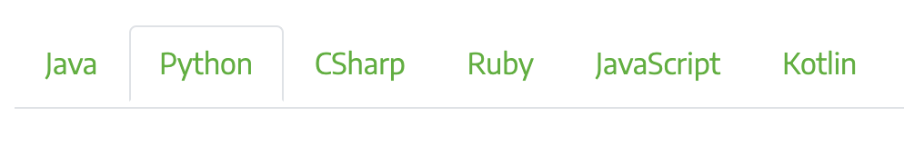
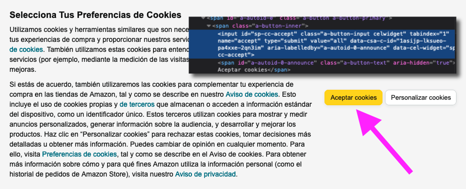
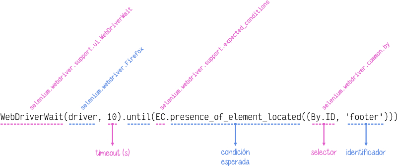

########
selenium
########

`Selenium <https://www.selenium.dev/>`__ es un proyecto que permite **automatizar navegadores**. Está principalmente enfocado al testeo de aplicaciones web pero también permite desarrollar potentes flujos de trabajo como es el caso de las técnicas de :ref:`scraping <pypi/scraping:Scraping>`. [#robot-unsplash]_

Existen múltiples "bindings"[#lang-bindings]_ pero el que nos ocupa en este caso es el de Python:

.. code-block:: console

    $ pip install selenium

*************
Pasos previos
*************

Documentación
=============

Recomendamos la `documentación oficial de Selenium`_ como punto de entrada a la librería. Eso sí, como ya hemos comentado previamente, existen adaptaciones para Python, Java, CSharp, Ruby, JavaScript y Kotlin, por lo que es conveniente fijar la pestaña de **Python** en los ejemplos de código:

Es igualmente importante manejar la `documentación de la API <https://www.selenium.dev/selenium/docs/api/py/api.html>`_ para Python. 

Prerequisitos
=============

Navegador web
-------------

Selenium necesita un **navegador web** instalado en el sistema para poder funcionar. Dentro de las opciones disponibles están Chrome, Firefox, Edge, Internet Explorer y Safari.  En el caso de este documento vamos a utilizar `Firefox <https://www.mozilla.org/es-ES/firefox/new/>`__. Su descarga e instalación es muy sencilla.

Driver
------

Además de esto, también es necesario disponer un **"webdriver"** que permita manejar el navegador (a modo de marioneta). Cada navegador tiene asociado un tipo de "driver". En el caso de Firefox hablamos de `geckodriver`_. Su descarga e instalación es muy sencilla.

************************
Configuración del driver
************************

El "driver" es el manejador de las peticiones del usuario. Se trata del objeto fundamental en Selenium que nos permitirá interactuar con el navegador y los sitios web.

Inicialización del driver
=========================

Para inicializar el "driver", en su versión más simple, usaremos el siguiente código::

    >>> from selenium import webdriver

    >>> driver = webdriver.Firefox()

En este momento se abrirá una ventana con el navegador Firefox.

.. tip::
    Es posible usar otros navegadores. La elección de este documento por Firefox tiene que ver con cuestiones de uso durante los últimos años.

Capacidades del navegador
=========================

Cuando inicializamos el "driver" podemos asignar ciertas "capacidades" al navegador. Las podemos dividir en dos secciones: opciones y perfil.

Opciones del navegador
----------------------

Una de las opciones más utilizadas es la capacidad de ocultar la ventana del navegador. Esto es útil cuando ya hemos probado que todo funciona y queremos automatizar la tarea:

.. code-block::
    :emphasize-lines: 5

    >>> from selenium import webdriver
    >>> from selenium.webdriver.firefox.options import Options

    >>> options = Options()
    >>> options.headless = True

    >>> driver = webdriver.Firefox(options=options)

El resto de opciones se pueden consultar en la `documentación de la API <https://www.selenium.dev/selenium/docs/api/py/webdriver_firefox/selenium.webdriver.firefox.options.html#module-selenium.webdriver.firefox.options>`__ [#firefox-driver]_.

Perfil del navegador
--------------------

Es posible definir un perfil personalizado para usarlo en el navegador controlado por el "driver".

Como ejemplo, podríamos querer desactivar javascript en el navegador (por defecto está activado). Esto lo haríamos de la siguiente manera:

.. code-block::
    :emphasize-lines: 7

    >>> from selenium import webdriver
    >>> from selenium.webdriver.firefox.options import Options
    >>> from selenium.webdriver.firefox.firefox_profile import FirefoxProfile

    >>> firefox_profile = FirefoxProfile()
    >>> firefox_profile.set_preference('javascript.enabled', False)

    >>> options=Options()
    >>> options.profile = firefox_profile

    >>> driver = webdriver.Firefox(options=options)

Existe una cantidad ingente de parámetros configurables en el perfil de usuario [#firefox-driver]_. Se pueden consultar en estos dos enlaces:

- https://searchfox.org/mozilla-release/source/modules/libpref/init/all.js
- https://searchfox.org/mozilla-release/source/browser/app/profile/firefox.js

Fichero de log
--------------

Desde la primera vez que inicializamos el "driver", se crea un fichero de log en el directorio de trabajo con el nombre ``geckodriver.log`` [#firefox-driver]_. En este fichero se registran todos los mensajes que se producen durante el tiempo de vida del navegador.

Es posible, aunque no recomendable, **evitar que se cree el fichero de log** de la siguiente manera::

    >>> import os

    >>> driver = webdriver.Firefox(options=options, service_log_path=os.devnull)

.. note::
    De igual modo, con el método anterior podemos cambiar la ruta y el nombre del fichero de log.

*********
Navegando
*********

La forma de **acceder a una url** es utilizar el método ``.get()``::

    >>> driver.get('https://aprendepython.es')

.. important::
    Cuando se navega a un sitio web, Selenium espera (por defecto) a que la propiedad ``document.readyState`` tenga el valor ``complete``. Esto no implica necesariamente que la página se haya cargado completamente, especialmente en páginas que usan mucho javascript para cargar contenido dinámicamente.

Podemos movernos **"hacia adelante" y "hacia detrás"** con::

    >>> driver.forward()
    >>> driver.back()

Si fuera necesario, también existe la posibilidad de **refrescar la página**::

    >>> driver.refresh()

Una vez terminadas todas las operaciones requeridas, es altamente recomendable **salir del navegador** para liberar los recursos que pueda estar utilizando::

    >>> driver.quit()

*********************
Localizando elementos
*********************

Una vez que hemos accedido a un sitio web, estamos en disposición de localizar elementos dentro del DOM [#dom]_. El objeto ``driver`` nos ofrece las siguientes funciones para ello:

.. csv-table::
    :file: tables/finding-selenium.csv
    :header-rows: 1
    :widths: 30, 50, 20

Todas estas funciones tienen su correspondiente versión **para devolver un único elemento** que cumpla con el filtro especificado. En caso de que hayan varios, sólo se devolverá el primero de ellos. El nombre de estas funciones sigue el patrón en singular::

    find_element_by_<accesor>()

Si te estás preguntando **para qué sirve el localizador** de la tabla anterior, es porque también existe la opción de localizar elementos mediante una función genérica:

.. code-block::
    :emphasize-lines: 5

    >>> from selenium.webdriver.common.by import By

    >>> # Estas dos llamadas tienen el mismo significado
    >>> driver.find_elements_by_class_name('matraca')
    >>> driver.find_elements(By.CLASS_NAME, 'matraca')

Veamos un ejemplo práctico de esto. Supongamos que queremos **obtener los epígrafes principales de la tabla de contenidos de "Aprende Python"**::

    >>> from selenium import webdriver

    >>> driver = webdriver.Firefox()
    >>> driver.get('https://aprendepython.es')

    >>> toc = driver.find_elements_by_css_selector('div.sidebar-tree li.toctree-l1')

    >>> for heading in toc:
    ...     print(heading.text)
    ...
    Introducción
    Entornos de desarrollo
    Tipos de datos
    Control de flujo
    Estructuras de datos
    Modularidad
    Procesamiento de texto
    Ciencia de datos
    Scraping

.. tip::
    Un poco más adelante veremos la forma de acceder a la información que contiene cada elemento del DOM.

Cada elemento que obtenemos con las funciones de localización es de tipo `FirefoxWebElement`_:

.. code-block::
    :emphasize-lines: 9

    >>> from selenium import webdriver

    >>> driver = webdriver.Firefox()
    >>> driver.get('https://aprendepython.es')

    >>> element = driver.find_element_by_id('aprende-python')

    >>> type(element)
    selenium.webdriver.firefox.webelement.FirefoxWebElement

*************
Interacciones
*************

Si bien el acceso a la información de un sitio web puede ser un objetivo en sí mismo, para ello podríamos usar herramientas como :ref:`requests <pypi/scraping/requests:Requests>`. Sin embargo, cuando entra en juego la interacción con los elementos del DOM, necesitamos otro tipo de aproximaciones.

Selenium nos permite hacer clic en el lugar deseado, enviar texto por teclado, borrar una caja de entrada o manejar elementos de selección, entre otros.

Clic
====

Para **hacer clic** utilizamos la función homónima. Veamos un ejemplo en el que accedemos a https://amazon.es y tenemos que aceptar las "cookies" haciendo clic en el botón correspondiente:

.. code-block::
    :emphasize-lines: 7

    >>> driver = webdriver.Firefox()

    >>> driver.get('https://amazon.es')

    >>> accept_cookies = driver.find_element_by_id('sp-cc-accept')

    >>> accept_cookies.click()

Inspeccionando el DOM
---------------------

Una tarea inherente a las técnicas de "scraping" y a la automatización de comportamientos para navegadores web es la de **inspeccionar los elementos del DOM**. Esto se puede hacer desde las herramientas para desarrolladores que incluyen los navegadores [#firefox-inspector]_.

    Botón de "cookies" en amazon.es

Para el ejemplo anterior de Amazon en el que debemos identificar el botón para aceptar "cookies", abrimos el inspector de Firefox y descubrimos que su ``id`` es ``sp-cc-accept``. Si no lo tuviéramos disponible habría que hacer uso de otros localizadores como "xpath" o selectores de estilo.

.. admonition:: Ejercicio
    :class: exercise

    Escriba un programa en Python que, utilizando Selenium, pulse el botón de "¡JUGAR!" en el sitio web https://wordle.danielfrg.com/. Los selectores "xpath" pueden ser de mucha ayuda.

    .. only:: html
    
        |solution| :download:`wordle_play.py <files/wordle_play.py>`

Enviar texto
============

Típicamente encontraremos situaciones donde habrá que enviar texto a algún campo de entrada de un sitio web. Selenium nos permite hacer esto.

Veamos un ejemplo en el que tratamos de **hacer login sobre PyPI**:

.. code-block::
    :emphasize-lines: 8-9

    >>> driver = webdriver.Firefox()

    >>> driver.get('https://pypi.org/account/login/')

    >>> username = driver.find_element_by_id('username')
    >>> password = driver.find_element_by_id('password')

    >>> username.send_keys('sdelquin')
    >>> password.send_keys('1234')

    >>> login_btn_xpath = '//*[@id="content"]/div/div/form/div[2]/div[3]/div/div/input'
    >>> login_btn = driver.find_element_by_xpath(login_btn_xpath)

    >>> login_btn.click()

En el caso de que queramos enviar alguna tecla "especial", Selenium nos proporciona un conjunto de símbolos para ello, definidos en `selenium.webdriver.common.keys`_.

Por ejemplo, si quisiéramos **enviar las teclas de cursor**, haríamos lo siguiente::

    >>> from selenium.webdriver.common.keys import Keys

    >>> element.send_keys(Keys.RIGHT)  # →
    >>> element.send_keys(Keys.DOWN)   # ↓
    >>> element.send_keys(Keys.LEFT)   # ←
    >>> element.send_keys(Keys.UP)     # ↑

.. admonition:: Ejercicio
    :class: exercise

    Escriba un programa en Python utilizando Selenium que, dada una palabra de 5 caracteres, permita enviar ese "string" a https://wordle.danielfrg.com/ para jugar.
    
    Tenga en cuenta lo siguiente:

    - En primer lugar hay que pulsar el botón de "¡JUGAR!".
    - El elemento sobre el que enviar texto podría ser directamente el "body".
    - Puede ser visualmente interesante poner un ``time.sleep(0.5)`` tras la inserción de cada letra.
    - Una vez enviada la cadena de texto hay que pulsar ENTER.

    .. only:: html
    
        |solution| :download:`wordle_try.py <files/wordle_try.py>`

Borrar contenido
================

Si queremos borrar el contenido de un elemento web editable, típicamente una caja de texto, lo podemos hacer usando el método ``.clear()``.

Manejo de selects
=================

Los elementos de selección ``<select>`` pueden ser complicados de manejar a nivel de automatización. Para suplir esta dificultad, Selenium proporciona el objecto ``Select``.

Supongamos un ejemplo en el que modificamos el idioma de búsqueda de Wikipedia. En primer lugar hay que acceder a la web y seleccionar el desplegable del idioma de búsqueda:

.. code-block::
    :emphasize-lines: 8

    >>> from selenium import webdriver
    >>> from selenium.webdriver.support.select import Select

    >>> driver = webdriver.Firefox()
    >>> driver.get('https://wikipedia.org')

    >>> lang = driver.find_element_by_id('searchLanguage')
    >>> lang_handler = Select(lang)

Ahora vamos a seleccionar el *idioma inglés* como idioma de búsqueda::

    >>> # Selección por el índice que ocupa cada "option" (base 0)
    >>> lang_handler.select_by_index(17)

    >>> # Selección por el campo "value" de cada "option"
    >>> lang_handler.select_by_value('en')

    >>> # Selección por el texto visible de cada "option"
    >>> lang_handler.select_by_visible_text('English')

.. tip::
    Estas tres funciones tienen su correspondiente ``deselect_by_<accesor>``.

Si queremos identificar las opciones que están actualmente seleccionadas, podemos usar los siguientes atributos::

    >>> lang_handler.all_selected_options
    [<selenium.webdriver.firefox.webelement.FirefoxWebElement (session="8612e5b7-6e66-4121-8869-ffce4139d197", element="8433ffdb-a8ad-4e0e-9367-d63fe1418b94")>]

    >>> lang_handler.first_selected_option
    <selenium.webdriver.firefox.webelement.FirefoxWebElement (session="8612e5b7-6e66-4121-8869-ffce4139d197", element="8433ffdb-a8ad-4e0e-9367-d63fe1418b94")>

También es posible listar todas las opciones disponibles en el elemento ``select``::

    >>> lang_handler.options
    [..., ..., ...]

.. seealso::
    `API del objeto Select <https://www.selenium.dev/selenium/docs/api/py/webdriver_support/selenium.webdriver.support.select.html#selenium.webdriver.support.select.Select>`__

******************
Acceso a atributos
******************

Como ya hemos comentado, los objetos del DOM con los que trabaja Selenium son de tipo ``FirefoxWebElement``. Veremos los mecanismos disponibles para poder acceder a sus `atributos <https://www.selenium.dev/selenium/docs/api/py/webdriver_remote/selenium.webdriver.remote.webelement.html#module-selenium.webdriver.remote.webelement>`__.

Para ejemplificar el acceso a la información de los elementos del DOM, vamos a **localizar el botón de descarga** en la web de Ubuntu::

    >>> from selenium import webdriver

    >>> driver = webdriver.Firefox()
    >>> driver.get('https://ubuntu.com/')

    >>> # Aceptar las cookies
    >>> cookies = driver.find_element_by_id('cookie-policy-button-accept')
    >>> cookies.click()

    >>> download_btn = driver.find_element_by_id('takeover-primary-url')

Nombre de etiqueta
==================

    >>> download_btn.tag_name
    'a'

Tamaño y posición
=================

Para cada elemento podemos obtener un diccionario que contiene la posición en pantalla :math:`(x, y)` acompañado del ancho y del alto (todo en píxeles)::

    >>> download_btn.rect
    {'x': 120.0,
     'y': 442.3999938964844,
     'width': 143.64999389648438,
     'height': 36.80000305175781}

Estado
======

Veamos las funciones disponibles para saber si un elemento se está mostrando, está habilitado o está seleccionado::

    >>> download_btn.is_displayed()
    True

    >>> download_btn.is_enabled()
    True

    >>> download_btn.is_selected()
    False

Propiedad CSS
=============

En caso de querer conocer el valor de cualquier propiedad CSS de un determinado elemento, lo podemos conseguir así::

    >>> download_btn.value_of_css_property('background-color')
    'rgb(14, 132, 32)'

    >>> download_btn.value_of_css_property('font-size')
    '16px'

Texto del elemento
==================

Cuando un elemento incluye texto en su contenido, ya sea de manera directa o mediante elementos anidados, es posible acceder a esta información usando::

    >>> download_btn.text
    'Download Now'

Elemento superior
=================

Selenium también permite obtener el elemento superior que contiene a otro elemento dado::

    >>> download_btn.parent
    <selenium.webdriver.firefox.webdriver.WebDriver (session="8612e5b7-6e66-4121-8869-ffce4139d197")>

Propiedad de elemento
=====================

De manera más genérica, podemos obtener el valor de cualquier atributo de un elemento del DOM a través de la siguiente función::

    >>> download_btn.get_attribute('href')
    'https://ubuntu.com/engage/developer-desktop-productivity-whitepaper

*******
Esperas
*******

Cuando navegamos a un sitio web utilizando ``driver.get()`` es posible que el elemento que estamos buscando no esté aún cargado en el DOM porque existan peticiones asíncronas pendientes o contenido dinámico javascript. Es por ello que Selenium pone a nuestra disposición una serie de **esperas explícitas** hasta que se cumpla una determinada condición.

Las esperas explícitas suelen hacer uso de `condiciones de espera`_. Cada una de estas funciones se puede utilizar para un propósito específico. Quizás una de las funciones más habituales sea ``presence_of_element_located()``.

Veamos un ejemplo en el que cargamos la web de Stack Overflow y esperamos a que el pie de página esté disponible:

.. code-block::
    :emphasize-lines: 7-8

    >>> from selenium.webdriver.support.ui import WebDriverWait
    >>> from selenium.webdriver.support import expected_conditions as EC
    >>> from selenium.webdriver.common.by import By

    >>> driver.get('https://stackoverflow.com')

    >>> footer = WebDriverWait(driver, 10).until(
    ...     EC.presence_of_element_located((By.ID, 'footer')))

    >>> print(footer.text)
    STACK OVERFLOW
    Questions
    Jobs
    Developer Jobs Directory
    Salary Calculator
    Help
    Mobile
    ...

    Anatomía de una condición de espera

.. attention::
    En el caso de que el elemento por el que estamos esperando no "aparezca" en el DOM, y una vez pasado el tiempo de "timeout", Selenium eleva una :ref:`excepción <core/modularity/exceptions:Excepciones>` de tipo ``selenium.common.exceptions.TimeoutException``.

*******************
Ejecutar javascript
*******************

Puede llegar a ser muy útil la ejecución de javascript en el navegador. La casuística es muy variada. En cualquier caso, Selenium nos proporciona el método ``execute_script()`` para esta tarea.

Supongamos un ejemplo en el que queremos **navegar a la web de GitHub y hacer "scroll" hasta el final de la página**:

.. code-block::
    :emphasize-lines: 6

    >>> driver = webdriver.Firefox()
    >>> driver.get('https://github.com')

    >>> body = driver.find_element_by_tag_name('body')

    >>> driver.execute_script('arguments[0].scrollIntoView(false)', body)

Cuando en la función ``execute_script()`` se hace referencia al array ``arguments[]`` podemos pasar elementos Selenium como argumentos y aprovechar así las potencialidades javascript. El primer argumento corresponde al índice 0, el segundo argumento al índice 1, y así sucesivamente.

.. admonition:: Ejercicio
    :class: exercise

    Escriba un programa en Python que permita sacar un listado de supermercados Mercadona dada una geolocalización ``(lat,lon)`` como dato de entrada.

    Pasos a seguir:

    1. Utilizar el siguiente :ref:`f-string <core/datatypes/strings.html:f-strings>` para obtener la url de acceso: ``f'https://info.mercadona.es/es/supermercados?coord={lat}%2C{lon}'``
    2. Aceptar las cookies al acceder al sitio web.
    3. Hacer scroll hasta el final de la página para hacer visible el botón "Ver todos". Se recomienda usar javascript para ello.
    4. Localizar el botón "Ver todos" y hacer clic para mostrar todos los establecimientos (de la geolocalización). Se recomienda una espera explícita con acceso por "xpath".
    5. Recorrer los elementos desplegados ``li`` y mostrar el contenido textual de los elementos ``h3`` que hay en su interior.

    Como detalle final, y una vez que compruebe que el programa funciona correctamente, aproveche para inicializar el "driver" :ref:`ocultando la ventana del navegador <pypi/scraping/selenium:Opciones del navegador>`.

    Puede probar su programa con la localización de Las Palmas de Gran Canaria (28.1035677, -15.5319742).

    .. only:: html
    
        |solution| :download:`mercadona.py <files/mercadona.py>`

.. --------------- Footnotes ---------------

.. [#robot-unsplash] Foto original de portada por `Andy Kelly`_ en Unsplash.
.. [#lang-bindings] Adaptación (interface) de la herramienta a un lenguaje de programación concreto.
.. [#firefox-driver] En este caso aplicable al navegador Firefox.
.. [#dom] Document Object Model.
.. [#firefox-inspector] Para Firefox tenemos a disposición la herramienta `Inspector`_.

.. --------------- Hyperlinks ---------------

.. _Andy Kelly: https://unsplash.com/@askkell?utm_source=unsplash&utm_medium=referral&utm_content=creditCopyText
.. _documentación oficial de Selenium: https://www.selenium.dev/documentation/webdriver/
.. _geckodriver: https://github.com/mozilla/geckodriver/releases
.. _FirefoxWebElement: https://www.selenium.dev/selenium/docs/api/py/webdriver_firefox/selenium.webdriver.firefox.webdriver.html#module-selenium.webdriver.firefox.webdriver
.. _Inspector: https://developer.mozilla.org/es/docs/Tools/Page_Inspector/How_to/Open_the_Inspector
.. _condiciones de espera: https://www.selenium.dev/selenium/docs/api/py/webdriver_support/selenium.webdriver.support.expected_conditions.html
.. _selenium.webdriver.common.keys: https://www.selenium.dev/selenium/docs/api/py/webdriver/selenium.webdriver.common.keys.html
